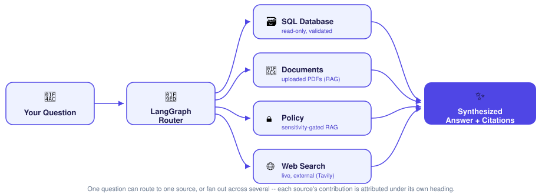
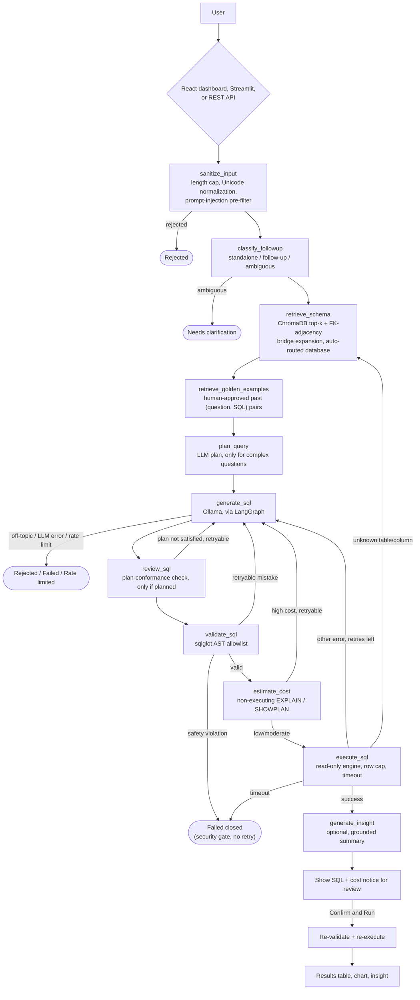

<div align="center">

<h1>Text-to-SQL Dashboard</h1>

<p><strong>Ask your own database a question in plain English — get validated, read-only SQL you review before it ever runs.</strong></p>

[User Guide](USER_GUIDE.md)&nbsp;&nbsp;&nbsp;|&nbsp;&nbsp;&nbsp;[Architecture](docs/ARCHITECTURE.md)&nbsp;&nbsp;&nbsp;|&nbsp;&nbsp;&nbsp;[API Reference](docs/API.md)&nbsp;&nbsp;&nbsp;|&nbsp;&nbsp;&nbsp;[Configuration](docs/CONFIGURATION.md)

[](LICENSE)
[](USER_GUIDE.md)
[](#-project-status)

</div>

> **Alpha — actively evolving.** Two interfaces currently ship side by side:
> a newer React dashboard (`frontend/`) and the original Streamlit app
> (`ui/app.py`) it's intended to eventually replace once fully signed off.
> Both call the identical LangGraph agent. See [Project status](#-project-status).

<a id="news-and-updates"></a>

## 📰 News and Updates

<!-- Newest first, sourced from real commit history. Keep no more than the three most recent entries. -->

- **2026-09-13** — [Security hardening pass on the agentic orchestrator (media generation, RAG, rate limits)](https://github.com/surajkumarnavodya/text-to-sql-agent-langgraph/commit/ec91b96)
- **2026-09-13** — [Image/video generation with intent detection and inline media display](https://github.com/surajkumarnavodya/text-to-sql-agent-langgraph/commit/319075a)
- **2026-09-12** — [Replace Streamlit UI with an installable React dashboard, extend the API to support it](https://github.com/surajkumarnavodya/text-to-sql-agent-langgraph/commit/a29e917)

<a id="example-usage"></a>

## 💻 Example Usage

The REST API (`api/`, FastAPI) is a thin wrapper over the same LangGraph
agent every UI in this repo calls — `POST /ask` works standalone, with or
without either UI running:

```bash
curl -X POST http://localhost:8000/ask \
  -H "Content-Type: application/json" \
  -d '{
        "question": "What were total sales last quarter?",
        "enable_insight": true
      }'
```

Add `-H "Authorization: Bearer $API_AUTH_TOKEN"` if you've set
`API_AUTH_TOKEN` in `.env` (unset by default — see
[`docs/API.md`](docs/API.md)). The response includes the generated SQL,
result rows, retry/attempt history, and (if enabled) a grounded
plain-English insight — see `api/schemas.py::AskResponse` for the full
shape.

<a id="get-started-and-stay-tuned"></a>

## 🌟 Get Started & Stay Tuned

<div align="center">


</div>

_An animated diagram, not a screen recording — a real screenshot of the
chat + generated-SQL view is still TODO._

Ready to try it? Jump to [Getting Started](#-getting-started) below.

We're glad you're here — [star the repository](https://github.com/surajkumarnavodya/text-to-sql-agent-langgraph)
if you want to keep it on your radar, and open an
[issue](https://github.com/surajkumarnavodya/text-to-sql-agent-langgraph/issues/new/choose)
for bugs, questions, or feature ideas.

<a id="what-is-this"></a>

## 🔎 What is this?

**A Text-to-SQL dashboard connected to one or more real, user-configured
databases.** A user asks a natural-language question, a LangGraph agent
turns it into SQL against the configured database (schema retrieved via
ChromaDB, embedded from live schema introspection — not a hardcoded
sample), the SQL is validated (SELECT-only allowlist, AST-parsed with
`sqlglot`) and executed read-only, and the result is rendered as a table +
auto-picked chart. The LLM runs locally via Ollama — no network calls for
generation, no API keys required for that part. Database connectivity is
fully config-driven via `.env`; there is no hardcoded connection string,
host, or schema anywhere in the codebase.

<div align="center">



</div>

<a id="choose-your-interface"></a>

## 🧭 Choose your interface

| Interface | Status | Run it |
|---|---|---|
| **React dashboard** (`frontend/`) | Newer, actively developed — theme/accent/font/language pickers, installable as a PWA, feature-parity-checked against Streamlit | `npm run build` in `frontend/`, then `uvicorn api.main:app` serves it at `http://localhost:8000/` |
| **Streamlit app** (`ui/app.py`) | The original interface. Still fully functional; scheduled for removal once the React app is fully signed off (not yet done — both exist today) | `streamlit run ui/app.py` → `http://localhost:8501/` |
| **REST API** (`api/`) | No UI — for scripts, notebooks, or your own frontend | `uvicorn api.main:app` → see [`docs/API.md`](docs/API.md) |

All three drive the identical `agent.graph.run_agent` (or, with multi-source
routing enabled, `agent.orchestrator.graph.run_orchestrated`) — no logic is
duplicated per interface.

<a id="why-this-project"></a>

## 💡 Why this project

- **The LLM's SQL is never trusted implicitly.** `sqlglot` parses the AST
  and allowlists the statement type (`SELECT`/`UNION`/`EXCEPT`/`INTERSECT`
  only) — an explicit allowlist, not a keyword blocklist that a syntax
  variant could slip past.
- **A self-correcting retry loop, not a free-form agent.** The pipeline is
  an explicit 11-node LangGraph state machine (see the diagram below); a
  review/validation/execution failure routes back to regeneration with the
  error appended to context, capped at an adaptively-widened retry budget —
  inspectable and boundable, not implicit ReAct-style reasoning.
- **Schema-aware retrieval**, not "dump the whole schema into the prompt."
  Each table's DDL is embedded in ChromaDB; only the top-k relevant tables
  are retrieved per question, with FK-adjacency bridge expansion to pull in
  structurally-required tables plain similarity search tends to miss.
- **A golden-dataset feedback loop.** Human-approved (question, SQL) pairs,
  saved via a thumbs-up on a confirmed result, are retrieved as few-shot
  examples for similar future questions.
- **Multi-database auto-routing.** More than one database can be configured
  at once; each question is routed to whichever one's schema looks most
  relevant — no manual picker.
- **Optional multi-source agentic RAG** (off by default) — a router can fan
  a question out across the SQL pipeline, uploaded PDF documents, a
  separate sensitivity-gated policy collection, and live web search
  (Tavily), attributing each source's contribution under its own heading.
- **Optional image/video generation** (off by default) — the same router
  recognizes a request that explicitly asks to *create* new media (e.g.
  "generate an image of monthly spend by category") via IMA Studio, and
  renders the actual result inline as real media, never a bare link. A
  plain "show me the data" question is never mistaken for one. Generation
  is the one source that spends real money, so it requires an explicit
  human confirmation before anything is actually generated — the same
  "Confirm and Run" philosophy the SQL pipeline already applies, extended
  to this source.
- **Grounded insights, not free-form narration.** An optional plain-English
  summary sentence is checked against the actual result data before it's
  shown; an unsupported number is silently dropped rather than displayed as
  if verified.
- **Fully local LLM stack.** Ollama runs on your machine — no data leaves
  it for SQL generation (the one opt-in exception is live web search,
  disabled by default).

<details>
<summary>Full agent graph (11 nodes)</summary>



See [`docs/ARCHITECTURE.md`](docs/ARCHITECTURE.md) for the full per-node
walkthrough and retry-routing table.

</details>

<a id="getting-started"></a>

## 🚀 Getting Started

### Prerequisites

- **Python 3.11** (the project's target — see `pyproject.toml` /
  `.github/workflows/ci.yml`)
- **[Ollama](https://ollama.com)**, installed and running, with a model pulled:
  ```bash
  ollama pull llama3.1:8b
  ```
- **A database to connect to** — PostgreSQL, MySQL, SQL Server, or Oracle
  (see [Supported models & databases](#-supported-models--databases) below).
  No sample database is bundled.
- **Node.js + npm** (a recent LTS) — only needed if you want to build the
  React dashboard; the Streamlit UI and the REST API don't require it.

### Clone, install, configure

```bash
git clone https://github.com/surajkumarnavodya/text-to-sql-agent-langgraph.git
cd text-to-sql-agent-langgraph
python -m venv .venv
source .venv/bin/activate        # Windows: .venv\Scripts\Activate.ps1
pip install --upgrade pip
pip install -r requirements.txt
cp .env.example .env             # Windows: Copy-Item .env.example .env
```

Edit `.env` with your real database connection details (every variable is
documented inline in `.env.example`) — **use a dedicated read-only database
account**, not an admin login (see [`SECURITY.md`](SECURITY.md)). Then
verify the connection and build the schema index:

```bash
python scripts/test_db_connection.py
python scripts/build_embeddings.py
```

### Run it

**React dashboard (recommended):**
```bash
cd frontend && npm install && npm run build && cd ..
uvicorn api.main:app --host 0.0.0.0 --port 8000
```
Open `http://localhost:8000/`.

**Streamlit app:**
```bash
streamlit run ui/app.py
```
Open `http://localhost:8501/`.

**REST API only** (no UI): `uvicorn api.main:app --host 0.0.0.0 --port 8000` —
see [`docs/API.md`](docs/API.md).

### Tests and linters

```bash
pytest
ruff check . && black --check . && mypy .
```

PowerShell equivalents are in `tasks.ps1` (`.\tasks.ps1 run`,
`.\tasks.ps1 test`, `.\tasks.ps1 lint`); Make targets for bash are in the
`Makefile`. CI (`.github/workflows/ci.yml`) runs the same lint + test steps
on GitHub Actions.

### Running with Docker

```bash
cp .env.example .env   # then edit .env as above
docker compose build
docker compose up -d
docker compose exec app python scripts/build_embeddings.py
```

This starts the Streamlit app (`http://localhost:8501`) and the API
(`http://localhost:8000`) as two containers from one image. The Dockerfile
does **not** install Node.js or build the frontend — if you want the API
container to also serve the React dashboard, run
`npm run build` inside `frontend/` on the host **before** `docker compose
build`, so `frontend/dist` exists to be copied into the image. See
[`docs/DEPLOYMENT.md`](docs/DEPLOYMENT.md) for external Ollama/database
connectivity and reverse-proxy placement.

<a id="explore-the-documentation"></a>

## 📚 Explore the documentation

| Goal | Start here |
|---|---|
| Just use the app | [`USER_GUIDE.md`](USER_GUIDE.md) |
| Understand the LangGraph node design and retry logic | [`docs/ARCHITECTURE.md`](docs/ARCHITECTURE.md) |
| Turn on document RAG, policy RAG, or web search | [`docs/MULTI_SOURCE_GUIDE.md`](docs/MULTI_SOURCE_GUIDE.md) |
| Look up REST API endpoints and auth | [`docs/API.md`](docs/API.md) |
| Find every `.env` variable | [`docs/CONFIGURATION.md`](docs/CONFIGURATION.md) |
| Deploy with Docker / an external DB or Ollama | [`docs/DEPLOYMENT.md`](docs/DEPLOYMENT.md) |
| See the latest measured benchmark accuracy | [`docs/EVALUATION.md`](docs/EVALUATION.md) |
| Diagnose a common failure mode | [`docs/TROUBLESHOOTING.md`](docs/TROUBLESHOOTING.md) |
| Understand this project's security posture | [`SECURITY.md`](SECURITY.md) |
| Check production readiness before deploying | [`docs/PRODUCTION_CHECKLIST.md`](docs/PRODUCTION_CHECKLIST.md), [`docs/PRODUCTION_READINESS_REPORT.md`](docs/PRODUCTION_READINESS_REPORT.md) |
| Governance, compliance, responsible-AI, risk tracking | [`docs/GOVERNANCE.md`](docs/GOVERNANCE.md), [`docs/COMPLIANCE.md`](docs/COMPLIANCE.md), [`docs/RESPONSIBLE_AI.md`](docs/RESPONSIBLE_AI.md), [`docs/RISK_REGISTER.md`](docs/RISK_REGISTER.md) |
| Contribute a change or an eval case | [`CONTRIBUTING.md`](CONTRIBUTING.md) |

<a id="supported-models-and-databases"></a>

## 🧩 Supported models & databases

Ollama is the only supported LLM runtime — there is no hosted-API code
path. Any `ollama pull`-able model works; `OLLAMA_MODEL` is a plain config
string (`config/settings.py`), not hardcoded:

| Model | Notes |
|---|---|
| `llama3.1:8b` (default) | What this project is built and benchmarked against — see [`docs/EVALUATION.md`](docs/EVALUATION.md) for measured accuracy. |
| `sqlcoder`, `duckdb-nsql`, or any other Ollama-hosted model | Supported by the same config knob; untested by this project's own benchmark as of this writing. |

| `DB_TYPE` | Driver | Notes |
|---|---|---|
| `postgresql` | `psycopg2-binary` | |
| `mysql` | `pymysql` | |
| `mssql` | `pyodbc` | Requires the Microsoft ODBC Driver for SQL Server installed as a system package — see [`docs/TROUBLESHOOTING.md`](docs/TROUBLESHOOTING.md). |
| `oracle` | `oracledb` (thin mode) | No separate Oracle Client install needed. |

Selected via `DB_TYPE` in `.env` (single database) or `DB_CONNECTIONS=name1,name2,...`
(multiple, auto-routed per question — see [`docs/CONFIGURATION.md`](docs/CONFIGURATION.md)).
Source of truth: `db/connection.py::SUPPORTED_DB_TYPES`.

<a id="get-help-and-file-an-issue"></a>

## 🛟 Get help and file an issue

Use the [issue chooser](https://github.com/surajkumarnavodya/text-to-sql-agent-langgraph/issues/new/choose)
(bug report / feature request templates under `.github/ISSUE_TEMPLATE/`)
for usage questions, reproducible bugs, and feature requests.

Follow [`SECURITY.md`](SECURITY.md) to report a suspected security
vulnerability rather than filing a public issue.

<a id="project-status"></a>

## 🧪 Project status

This project is **alpha** and evolving quickly. Two UIs coexist today: the
React dashboard has reached feature parity with Streamlit, but Streamlit
hasn't been removed yet — both are maintained. See
[Known limitations](#known-limitations) below for the honest current state
of accuracy and production-readiness, not a marketing claim.

<a id="known-limitations"></a>

## ⚠️ Known limitations

- **Accuracy depends heavily on the local model.** The latest full
  benchmark run (`docs/EVALUATION.md`, 57 cases, `llama3.1:8b` against
  AdventureWorksDW2025) measured **92.3% execution accuracy** (the SQL
  runs) but only **29.6% result-set accuracy** and **35.0% final
  accuracy** — the SQL often runs successfully but returns the wrong
  answer, especially on hard/real-world questions (25% pass rate on each).
  Security-rejection accuracy is 100%.
- **Single-user, local-dev oriented.** Not hardened for concurrent
  multi-tenant or production use — see [`SECURITY.md`](SECURITY.md) and
  [`docs/PRODUCTION_CHECKLIST.md`](docs/PRODUCTION_CHECKLIST.md) before
  pointing it at anything sensitive.
- **Document/policy RAG requires SQL Server 2025+ or Azure SQL**
  specifically (native `VECTOR` column type), separate from the four
  `DB_TYPE`s the core SQL pipeline supports.
- **Two UIs coexist.** The React dashboard has reached feature parity with
  Streamlit, but Streamlit hasn't been removed yet.
- **Image/video generation (`ENABLE_MEDIA_GENERATION`, off by default)
  uses real, metered IMA Studio credits when enabled.** Image generation is
  confirmed working end-to-end against a live account; video generation
  shares the same code path but hasn't been separately confirmed with a
  live call yet.

<a id="contributing"></a>

## 🤝 Contributing

- Read [`CONTRIBUTING.md`](CONTRIBUTING.md) before proposing a change —
  dev setup, coding standards, and how to add an evaluation case.
- Licensed under the terms in [`LICENSE`](LICENSE) (MIT).
