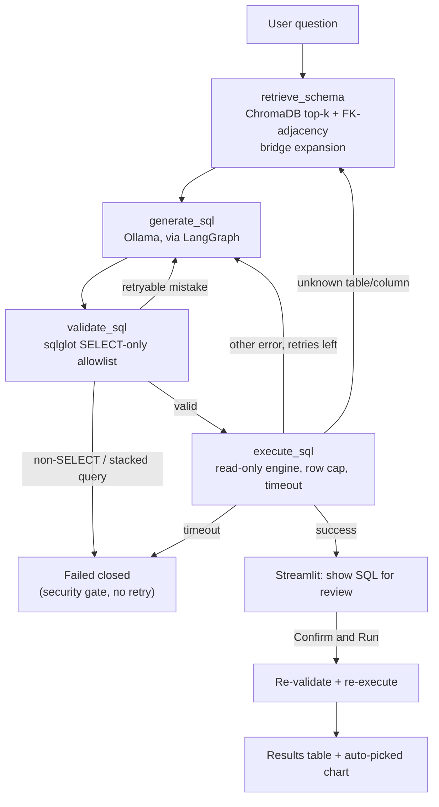

# Text-to-SQL Dashboard

Ask questions about a real database in plain English and get back validated,
read-only SQL, a results table, and an auto-picked chart — powered by a
fully local LLM stack (Ollama) and an explicit, self-correcting
[LangGraph](https://langchain-ai.github.io/langgraph/) state machine rather
than a black-box agent.

**Why I built this:** most "chat with your database" demos either trust the
LLM's SQL blindly or hide the reasoning behind an opaque agent loop. I
wanted to build the version that treats LLM output as untrusted by
construction — every query is parsed and allowlisted before it can run,
every retry is visible and inspectable, and the schema the model sees
scales to a database with hundreds of tables instead of assuming a toy
5-table sample. It's also a fully local stack (Ollama + ChromaDB, no API
keys, no data leaving the machine), which matters for anyone who can't send
a real schema or query results to a hosted API.

## Architecture



Retries are capped (`MAX_RETRIES`, default 3) and every attempt is recorded
and shown in the UI's "Retry timeline" — the self-correction loop is meant
to be inspectable, not a black box. See
[`docs/ARCHITECTURE.md`](docs/ARCHITECTURE.md) for the full technical
walkthrough (node-by-node design, retry semantics, schema-retrieval
internals).

## Key features

- **Self-correcting retry loop** — a validation or execution failure feeds
  the actual error back into the next generation attempt, up to a
  configurable cap, instead of failing on the first mistake.
- **Read-only SQL validator** — an AST-based allowlist (via `sqlglot`), not
  a regex blocklist: only a single `SELECT`/`UNION`/`EXCEPT`/`INTERSECT`
  statement is ever allowed to execute, in every dialect the project
  supports.
- **Schema-aware retrieval** — the LLM never sees the whole schema. Each
  table's DDL (plus sampled real column values, for disambiguating coded
  columns) is embedded in ChromaDB; only the top-k relevant tables are
  retrieved per question, with FK-adjacency expansion to pull in
  structurally-required tables (like a fact table) that plain similarity
  search tends to miss.
- **Fully configurable database connection** — PostgreSQL, MySQL, SQL
  Server, or Oracle via SQLAlchemy, entirely driven by `.env`; no hardcoded
  connection string, host, or schema anywhere in the codebase.
- **Human-readable output formatting** — surrogate/ID columns are hidden
  from the default results view, and column labels are expanded from
  common abbreviations, without ever touching the underlying query.
- **Eval harness with pass/fail accuracy checks** — a small, growable set of
  real natural-language questions with machine-checkable expectations
  (`scripts/run_eval.py`), so a join/filter regression shows up as a
  failing check instead of shipping silently.

## Tech stack

| Layer | Choice | Why |
|---|---|---|
| LLM runtime | [Ollama](https://ollama.com) (`llama3.1:8b` default) | Fully local — no API keys, no data leaves the machine, no per-token cost while iterating. |
| Orchestration | [LangGraph](https://langchain-ai.github.io/langgraph/) | An explicit state machine (not a free-form ReAct agent) — the retry/error-feedback path is a fixed, inspectable graph, not implicit agent reasoning. |
| Schema retrieval | [ChromaDB](https://www.trychroma.com/) | Local vector store; keeps the prompt small and relevant on a schema with hundreds of tables instead of dumping everything into context. |
| Database | [SQLAlchemy](https://www.sqlalchemy.org/) | One engine abstraction across 4 supported databases, config-driven, with a real `Inspector`-based introspection API instead of per-engine catalog queries. |
| SQL validation | [sqlglot](https://github.com/tobymao/sqlglot) | Parses the AST and allowlists the statement *type* — can't be bypassed by a syntax variant the way a keyword blocklist can. |
| UI | [Streamlit](https://streamlit.io) + [Plotly](https://plotly.com/python/) | Fast to build a real reviewable UI (editable SQL box, retry timeline, schema browser) without a separate frontend. |

## Setup

### Prerequisites
- **Python 3.11** (the project's target; see the version note in
  [`CLAUDE.md`](CLAUDE.md) if you're on a newer/older interpreter)
- **[Ollama](https://ollama.com)**, installed and running, with a model pulled:
  ```bash
  ollama pull llama3.1:8b
  ```
- **A database to connect to** — PostgreSQL, MySQL, SQL Server, or Oracle.
  No sample database is bundled (see "Trying it against a sample database"
  below if you don't have one handy).

### Clone and install

**macOS / Linux / WSL (bash):**
```bash
git clone <this-repo-url>
cd Gen_AI_Project_TSQL
python3 -m venv .venv
source .venv/bin/activate
pip install --upgrade pip
pip install -r requirements.txt
cp .env.example .env
```

**Windows (PowerShell):**
```powershell
git clone <this-repo-url>
cd Gen_AI_Project_TSQL
py -3.11 -m venv .venv      # or: python -m venv .venv
.venv\Scripts\Activate.ps1
python -m pip install --upgrade pip
pip install -r requirements.txt
Copy-Item .env.example .env
```

Then edit `.env` with your real database connection details (every
variable is documented inline in `.env.example`) — **use a dedicated
read-only database account**, not an admin login (see
[`SECURITY.md`](SECURITY.md)).

Verify the connection before doing anything else:
```bash
python scripts/test_db_connection.py
```

### Trying it against a sample database

This project was built and tested against Microsoft's public
**AdventureWorksDW2025** sample data warehouse (SQL Server). If you don't
have a database handy to point this at, you can download and restore it
from Microsoft's official samples page:
[learn.microsoft.com/en-us/sql/samples/adventureworks-install-configure](https://learn.microsoft.com/en-us/sql/samples/adventureworks-install-configure)
— any edition of SQL Server (including the free LocalDB/Express editions)
works.

## How to run

Build the schema embeddings once (and again any time the schema changes —
this is also available from the UI's "Refresh Schema" button):
```bash
python scripts/build_embeddings.py
```

Run the app:
```bash
streamlit run ui/app.py
```

Run the eval harness (a live-DB + live-Ollama check, separate from the
mocked `pytest` suite — see [`CONTRIBUTING.md`](CONTRIBUTING.md) for how to
add questions to it):
```bash
python scripts/run_eval.py
```

Run the mocked unit test suite + linters:
```bash
pytest
ruff check . && black --check . && mypy .
```

PowerShell equivalents for all of the above are in `tasks.ps1`
(`.\tasks.ps1 run`, `.\tasks.ps1 test`, `.\tasks.ps1 lint`); Make targets for
bash are in the `Makefile`.

## Screenshots

_TODO: add a screenshot of the chat + generated-SQL view, and one of a
results table with an auto-picked chart._

## Known limitations

- **Accuracy depends heavily on the local model.** `llama3.1:8b` handles
  straightforward aggregation/filter/join questions well but is noticeably
  weaker on window-function-heavy or deeply nested subquery questions —
  swapping to a SQL-specialized model (e.g. `sqlcoder`, `duckdb-nsql`) or a
  larger model generally helps, at the cost of speed/memory.
- **Local inference is slower than a hosted API**, especially across
  several retry attempts on a hard question — this trades latency for
  running entirely offline with no per-call cost.
- **Schema retrieval can still miss a required table** on schemas with long,
  multi-hop hierarchies if more than one hop is missing from the initial
  top-k match; the FK-adjacency bridge expansion catches the common single-hop
  case, not every possible gap.
- **Single-user, local-dev oriented.** This has not been hardened for
  concurrent multi-tenant use or production deployment — see
  [`SECURITY.md`](SECURITY.md) before pointing it at anything sensitive.

## More documentation

- [`docs/ARCHITECTURE.md`](docs/ARCHITECTURE.md) — detailed technical
  walkthrough of the LangGraph node design, retry/self-correction logic,
  and schema-retrieval pipeline.
- [`docs/User_Guide.pdf`](docs/User_Guide.pdf) — comprehensive documentation
  covering both the functional (how to use the app) and technical (how it's
  built, configured, and secured) sides, written for a general audience.
- [`SECURITY.md`](SECURITY.md) — this project's security posture.
- [`CONTRIBUTING.md`](CONTRIBUTING.md) — dev setup, coding standards, how
  to add eval questions.

## License

[MIT](LICENSE) — see `LICENSE` for the full text.
