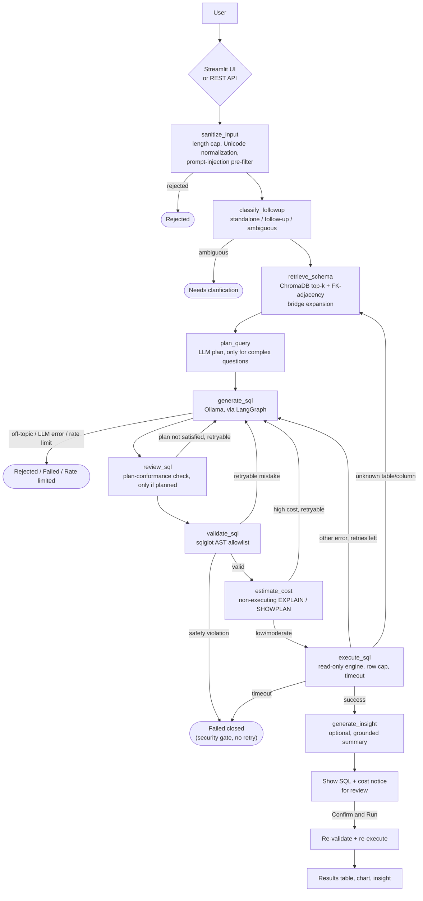

# Text-to-SQL Dashboard

Ask questions about a real database in plain English and get back validated,
read-only SQL, a results table, and an auto-picked chart — powered by a
fully local LLM stack (Ollama) and an explicit, self-correcting
[LangGraph](https://langchain-ai.github.io/langgraph/) state machine rather
than a black-box agent.

**Why I built this:** most "chat with your database" demos either trust the
LLM's SQL blindly or hide the reasoning behind an opaque agent loop. I
wanted to build the version that treats LLM output as untrusted by
construction — every query is parsed and allowlisted before it can run,
every retry is visible and inspectable, and the schema the model sees
scales to a database with hundreds of tables instead of assuming a toy
5-table sample. It's also a fully local stack (Ollama + ChromaDB, no API
keys, no data leaving the machine), which matters for anyone who can't send
a real schema or query results to a hosted API — this holds for the core
SQL pipeline unconditionally; the optional multi-source router's web
search feature (off by default) is the one deliberate exception, since a
live web search inherently needs to leave the machine — see "Multi-source
knowledge" below.

## Architecture



Retries are capped by an adaptive per-question budget (`MAX_RETRIES`,
default 3, plus up to `COMPLEX_QUERY_MAX_RETRY_BONUS` extra retries for a
question that reads as non-trivial — top-N-per-group, year-over-year
growth, several metrics at once) and every attempt is recorded and shown in
the UI's "Retry timeline" — the self-correction loop is meant to be
inspectable, not a black box. `plan_query`/`review_sql` are a zero-cost
pass-through for an ordinary question — no extra LLM call, no added
latency — and only engage for that same class of non-trivial question; see
"Key features" below. See [`docs/ARCHITECTURE.md`](docs/ARCHITECTURE.md)
for the full technical walkthrough (all ten LangGraph nodes, retry
semantics, schema-retrieval internals) and
[`USER_GUIDE.md`](USER_GUIDE.md) for what this looks like from inside the
app.

**Optional: this SQL pipeline is the default destination of a
multi-source router**, off by default (`ENABLE_MULTI_SOURCE_ROUTER=false`).
Turned on, a question can also be routed to (or fanned out across) uploaded
PDF documents, a separate sensitivity-gated company-policy collection, or
live web search — see "Multi-source knowledge" below. With the router off,
this diagram is the *entire* app, unchanged from before that feature
existed.

## Key features

- **Self-correcting retry loop** — a validation, cost-estimate, or
  execution failure feeds the actual error back into the next generation
  attempt, up to a configurable cap (`MAX_RETRIES`), instead of failing on
  the first mistake. Every attempt is recorded and shown in the UI's
  "Retry timeline," not just logged to a terminal.
- **Agentic query planning + plan-conformance self-correction** — a
  question that reads as non-trivial (top-N-per-group ranking, year-over-
  year/period growth, several metrics requested at once) gets an up-front
  LLM-generated plan before any SQL is written, and the generated SQL is
  then checked against that plan (a second LLM call) before it ever reaches
  the validator. A plan-conformance failure loops back into the same
  self-correction budget above with a targeted critique, not a separate
  unbounded loop. An ordinary question never triggers either call — zero
  added latency/cost for the common case. See
  [`docs/ARCHITECTURE.md`](docs/ARCHITECTURE.md#2-retry--self-correction-semantics).
- **Retry budget scales with question complexity** — a cheap, LLM-free
  heuristic (`agent/complexity.py`) widens `MAX_RETRIES` by up to
  `COMPLEX_QUERY_MAX_RETRY_BONUS` extra attempts for a question matching
  one of the same complexity signals above, instead of one flat cap for
  every question regardless of how hard it is.
- **Static + execution-time detection of nested aggregates** — a shape
  every SQL engine rejects (`AVG(CASE WHEN ... THEN SUM(x) ELSE 0 END)`,
  a common mistake for "average growth"-style questions) is caught by
  `sqlglot` AST analysis *before* the query ever reaches the database, with
  an execution-time backstop for anything that slips past the static check.
- **Read-only SQL validator** — an AST-based allowlist (via `sqlglot`), not
  a regex blocklist: only a single `SELECT`/`UNION`/`EXCEPT`/`INTERSECT`
  statement is ever allowed to execute, in every dialect the project
  supports. Also rejects a write/DDL statement embedded anywhere in the
  parsed tree (e.g. a data-modifying CTE) and a denylist of known-dangerous
  functions (`pg_sleep`, `xp_cmdshell`, `OPENROWSET`, ...) — see
  [`SECURITY.md`](SECURITY.md).
- **Schema-aware retrieval** — the LLM never sees the whole schema. Each
  table's DDL (plus sampled real column values, for disambiguating coded
  columns) is embedded in ChromaDB; only the top-k relevant tables are
  retrieved per question, with FK-adjacency expansion to pull in
  structurally-required tables (like a fact table) that plain similarity
  search tends to miss.
- **Proactive query cost estimation** — before a validated query runs, a
  non-executing `EXPLAIN`/`SHOWPLAN` estimates its row count; a query
  estimated as very expensive is never executed at all and is instead fed
  back to the model as a retryable mistake, the same as a syntax error.
- **Multi-turn follow-up questions** — a cheap heuristic classifies each
  question as standalone, a follow-up to the prior exchange, or ambiguous
  (in which case the agent asks for clarification instead of guessing),
  using the session's recent query history as context.
- **Grounded AI insights, not free-form narration** — an optional
  plain-English summary sentence after a successful query is checked
  against the actual result data before it's ever shown; a sentence that
  contains an unsupported number is silently dropped rather than displayed
  as if verified.
- **Basic rate limiting and query-cost/row/timeout controls** — separate
  per-session question-submission and process-wide LLM-call limits, a row
  cap enforced two independent ways, and a query execution timeout — see
  [`SECURITY.md`](SECURITY.md) for exact scope and limits.
- **Fully configurable database connection** — PostgreSQL, MySQL, SQL
  Server, or Oracle via SQLAlchemy, entirely driven by `.env`; no hardcoded
  connection string, host, or schema anywhere in the codebase.
- **Human-readable output formatting** — surrogate/ID columns are hidden
  from the default results view, and column labels are expanded from
  common abbreviations, without ever touching the underlying query.
- **Text-to-SQL benchmark harness** — a growable, categorized dataset (easy/
  medium/hard/real-world/adversarial, 20+ subcategories) graded by real
  execution-accuracy (comparing the agent's actual result set against gold
  SQL run live, not SQL-text similarity), covering retrieval recall, join/
  aggregation/date/GROUP BY/window-function correctness, follow-up and
  security-rejection accuracy, retry/latency/cost metrics, and regression
  detection against a stored baseline (`scripts/run_benchmark.py`, `eval/`).
  See [`docs/EVALUATION.md`](docs/EVALUATION.md) for the actual latest
  measured numbers, not just the methodology.
- **A minimal REST API** (`api/`, FastAPI) alongside the Streamlit UI, for
  programmatic access — a thin wrapper over the same `agent.graph.run_agent`
  the UI calls, so every safety layer applies identically. See
  [`docs/API.md`](docs/API.md).
- **Optional multi-source agentic RAG** — a router (off by default,
  `ENABLE_MULTI_SOURCE_ROUTER`) that can fan a question out across the SQL
  pipeline above, uploaded PDF documents, a separate sensitivity-gated
  company-policy collection, and live web search (Tavily), synthesizing an
  attributed answer when more than one source contributes. Document/policy
  chunks are stored using SQL Server 2025+/Azure SQL's native `VECTOR`
  type. See "Multi-source knowledge" below and
  [`docs/MULTI_SOURCE_GUIDE.md`](docs/MULTI_SOURCE_GUIDE.md).

## Tech stack

| Layer | Choice | Why |
|---|---|---|
| LLM runtime | [Ollama](https://ollama.com) (`llama3.1:8b` default) | Fully local — no API keys, no data leaves the machine, no per-token cost while iterating. |
| Orchestration | [LangGraph](https://langchain-ai.github.io/langgraph/) | An explicit state machine (not a free-form ReAct agent) — the retry/error-feedback path is a fixed, inspectable graph, not implicit agent reasoning. |
| Schema retrieval | [ChromaDB](https://www.trychroma.com/) | Local vector store; keeps the prompt small and relevant on a schema with hundreds of tables instead of dumping everything into context. |
| Database | [SQLAlchemy](https://www.sqlalchemy.org/) | One engine abstraction across 4 supported databases, config-driven, with a real `Inspector`-based introspection API instead of per-engine catalog queries. |
| SQL validation | [sqlglot](https://github.com/tobymao/sqlglot) | Parses the AST and allowlists the statement *type* — can't be bypassed by a syntax variant the way a keyword blocklist can. |
| UI | [Streamlit](https://streamlit.io) + [Plotly](https://plotly.com/python/) | Fast to build a real reviewable UI (editable SQL box, retry timeline, schema browser) without a separate frontend. |
| API | [FastAPI](https://fastapi.tiangolo.com/) | A thin, optional REST surface (`api/`) over the same agent graph the UI calls — see [`docs/API.md`](docs/API.md). |
| Multi-source router | LangGraph (a second graph, `agent/orchestrator/`) | Optional, off by default — routes to/fans out across the SQL pipeline, document/policy RAG, and web search. See [`docs/MULTI_SOURCE_GUIDE.md`](docs/MULTI_SOURCE_GUIDE.md). |
| Document/policy RAG storage | SQL Server 2025+ / Azure SQL native `VECTOR` type | A dedicated connection, separate from `DB_CONNECTIONS` — see `rag/store.py`. |
| Web search | [Tavily](https://tavily.com) (configurable provider) | The one exception to this project's fully-local posture — only when explicitly enabled. |
| Deployment | [Docker](https://www.docker.com/) + Compose | Non-root, pinned, health-checked containers for the UI and API — see [`docs/DEPLOYMENT.md`](docs/DEPLOYMENT.md). |

### Supported LLM models

Ollama is the only supported LLM runtime — there is no hosted-API code
path (no OpenAI/Anthropic/etc. client anywhere in the codebase). Any model
`ollama pull`-able works; `OLLAMA_MODEL` is a plain config string
(`config/settings.py`), not a hardcoded value:

| Model | Notes |
|---|---|
| `llama3.1:8b` (default) | What this project is built and benchmarked against — see [`docs/EVALUATION.md`](docs/EVALUATION.md) for measured accuracy. |
| `sqlcoder`, `duckdb-nsql`, or any other Ollama-hosted model | Untested by this project's own benchmark as of this writing, but supported by the same config knob — swap `OLLAMA_MODEL` and re-run `python scripts/run_benchmark.py` to measure it yourself. |

### Supported databases

| `DB_TYPE` | Driver | Notes |
|---|---|---|
| `postgresql` | `psycopg2-binary` | |
| `mysql` | `pymysql` | |
| `mssql` | `pyodbc` | Requires the Microsoft ODBC Driver for SQL Server installed as a system package — see [`docs/TROUBLESHOOTING.md`](docs/TROUBLESHOOTING.md). |
| `oracle` | `oracledb` (thin mode) | No separate Oracle Client install needed. |

Selected via `DB_TYPE` in `.env`; see `db/connection.py::SUPPORTED_DB_TYPES`
for the single source of truth this table is drawn from, and
[`docs/CONFIGURATION.md`](docs/CONFIGURATION.md) for every connection
variable.

**Multiple databases:** set `DB_CONNECTIONS=name1,name2,...` (plus a
`DB_<NAME>_*` block per name) instead of the single `DB_*` block above to
connect to more than one database at once — each can be a different
`DB_TYPE`. Each question is then auto-routed to whichever configured
database looks relevant (`embeddings/retriever.py::select_database`); there
is no manual database picker in the UI. See
[`docs/CONFIGURATION.md`](docs/CONFIGURATION.md) and `.env.example` for the
exact variable shape.

## Multi-source knowledge (optional)

Beyond the SQL database(s), a question can also be routed to (or fanned
out across) three more sources — all off by default:

- **Document RAG** — upload general PDFs on the Streamlit "Knowledge
  Sources" page; retrieved and answered by an agentic RAG subgraph
  (retrieve → grade relevance → rewrite query and retry if not relevant,
  bounded → generate a cited answer, or an honest "couldn't find that"
  fallback).
- **Policy RAG** — the same subgraph, pointed at a separate, more
  access-sensitive collection for internal company policy PDFs. A document
  tagged `compensation`/`disciplinary`/`legal` at upload time is never
  summarized into an answer — this app has no per-user authorization
  system, so it fails closed instead of guessing who's allowed to see it.
- **Live web search** (Tavily) — for questions about current/external
  information outside any configured source. Every web-sourced answer is
  explicitly labeled "According to a live web search:", never presented as
  if it came from the company's own systems.

When more than one source is relevant to a question, an LLM router picks
which (a bounded, well-tested single LLM call — see
[`docs/ARCHITECTURE.md`](docs/ARCHITECTURE.md#4-multi-source-orchestration)),
and the answer attributes each source's contribution under its own labeled
heading rather than blending them together. Document/policy chunks are
stored using SQL Server 2025+/Azure SQL's native `VECTOR` column type, on a
connection kept deliberately separate from your business database(s).

**Full setup walkthrough, including exactly where the Tavily API key goes
and how to upload a policy document:**
[`docs/MULTI_SOURCE_GUIDE.md`](docs/MULTI_SOURCE_GUIDE.md).

## Project structure

```
Gen_AI_Project_TSQL/
├── agent/            # LangGraph nodes, state, SQL validator, LLM client, rate limiting
│   └── orchestrator/  # Optional multi-source router (off by default) -- sits in front of agent/graph.py
├── api/               # Optional FastAPI REST layer (thin wrapper over agent.orchestrator.graph.run_orchestrated)
├── config/            # Settings (env-driven), table descriptions, sensitive-column classification
├── db/                 # SQLAlchemy engine, schema introspection, query execution, cost estimation
├── docs/              # Architecture, security, deployment, API, evaluation, governance, multi-source docs
├── embeddings/        # Chroma index build + top-k/FK-adjacency schema retrieval
├── eval/               # Text-to-SQL benchmark harness: dataset, evaluators, metrics, regression
│   └── benchmark/      # Benchmark case YAML files (easy/medium/hard/real_world/adversarial/...)
├── observability/      # LLM call timing capture, result-log redaction
├── rag/                # Optional document/policy agentic RAG (SQL Server native VECTOR storage)
├── scripts/            # CLI entry points: build_embeddings, test_db_connection, run_benchmark, ...
├── search/             # Optional live web search (provider-configurable, Tavily implemented)
├── security/           # Secret redaction, SecretStr, audit logging, sanitization, injection patterns
├── tests/              # Fully mocked pytest suite (no live DB/Ollama required)
├── ui/                 # Streamlit app (the primary interface) + session history + column formatting
│   └── pages/           # Knowledge Sources page -- PDF upload/management for document/policy RAG
├── Dockerfile, docker-compose.yml, .dockerignore
├── requirements.txt, pyproject.toml
├── tasks.ps1, Makefile
└── README.md, SECURITY.md, CONTRIBUTING.md, USER_GUIDE.md
```

The two things worth knowing before browsing further: `agent/graph.py`
wires everything in `agent/nodes.py` into the state machine described
above, and `ui/app.py`/`api/main.py` are both thin — neither contains
agent logic, they only call `agent.graph.run_agent`. See
[`docs/ARCHITECTURE.md`](docs/ARCHITECTURE.md) for what each module is
responsible for in detail.

## Setup

### Prerequisites
- **Python 3.11** (the project's target; see the version note in
  [`CLAUDE.md`](CLAUDE.md) if you're on a newer/older interpreter)
- **[Ollama](https://ollama.com)**, installed and running, with a model pulled:
  ```bash
  ollama pull llama3.1:8b
  ```
- **A database to connect to** — PostgreSQL, MySQL, SQL Server, or Oracle.
  No sample database is bundled (see "Trying it against a sample database"
  below if you don't have one handy).

### Clone and install

**macOS / Linux / WSL (bash):**
```bash
git clone <this-repo-url>
cd Gen_AI_Project_TSQL
python3 -m venv .venv
source .venv/bin/activate
pip install --upgrade pip
pip install -r requirements.txt
cp .env.example .env
```

**Windows (PowerShell):**
```powershell
git clone <this-repo-url>
cd Gen_AI_Project_TSQL
py -3.11 -m venv .venv      # or: python -m venv .venv
.venv\Scripts\Activate.ps1
python -m pip install --upgrade pip
pip install -r requirements.txt
Copy-Item .env.example .env
```

Then edit `.env` with your real database connection details (every
variable is documented inline in `.env.example`) — **use a dedicated
read-only database account**, not an admin login (see
[`SECURITY.md`](SECURITY.md)).

Verify the connection before doing anything else:
```bash
python scripts/test_db_connection.py
```

### Trying it against a sample database

This project was built and tested against Microsoft's public
**AdventureWorksDW2025** sample data warehouse (SQL Server). If you don't
have a database handy to point this at, you can download and restore it
from Microsoft's official samples page:
[learn.microsoft.com/en-us/sql/samples/adventureworks-install-configure](https://learn.microsoft.com/en-us/sql/samples/adventureworks-install-configure)
— any edition of SQL Server (including the free LocalDB/Express editions)
works.

## How to run

Build the schema embeddings once (and again any time the schema changes —
this is also available from the UI's "Refresh Schema" button):
```bash
python scripts/build_embeddings.py
```

Run the app:
```bash
streamlit run ui/app.py
```

Run the Text-to-SQL benchmark (a live-DB + live-Ollama check, separate from
the mocked `pytest` suite — see [`CONTRIBUTING.md`](CONTRIBUTING.md) for how
to add cases to it):
```bash
python scripts/run_benchmark.py                   # full dataset
python scripts/run_benchmark.py --limit 20         # a quick, smaller run
python scripts/run_benchmark.py --check-regression # compare against the stored baseline
```

Run the mocked unit test suite + linters:
```bash
pytest
ruff check . && black --check . && mypy .
```

PowerShell equivalents for all of the above are in `tasks.ps1`
(`.\tasks.ps1 run`, `.\tasks.ps1 test`, `.\tasks.ps1 lint`); Make targets for
bash are in the `Makefile`.

### Running with Docker

```bash
cp .env.example .env   # then edit .env as above
docker compose build
docker compose up -d
docker compose exec app python scripts/build_embeddings.py
```

UI at `http://localhost:8501`, API at `http://localhost:8000`. See
[`docs/DEPLOYMENT.md`](docs/DEPLOYMENT.md) for connecting containers to a
host-run Ollama, an external database, reverse-proxy/auth placement, and
what's deliberately not included (Kubernetes, a bundled database/LLM).

## Screenshots

_TODO: add a screenshot of the chat + generated-SQL view, and one of a
results table with an auto-picked chart._

## Known limitations

- **Accuracy depends heavily on the local model, and the real numbers are
  lower than a feature list alone would suggest.** `llama3.1:8b` handles
  straightforward aggregation/filter/join questions well but is noticeably
  weaker on window-function-heavy, ambiguous, or deeply nested subquery
  questions — the latest full benchmark run measured 35% final accuracy /
  30% result-set accuracy overall (92% *execution* accuracy — the SQL
  runs, but is often wrong). See [`docs/EVALUATION.md`](docs/EVALUATION.md)
  for the full breakdown. Swapping to a SQL-specialized model (e.g.
  `sqlcoder`, `duckdb-nsql`) or a larger model generally helps, at the cost
  of speed/memory.
- **Local inference is slower than a hosted API**, especially across
  several retry attempts on a hard question — this trades latency for
  running entirely offline with no per-call cost.
- **Schema retrieval can still miss a required table** on schemas with long,
  multi-hop hierarchies if more than one hop is missing from the initial
  top-k match; the FK-adjacency bridge expansion catches the common single-hop
  case, not every possible gap.
- **Single-user, local-dev oriented.** This has not been hardened for
  concurrent multi-tenant use or production deployment — see
  [`SECURITY.md`](SECURITY.md) before pointing it at anything sensitive.
- **Multi-source questions aren't decomposed per-source (optional feature).**
  When the multi-source router fans a question out to more than one
  source, every source receives the same full question text. A
  single-topic multi-source question retrieves fine on every side (e.g.
  "compare our leave policy with sales in the database"); a question
  that's really two unrelated asks mashed into one sentence can retrieve
  poorly on both sides even though each half would work fine asked
  separately. See [`docs/MULTI_SOURCE_GUIDE.md`](docs/MULTI_SOURCE_GUIDE.md).
- **Document/policy RAG requires SQL Server 2025+ or Azure SQL**
  specifically (native `VECTOR` column type) — not one of the four
  `DB_TYPE`s the core SQL pipeline supports. Confirmed against a real
  instance before being built, not assumed; check `SELECT @@VERSION`
  before configuring `RAG_STORE_CONNECTION_STRING`.

## More documentation

- [`USER_GUIDE.md`](USER_GUIDE.md) — **start here if you just want to use
  the app.** Plain-language walkthrough of the full workflow: asking a
  question, reviewing generated SQL, cost warnings, confirming execution,
  reading results/charts/insights, follow-ups, history, and what error
  messages mean.
- [`docs/ARCHITECTURE.md`](docs/ARCHITECTURE.md) — detailed technical
  walkthrough of the LangGraph node design, retry/self-correction logic,
  schema-retrieval pipeline, and (§4) the optional multi-source router.
- [`docs/MULTI_SOURCE_GUIDE.md`](docs/MULTI_SOURCE_GUIDE.md) — how to turn
  on and use document RAG, policy RAG, and live web search: where the
  Tavily key goes, how to upload a policy PDF, what the sensitivity
  categories actually do, and troubleshooting.
- [`docs/User_Guide.pdf`](docs/User_Guide.pdf) — an earlier, PDF-format
  general-audience guide. `USER_GUIDE.md` above is the current,
  markdown-native reference kept in sync with the running app; this PDF
  has not been re-verified as part of this documentation pass and may
  describe an older version of the UI.
- [`SECURITY.md`](SECURITY.md) — this project's security posture.
- [`CONTRIBUTING.md`](CONTRIBUTING.md) — dev setup, coding standards, how
  to add eval questions.
- [`docs/API.md`](docs/API.md) — the REST API's endpoints, auth, and design.
- [`docs/DEPLOYMENT.md`](docs/DEPLOYMENT.md) — Docker/Compose, external
  Ollama/DB connectivity, reverse-proxy auth, scaling considerations.
- [`docs/CONFIGURATION.md`](docs/CONFIGURATION.md) — every `.env` variable,
  grouped and explained.
- [`docs/TROUBLESHOOTING.md`](docs/TROUBLESHOOTING.md) — common failure
  modes and what to do about them.
- [`docs/EVALUATION.md`](docs/EVALUATION.md) — the benchmark's actual
  latest measured accuracy, not just its methodology.
- [`docs/PRODUCTION_CHECKLIST.md`](docs/PRODUCTION_CHECKLIST.md) — a
  concrete go/no-go checklist before deploying this for real users.
- [`docs/PRODUCTION_READINESS_REPORT.md`](docs/PRODUCTION_READINESS_REPORT.md) —
  a full production-readiness audit (architecture, security, AI quality,
  reliability, testing, deployment) with a scored assessment and roadmap.
- [`docs/GOVERNANCE.md`](docs/GOVERNANCE.md),
  [`docs/COMPLIANCE.md`](docs/COMPLIANCE.md),
  [`docs/RESPONSIBLE_AI.md`](docs/RESPONSIBLE_AI.md),
  [`docs/RISK_REGISTER.md`](docs/RISK_REGISTER.md),
  [`docs/security-changelog.md`](docs/security-changelog.md) — this
  project's governance, compliance self-assessment, responsible-AI design
  choices, tracked risks, and dated security-change log.

## License

[MIT](LICENSE) — see `LICENSE` for the full text.
