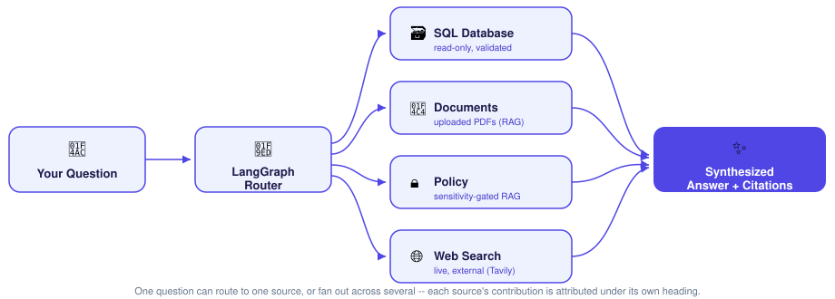
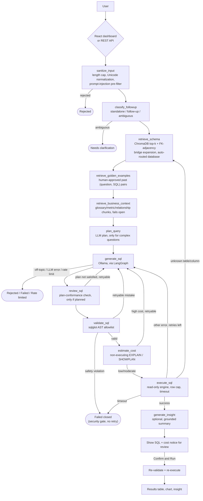

<div align="center">

<h1>Text-to-SQL Dashboard</h1>

<p><strong>Ask your own database a question in plain English — get validated, read-only SQL you review before it ever runs.</strong></p>

[User Guide](USER_GUIDE.md)&nbsp;&nbsp;&nbsp;|&nbsp;&nbsp;&nbsp;[Architecture](docs/ARCHITECTURE.md)&nbsp;&nbsp;&nbsp;|&nbsp;&nbsp;&nbsp;[API Reference](docs/API.md)&nbsp;&nbsp;&nbsp;|&nbsp;&nbsp;&nbsp;[Configuration](docs/CONFIGURATION.md)

[](LICENSE)
[](USER_GUIDE.md)
[](#-project-status)

</div>

> **Beta — security hardened.** The React dashboard (`frontend/`) is now
> the only UI this project ships; the original Streamlit app has been
> removed. See [Project status](#-project-status).

<a id="news-and-updates"></a>

## 📰 News and Updates

<!-- Newest first, sourced from real commit history. Keep no more than the three most recent entries. -->

- **2026-09-27** — Added real, provider-backed AI-guided (generative) image editing: the Edit-image modal's "AI-guided editing" panel, previously a permanent stub, now calls a real backend (`POST /attachments/{id}/ai-edit`, IMA Studio's `image_to_image` task category) — "remove the selected object," "replace the sky," and similar prompted edits produce a real, brand-new derived attachment rather than an honest-but-fixed rejection. Verified live against IMA's real infrastructure (upload succeeded; the account's own credit balance, not the code, is what's blocking a full generation right now). Since IMA has no native mask/inpainting parameter, a painted mask is conveyed as a translucent overlay plus a text instruction — disclosed to the caller via the response's `warnings`, never presented as pixel-exact. Quick-action routing keeps the two non-generative presets ("Blur the selected face," "Extract the selected table or chart") on their existing free, local/deterministic paths — neither reaches the paid endpoint. Off by default (`ENABLE_IMAGE_EDITING`); local editing, OCR, resize, and blur are unaffected either way. See [`docs/image-editing-architecture.md`](docs/image-editing-architecture.md).
- **2026-09-27** — An enterprise scalability/security assessment found and fixed six further, in-place gaps, none requiring new infrastructure: rate/concurrency limiting extended to every remaining limited route (not just `/ask`) to key on real caller identity rather than raw IP; opt-in trusted-proxy IP resolution (`security/client_ip.py`, `TRUSTED_PROXY_COUNT`, off by default) for a deployment that sits behind a real reverse proxy/load balancer; structured JSON logging (`LOG_FORMAT=json`) for real log-aggregation pipelines; a liveness/readiness split (`GET /live` alongside `GET /health`); graceful shutdown of the bounded `/ask` thread pool on `SIGTERM`; and a startup warning when configured concurrency exceeds a replica's own DB-pool capacity. See [`docs/ENTERPRISE_SCALABILITY_SECURITY_ASSESSMENT.md`](docs/ENTERPRISE_SCALABILITY_SECURITY_ASSESSMENT.md).
- **2026-09-27** — Added configurable Ollama model selection for Text-to-SQL: a caller (or the dashboard's own new "AI Model" picker in Settings) can now choose which locally-installed model answers a given question via `POST /ask`'s optional `model` field, instead of always using `OLLAMA_MODEL`. Config-driven end to end — `OLLAMA_ALLOWED_MODELS`/`OLLAMA_MODEL_SELECTION_ENABLED` (`config/settings.py`) plus a small hand-authored display-metadata catalog (`config/ollama_models.yaml`) — so adding or removing a model never requires a React or LangGraph code change. A new `GET /models` endpoint (`agent/model_registry.py`) reports every configured model's live "installed on the connected Ollama instance" status (never the online Ollama Library, which is only ever consulted as a one-time research input, not a runtime dependency); an invalid/disallowed model is rejected with HTTP 400 *before* any LLM/DB work starts. Model selection is fully request-scoped (`AgentState["selected_model"]`, mirroring the existing `selected_database` pattern) — no global mutable state, verified with a real-threading concurrency regression test proving two simultaneous requests with different models never cross-contaminate. See [`docs/CONFIGURATION.md`](docs/CONFIGURATION.md#model-selection).

<a id="example-usage"></a>

## 💻 Example Usage

The REST API (`api/`, FastAPI) is a thin wrapper over the same LangGraph
agent the React dashboard calls — `POST /ask` works standalone, with or
without the dashboard built/running:

```bash
curl -X POST http://localhost:8000/ask \
  -H "Content-Type: application/json" \
  -d '{
        "question": "What were total sales last quarter?",
        "enable_insight": true
      }'
```

Add `-H "Authorization: Bearer $API_AUTH_TOKEN"` if you've set
`API_AUTH_TOKEN` in `.env` (unset by default — see
[`docs/API.md`](docs/API.md)). The response includes the generated SQL,
result rows, retry/attempt history, and (if enabled) a grounded
plain-English insight — see `api/schemas.py::AskResponse` for the full
shape.

<a id="get-started-and-stay-tuned"></a>

## 🌟 Get Started & Stay Tuned

<div align="center">


</div>

_An animated diagram, not a screen recording — a real screenshot of the
chat + generated-SQL view is still TODO._

Ready to try it? Jump to [Getting Started](#-getting-started) below.

We're glad you're here — [star the repository](https://github.com/surajkumarnavodya/text-to-sql-agent-langgraph)
if you want to keep it on your radar, and open an
[issue](https://github.com/surajkumarnavodya/text-to-sql-agent-langgraph/issues/new/choose)
for bugs, questions, or feature ideas.

<a id="what-is-this"></a>

## 🔎 What is this?

**A Text-to-SQL dashboard connected to one or more real, user-configured
databases.** A user asks a natural-language question, a LangGraph agent
turns it into SQL against the configured database (schema retrieved via
ChromaDB, embedded from live schema introspection — not a hardcoded
sample), the SQL is validated (SELECT-only allowlist, AST-parsed with
`sqlglot`) and executed read-only, and the result is rendered as a table +
auto-picked chart. The LLM runs locally via Ollama — no network calls for
generation, no API keys required for that part. Database connectivity is
fully config-driven via `.env`; there is no hardcoded connection string,
host, or schema anywhere in the codebase.

<div align="center">



</div>

<a id="choose-your-interface"></a>

## 🧭 Choose your interface

| Interface | Status | Run it |
|---|---|---|
| **React dashboard** (`frontend/`) | The only UI this project ships — theme/accent/font/language pickers, installable as a PWA, chat history | `npm run build` in `frontend/`, then `uvicorn api.main:app` serves it at `http://localhost:8000/` |
| **REST API** (`api/`) | No UI — for scripts, notebooks, or your own frontend | `uvicorn api.main:app` → see [`docs/API.md`](docs/API.md) |

Both drive the identical `agent.graph.run_agent` (or, with multi-source
routing enabled, `agent.orchestrator.graph.run_orchestrated`) — no logic is
duplicated per interface. A Streamlit app used to ship alongside the React
dashboard; it was removed once the dashboard reached full feature parity
(history note, like the earlier bundled-DuckDB removal — see CLAUDE.md).

<a id="why-this-project"></a>

## 💡 Why this project

- **The LLM's SQL is never trusted implicitly.** `sqlglot` parses the AST
  and allowlists the statement type (`SELECT`/`UNION`/`EXCEPT`/`INTERSECT`
  only) — an explicit allowlist, not a keyword blocklist that a syntax
  variant could slip past.
- **A self-correcting retry loop, not a free-form agent.** The pipeline is
  an explicit 12-node LangGraph state machine (see the diagram below); a
  review/validation/execution failure routes back to regeneration with the
  error appended to context, capped at an adaptively-widened retry budget —
  inspectable and boundable, not implicit ReAct-style reasoning.
- **Schema-aware retrieval**, not "dump the whole schema into the prompt."
  Each table's DDL is embedded in ChromaDB; only the top-k relevant tables
  are retrieved per question, with FK-adjacency bridge expansion to pull in
  structurally-required tables plain similarity search tends to miss.
- **A golden-dataset feedback loop.** Human-approved (question, SQL) pairs,
  saved via a thumbs-up on a confirmed result, are retrieved as few-shot
  examples for similar future questions.
- **Multi-database auto-routing.** More than one database can be configured
  at once; each question is routed to whichever one's schema looks most
  relevant — no manual picker.
- **Optional multi-source agentic RAG** (off by default) — a router can fan
  a question out across the SQL pipeline, uploaded PDF documents, a
  separate sensitivity-gated policy collection, and live web search
  (Tavily), attributing each source's contribution under its own heading.
- **Optional image/video generation** (off by default) — the same router
  recognizes a request that explicitly asks to *create* new media (e.g.
  "generate an image of monthly spend by category") via IMA Studio, and
  renders the actual result inline as real media, never a bare link. A
  plain "show me the data" question is never mistaken for one. Generation
  is the one source that spends real money, so it requires an explicit
  human confirmation before anything is actually generated — the same
  "Confirm and Run" philosophy the SQL pipeline already applies, extended
  to this source.
- **Voice mode** (on by default) — press the mic, speak a question (local
  `faster-whisper` transcription, schema-aware so real table/column names
  are recognized correctly, with live word-by-word captions as you talk),
  it's submitted automatically once you stop talking, and the answer is
  read back automatically (local Piper text-to-speech) — then it resets to
  the normal composer, one question and one spoken answer per press,
  matching Google Assistant/ChatGPT's "press to talk" turn shape.
  Transcription and synthesis are fully local, same as the LLM itself — no
  cloud speech API, no data leaving the machine for either — and a typed
  question never triggers spoken output. (Live captions are the one
  disclosed exception: they use the browser's own built-in speech
  recognition, which in Chromium browsers is cloud-backed; the actual
  submitted transcript still comes from local Whisper.)
- **Optional media search** (off by default) — search a local, *untagged*
  image/video library by plain-English content description (e.g. "find the
  photo of the site inspection," "show me the clip where the crane lifts
  the beam"), routed as its own orchestrator source or usable directly via
  a standalone search page. No filenames or manual tags needed: images are
  embedded with a local CLIP model, videos are segmented at scene-change
  boundaries with each segment transcribed (local Whisper), OCR'd, and
  optionally captioned (a local Ollama vision model). Fully local by
  default, same as the LLM itself — no hosted embedding API, no cost per
  image indexed. Off by default (unlike voice mode) since it needs a real
  library folder configured and pulls in a meaningfully larger dependency
  footprint (`torch`, OpenCV).
- **Grounded insights, not free-form narration.** An optional plain-English
  summary sentence is checked against the actual result data before it's
  shown; an unsupported number is silently dropped rather than displayed as
  if verified.
- **Fully local LLM stack.** Ollama runs on your machine — no data leaves
  it for SQL generation (the opt-in exceptions are live web search and
  voice mode, both disabled by default and both fully local when voice
  mode is the one enabled).

<details>
<summary>Full agent graph (12 nodes)</summary>


```mermaid
flowchart TD
    U[User] --> ENTRY{"React dashboard<br/>or REST API"}
    ENTRY --> SI["sanitize_input<br/>length cap, Unicode normalization,<br/>prompt-injection pre-filter"]
    SI -->|rejected| STOP1(["Rejected"])
    SI --> CF["classify_followup<br/>standalone / follow-up / ambiguous"]
    CF -->|ambiguous| STOP2(["Needs clarification"])
    CF --> RS["retrieve_schema<br/>ChromaDB top-k + FK-adjacency<br/>bridge expansion, auto-routed database"]
    RS --> RGE["retrieve_golden_examples<br/>human-approved past (question, SQL) pairs"]
    RGE --> RBC["retrieve_business_context<br/>glossary/metric/relationship chunks, fails open"]
    RBC --> PQ["plan_query<br/>LLM plan, only for complex questions"]
    PQ --> GS["generate_sql<br/>Ollama, via LangGraph"]
    GS -->|off-topic / LLM error / rate limit| STOP3(["Rejected / Failed / Rate limited"])
    GS --> RV["review_sql<br/>plan-conformance check, only if planned"]
    RV -->|plan not satisfied, retryable| GS
    RV --> VS["validate_sql<br/>sqlglot AST allowlist"]
    VS -->|retryable mistake| GS
    VS -->|safety violation| STOP4(["Failed closed<br/>(security gate, no retry)"])
    VS -->|valid| CE["estimate_cost<br/>non-executing EXPLAIN / SHOWPLAN"]
    CE -->|high cost, retryable| GS
    CE -->|low/moderate| ES["execute_sql<br/>read-only engine, row cap, timeout"]
    ES -->|unknown table/column| RS
    ES -->|other error, retries left| GS
    ES -->|timeout| STOP4
    ES -->|success| GI["generate_insight<br/>optional, grounded summary"]
    GI --> REVIEW["Show SQL + cost notice for review"]
    REVIEW -->|Confirm and Run| RUN[Re-validate + re-execute]
    RUN --> RESULTS[Results table, chart, insight]
```

See [`docs/ARCHITECTURE.md`](docs/ARCHITECTURE.md) for the full per-node
walkthrough and retry-routing table.

</details>

<a id="getting-started"></a>

## 🚀 Getting Started

### Prerequisites

- **Python 3.11** (the project's target — see `pyproject.toml` /
  `.github/workflows/ci.yml`)
- **[Ollama](https://ollama.com)**, installed and running, with a model pulled:
  ```bash
  ollama pull llama3.1:8b
  ```
- **A database to connect to** — PostgreSQL, MySQL, SQL Server, or Oracle
  (see [Supported models & databases](#-supported-models--databases) below).
  No sample database is bundled.
- **Node.js + npm** (a recent LTS) — needed to build the React dashboard
  (the only UI this project ships); the REST API on its own doesn't
  require it.

### Clone, install, configure

```bash
git clone https://github.com/surajkumarnavodya/text-to-sql-agent-langgraph.git
cd text-to-sql-agent-langgraph
python -m venv .venv
source .venv/bin/activate        # Windows: .venv\Scripts\Activate.ps1
pip install --upgrade pip
pip install -r requirements.txt
cp .env.example .env             # Windows: Copy-Item .env.example .env
```

Edit `.env` with your real database connection details (every variable is
documented inline in `.env.example`) — **use a dedicated read-only database
account**, not an admin login (see [`SECURITY.md`](SECURITY.md)). Then
verify the connection and build the schema index:

```bash
python scripts/test_db_connection.py
python scripts/build_embeddings.py
```

### Business-context vector retrieval (optional, recommended)

On top of the schema index above, the agent can also retrieve business
glossary terms, metric definitions, table/column/relationship descriptions,
curated SQL examples, and documentation — see
[`docs/vector-retrieval-design.md`](docs/vector-retrieval-design.md) for
the full design. It's additive and fails open (the app works identically
with none of this ingested — see that doc's "Fallback behavior" section),
but improves context recall once ingested:

```bash
# Preview what would be ingested, without embedding or writing anything:
python -m scripts.ingest_schema --database-id default --dry-run

# Actually ingest (safe to re-run any time -- only changed chunks are
# re-embedded; see the design doc's "Ingestion strategy" section):
python -m scripts.ingest_schema --database-id default
```

(`--database-id` matches one of `Settings.databases`' names — `default`
for a plain single-database `.env`, or the name you gave it under
`DB_CONNECTIONS` for a multi-database setup.)

Sample glossary/metric/SQL-example/documentation content lives under
[`data/knowledge/`](data/knowledge/) — replace it with your own before
relying on this in production (the shipped samples are clearly labeled
demonstration content, not reviewed business documentation).

If you ever need to fully rebuild a database's business-context index
(e.g. after changing `RETRIEVAL_SIMILARITY_METRIC`, which — like the
schema-DDL collection above — is fixed at collection-creation time):

```bash
python -m scripts.rebuild_index --database-id default
```

### User accounts, universal chat history & password policy (optional)

Set `LOCAL_AUTH_ENABLED=true` (plus `AUTH_DATABASE_URL`, a dedicated
PostgreSQL database, and `JWT_SECRET_KEY` — see `.env.example`) to enable
this app's own self-hosted accounts. See
[`docs/AUTHENTICATION.md`](docs/AUTHENTICATION.md) for the full picture;
this section covers only what's new in this pass:

- **Display name is mandatory at sign-up** and **passwords must clear a
  real strength policy** (12+ characters, no common/patterned passwords,
  nothing containing your email/name) — see
  [`docs/authentication-and-password-policy.md`](docs/authentication-and-password-policy.md).
- **Chat history is server-side and universal**: once signed in with a
  local account, every conversation is stored in the identity database and
  follows you across browsers and devices — logging out, a session
  expiring, or an app restart never deletes it. See
  [`docs/chat-history-architecture.md`](docs/chat-history-architecture.md)
  and [`docs/chat-history-search.md`](docs/chat-history-search.md).

Run the identity database's migrations before first use (or after pulling
an update that touches `identity/models.py`):

```bash
alembic -c identity/alembic.ini upgrade head
```

### Run it

**Build and serve the React dashboard (recommended):**
```bash
cd frontend && npm install && npm run build && cd ..
uvicorn api.main:app --host 0.0.0.0 --port 8000
```
Open `http://localhost:8000/` — the same FastAPI process serves both the
API and the dashboard's built static files (see `api/main.py`'s
`StaticFiles` mount).

**Frontend hot-reload during active frontend development:** run the API
as above in one terminal, then in a second terminal:
```bash
cd frontend && npm run dev
```
Open `http://localhost:5173/` — Vite proxies `/ask`, `/execute`,
`/documents`, `/schema`, `/feedback`, `/health`, `/media`, `/generate`,
`/voice`, and `/search` to the API on port 8000 (see
`frontend/vite.config.ts`), so no CORS setup is needed either way.

**REST API only** (no UI): `uvicorn api.main:app --host 0.0.0.0 --port 8000` —
see [`docs/API.md`](docs/API.md).

### Tests and linters

```bash
pytest
ruff check . && black --check . && mypy .
```

PowerShell equivalents are in `tasks.ps1` (`.\tasks.ps1 run`,
`.\tasks.ps1 test`, `.\tasks.ps1 lint`); Make targets for bash are in the
`Makefile`. CI (`.github/workflows/ci.yml`) runs the same lint + test steps
on GitHub Actions.

**Frontend tests** (`frontend/`, vitest + React Testing Library — added
alongside the UI overhaul below, previously no test runner existed):

```bash
cd frontend
npm run test        # vitest run -- one-shot
npm run test:watch  # vitest -- watch mode
npm run lint         # oxlint
npm run build        # tsc -b && vite build (also the typecheck)
```

### Frontend UI

The React dashboard has a persistent left sidebar (conversation history +
search, replacing an earlier combined history/settings drawer — see
[`docs/ui-design-system.md`](docs/ui-design-system.md) and
[`docs/chat-history-ui.md`](docs/chat-history-ui.md)), collapsible on
desktop to a narrow icon rail via the header's sidebar toggle (the
collapsed/expanded preference persists across sessions, `localStorage`
only, never chat content), a single consolidated account menu (avatar,
top-right — display name/email, Settings, Theme, Sign out; previously
duplicated as two independent copies of Settings and Sign out, see
[`docs/ui-production-audit.md`](docs/ui-production-audit.md) and
[`docs/navigation-and-actions.md`](docs/navigation-and-actions.md) for the
one-owner-per-action rule that replaced it), a Stop button that genuinely
cancels an in-flight question (`AbortController`, no fake token stream),
and an optional attachment (image, PDF, DOCX, XLSX, PPTX, TXT, MD, CSV,
JSON) + local image editor (crop/draw/annotate/undo-redo) in the composer.
Attachments are real, not local-only: each one is uploaded, validated,
malware-scanned (if configured), and processed server-side, and the model
genuinely sees its content — a vision model's description or an OCR
fallback for images, extracted text for documents — via a dedicated
LangGraph subgraph (see "Known limitations" below and `CLAUDE.md`'s "Chat
attachments" section). The image editor's own "AI-guided editing" panel
(natural-language-prompted generative edits — "remove the selected
object," "replace the sky") is also real, provider-backed editing now
(IMA Studio, off by default via `ENABLE_IMAGE_EDITING`), not a stub — see
[`docs/image-editing-architecture.md`](docs/image-editing-architecture.md)
for the full design, the mask-conveyance approach IMA's lack of a native
mask parameter required, and disclosed limitations.

### Running with Docker

```bash
cp .env.example .env   # then edit .env as above
docker compose build
docker compose up -d
docker compose exec api python scripts/build_embeddings.py
docker compose exec api python -m scripts.ingest_schema --database-id default   # optional, see below
```

This builds the React dashboard (a Node build stage) and bakes it into the
same image as the API (a Python stage) — one container, serving both the
REST API and the dashboard at `http://localhost:8000`. See
[`docs/DEPLOYMENT.md`](docs/DEPLOYMENT.md) for external Ollama/database
connectivity and reverse-proxy placement.

<a id="explore-the-documentation"></a>

## 📚 Explore the documentation

| Goal | Start here |
|---|---|
| Just use the app | [`USER_GUIDE.md`](USER_GUIDE.md) |
| Understand the LangGraph node design and retry logic | [`docs/ARCHITECTURE.md`](docs/ARCHITECTURE.md) |
| Understand business-context vector retrieval (glossary/metrics/SQL examples) | [`docs/vector-retrieval-design.md`](docs/vector-retrieval-design.md) |
| Evaluate retrieval quality | [`docs/retrieval-evaluation.md`](docs/retrieval-evaluation.md) |
| Turn on document RAG, policy RAG, or web search | [`docs/MULTI_SOURCE_GUIDE.md`](docs/MULTI_SOURCE_GUIDE.md) |
| Look up REST API endpoints and auth | [`docs/API.md`](docs/API.md) |
| Find every `.env` variable | [`docs/CONFIGURATION.md`](docs/CONFIGURATION.md) |
| Deploy with Docker / an external DB or Ollama | [`docs/DEPLOYMENT.md`](docs/DEPLOYMENT.md) |
| See the latest measured benchmark accuracy | [`docs/EVALUATION.md`](docs/EVALUATION.md) |
| Diagnose a common failure mode | [`docs/TROUBLESHOOTING.md`](docs/TROUBLESHOOTING.md) |
| Understand this project's security posture | [`SECURITY.md`](SECURITY.md) |
| Set up OIDC login and RBAC roles | [`docs/AUTHENTICATION.md`](docs/AUTHENTICATION.md), [`docs/AUTHORIZATION.md`](docs/AUTHORIZATION.md) |
| Understand universal server-side chat history | [`docs/chat-history-architecture.md`](docs/chat-history-architecture.md), [`docs/chat-history-search.md`](docs/chat-history-search.md) |
| Understand the display-name/password-strength requirements | [`docs/authentication-and-password-policy.md`](docs/authentication-and-password-policy.md) |
| See what the chat-history feature replaced and why | [`docs/chat-history-authentication-audit.md`](docs/chat-history-authentication-audit.md) |
| Understand the frontend's design tokens (colors, spacing, motion, theming) | [`docs/ui-design-system.md`](docs/ui-design-system.md) |
| Understand the sidebar/history/search UI (not the backend behind it) | [`docs/chat-history-ui.md`](docs/chat-history-ui.md) |
| See which UI action lives where (Settings, Theme, Logout, sidebar collapse, ...) and why | [`docs/navigation-and-actions.md`](docs/navigation-and-actions.md) |
| See the duplicated controls a later UI pass found and removed (two settings dialogs, two logout buttons, no sidebar collapse) | [`docs/ui-production-audit.md`](docs/ui-production-audit.md) |
| Understand the local Konva image editor, including real AI-guided (generative) editing via IMA Studio | [`docs/image-editing-architecture.md`](docs/image-editing-architecture.md) |
| See the full frontend audit this UI pass started from | [`docs/frontend-ui-audit.md`](docs/frontend-ui-audit.md) |
| See the live, browser-verified root-cause investigation of reported Settings/search/New-Chat/image-attachment issues | [`docs/functional-ui-audit.md`](docs/functional-ui-audit.md) |
| Understand exactly how the Settings modal's overlay/focus/keyboard behavior works | [`docs/settings-modal.md`](docs/settings-modal.md) |
| Understand the New Chat lazy-persistence flow and its duplicate-creation safeguards | [`docs/new-chat-flow.md`](docs/new-chat-flow.md) |
| See the historical record of the image-attachment gap this project closed (superseded — see `CLAUDE.md`'s "Chat attachments" section for the current pipeline) | [`docs/image-attachment-flow.md`](docs/image-attachment-flow.md) |
| See a point-in-time production-UI checklist and what it found | [`docs/production-ui-checklist.md`](docs/production-ui-checklist.md) |
| Understand the root cause of the dark-mode Settings-modal transparency bug and its fix | [`docs/settings-modal-visual-bug.md`](docs/settings-modal-visual-bug.md) |
| Understand the generic Tool/MCP abstraction (`agent/tools/`) — what it wraps, why the orchestrator doesn't call it yet | [`docs/TOOLS.md`](docs/TOOLS.md) |
| See the full platform-transformation discovery/assessment/roadmap this and other recent passes were scoped from | [`docs/PLATFORM_TRANSFORMATION_ASSESSMENT.md`](docs/PLATFORM_TRANSFORMATION_ASSESSMENT.md), [`docs/DEEP_FEATURE_PERFORMANCE_ASSESSMENT.md`](docs/DEEP_FEATURE_PERFORMANCE_ASSESSMENT.md) |
| See the live performance-metrics rollup (`GET /metrics/performance`) | [`docs/API.md`](docs/API.md) |
| Check production readiness before deploying | [`docs/PRODUCTION_CHECKLIST.md`](docs/PRODUCTION_CHECKLIST.md), [`docs/PRODUCTION_READINESS_REPORT.md`](docs/PRODUCTION_READINESS_REPORT.md) |
| Governance, compliance, responsible-AI, risk tracking | [`docs/GOVERNANCE.md`](docs/GOVERNANCE.md), [`docs/COMPLIANCE.md`](docs/COMPLIANCE.md), [`docs/RESPONSIBLE_AI.md`](docs/RESPONSIBLE_AI.md), [`docs/RISK_REGISTER.md`](docs/RISK_REGISTER.md) |
| Contribute a change or an eval case | [`CONTRIBUTING.md`](CONTRIBUTING.md) |

<a id="supported-models-and-databases"></a>

## 🧩 Supported models & databases

Ollama is the only supported LLM runtime — there is no hosted-API code
path. Any `ollama pull`-able model works; `OLLAMA_MODEL` is a plain config
string (`config/settings.py`), not hardcoded:

| Model | Notes |
|---|---|
| `llama3.1:8b` (default) | What this project is built and benchmarked against — see [`docs/EVALUATION.md`](docs/EVALUATION.md) for measured accuracy. |
| `sqlcoder`, `duckdb-nsql`, or any other Ollama-hosted model | Supported by the same config knob; untested by this project's own benchmark as of this writing. |

**Per-question model selection**: a caller (or the dashboard's own "AI
Model" picker, in Settings) can choose a different Ollama model per
question via `POST /ask`'s optional `model` field, without touching
`OLLAMA_MODEL`/any code — validated server-side against
`OLLAMA_ALLOWED_MODELS` (a small, practical starter set out of the box:
`qwen2.5:7b`, `qwen2.5:14b`, `llama3.2:3b`, `mistral:7b`, `deepseek-r1:8b`,
alongside the configured default) and cross-checked live against what's
actually `ollama pull`ed on the connected server via `GET /models`. See
[`docs/CONFIGURATION.md`](docs/CONFIGURATION.md#model-selection) for the
full design (why the online Ollama Library is never a runtime dependency,
how to add/remove a model, request-scoping guarantees).

| `DB_TYPE` | Driver | Notes |
|---|---|---|
| `postgresql` | `psycopg2-binary` | |
| `mysql` | `pymysql` | |
| `mssql` | `pyodbc` | Requires the Microsoft ODBC Driver for SQL Server installed as a system package — see [`docs/TROUBLESHOOTING.md`](docs/TROUBLESHOOTING.md). |
| `oracle` | `oracledb` (thin mode) | No separate Oracle Client install needed. |

Selected via `DB_TYPE` in `.env` (single database) or `DB_CONNECTIONS=name1,name2,...`
(multiple, auto-routed per question — see [`docs/CONFIGURATION.md`](docs/CONFIGURATION.md)).
Source of truth: `db/connection.py::SUPPORTED_DB_TYPES`.

<a id="get-help-and-file-an-issue"></a>

## 🛟 Get help and file an issue

Use the [issue chooser](https://github.com/surajkumarnavodya/text-to-sql-agent-langgraph/issues/new/choose)
(bug report / feature request templates under `.github/ISSUE_TEMPLATE/`)
for usage questions, reproducible bugs, and feature requests.

Follow [`SECURITY.md`](SECURITY.md) to report a suspected security
vulnerability rather than filing a public issue.

<a id="project-status"></a>

## 🧪 Project status

This project is **beta — security hardened**. The React dashboard is now
the only UI — a previous Streamlit app was removed once the dashboard
reached full feature parity with it. Three completed security review
passes (referenced throughout this codebase as "2026 Phase 1/2/3") have
covered authentication (OIDC + this app's own self-hosted accounts),
RBAC, the AST-based SQL validator, content moderation, audit logging,
security headers/CSP, and SSRF/CORS hardening — see
[`SECURITY_FINAL_REPORT.md`](SECURITY_FINAL_REPORT.md),
[`SECURITY_BASELINE.md`](SECURITY_BASELINE.md), and
[`SECURITY_CHANGELOG.md`](SECURITY_CHANGELOG.md) for the full, cited audit
trail, and [`SECURITY_PRODUCTION_CHECKLIST.md`](SECURITY_PRODUCTION_CHECKLIST.md)
for what still needs operator action before a production deployment.

**A later engagement went further** ([`docs/security/`](docs/security/),
distinct from the repo-root `SECURITY_*.md` files above): CI's
security gates (SAST, dependency scanning, secret scanning) are now
blocking, not just report-only; a `MalwareScanner` abstraction was added
(opt-in, fail-closed once configured — see
[`docs/security/FINAL_PRODUCTION_GATE.md`](docs/security/FINAL_PRODUCTION_GATE.md));
and a first production-readiness gate was run end-to-end. **Its verdict
is `NOT READY`** — not because a vulnerability was found (the tested
security architecture — auth, RBAC, SQL validation, SSRF, IDOR — holds up
well), but because three things this project has never had the
infrastructure to verify remain open: the frontend OIDC flow still hasn't
been exercised against a live identity provider, DAST has never been run
against this app at all, and the malware scanner above has never been
tested against a real scanner daemon. See
[`docs/security/PRODUCTION_SECURITY_READINESS_REPORT.md`](docs/security/PRODUCTION_SECURITY_READINESS_REPORT.md)
for the full, current, evidence-cited answer to "is this production
ready" — it supersedes this section and the checklist linked above where
they differ. See [Known limitations](#known-limitations) below for the
honest current state of answer accuracy — that has not changed as part of
any of this security work and remains a separate, equally real gap.

<a id="known-limitations"></a>

## ⚠️ Known limitations

- **Accuracy depends heavily on the local model.** The latest full
  benchmark run (`docs/EVALUATION.md`, 57 cases, `llama3.1:8b` against
  AdventureWorksDW2025) measured **92.3% execution accuracy** (the SQL
  runs) but only **29.6% result-set accuracy** and **35.0% final
  accuracy** — the SQL often runs successfully but returns the wrong
  answer, especially on hard/real-world questions (25% pass rate on each).
  Security-rejection accuracy is 100%.
- **Local-dev oriented; not yet multi-tenant.** A 2026-09-26 hardening
  pass (see the News entry above and
  [`docs/SCALE_OUT_PROMPT.md`](docs/SCALE_OUT_PROMPT.md)) added real
  bounded concurrency/admission control for `/ask` and fixed a genuine
  cross-user isolation gap in attachment ownership, with a measured
  baseline in [`docs/SCALE_BASELINE.md`](docs/SCALE_BASELINE.md) — but
  rate limiting, the schema-embedding index, and the compiled-graph/Ollama
  singletons are all still per-process (no multi-replica story yet), and
  there's no tenant isolation model. See [`SECURITY.md`](SECURITY.md) and
  [`docs/PRODUCTION_CHECKLIST.md`](docs/PRODUCTION_CHECKLIST.md) before
  pointing it at anything sensitive or multi-tenant.
- **Document/policy RAG requires SQL Server 2025+ or Azure SQL**
  specifically (native `VECTOR` column type), separate from the four
  `DB_TYPE`s the core SQL pipeline supports.
- **Image/video generation (`ENABLE_MEDIA_GENERATION`, off by default)
  uses real, metered IMA Studio credits when enabled.** Image generation is
  confirmed working end-to-end against a live account; video generation
  shares the same code path but hasn't been separately confirmed with a
  live call yet.
- **Voice mode (`ENABLE_VOICE_MODE`, on by default) needs a one-time
  Piper voice download** (`python scripts/download_voice_model.py`) before
  spoken answers work — `POST /voice/synthesize` returns a clean error
  until that's done. Transcription accuracy depends on the Whisper model
  size (`STT_MODEL_SIZE`, default `base`) and your microphone/environment,
  same caveats as any local speech-to-text setup. Live captions use the
  browser's own speech recognition, so they need a Chromium-based browser
  and, in that browser, are not fully local (see `CLAUDE.md`'s "Voice
  mode" section).
- **Chat attachments (images, PDF, DOCX, XLSX, PPTX, TXT, MD, CSV, JSON) are
  real, not frontend-only** — `POST /attachments/upload` validates,
  malware-scans (if configured), stores, and processes each file, and
  `POST /ask`'s `attachment_ids` gives the model actual access to them via
  a dedicated LangGraph subgraph (see `CLAUDE.md`'s "Chat attachments"
  section). **Describing an image's visual content requires a vision-
  capable Ollama model** (`MEDIA_VISION_MODEL`, e.g. `llava` — blank by
  default); with no vision model configured, an attached image still isn't
  silently ignored — it falls back to OCR'ing any on-screen text (Tesseract)
  and `GET /attachments/capabilities`/`GET /health` report whether a
  configured vision model was actually found on the Ollama server, so a
  misconfiguration is visible rather than a silent quality drop. Three
  explicit, deterministic image actions also exist independent of any
  model — `POST /attachments/{id}/extract-text|resize|remove-text` — the
  last being classical (OpenCV inpainting) region-based text removal, not
  a generative edit. Security hardening around this pipeline (zip
  decompression-bomb guard, PDF preflight, a bounded per-file processing
  timeout, and prompt-injection pattern detection on extracted text) is
  documented in `SECURITY.md`'s "Chat attachments — security controls"
  section. A question that only concerns an attached file (e.g. "summarize
  this file") is routed directly to the attachment pipeline rather than
  being treated as a database question. The image editor's "AI-guided
  editing" panel (prompt field, preset buttons) now calls a real
  generative provider (IMA Studio, off by default via
  `ENABLE_IMAGE_EDITING`) rather than always rejecting — the provider has
  no native mask parameter, so a painted mask is conveyed as a translucent
  overlay plus a text instruction, disclosed via the response's own
  `warnings` rather than presented as pixel-exact — see
  [`docs/image-editing-architecture.md`](docs/image-editing-architecture.md)
  for the full design and every other disclosed limitation.
- **Media search (`ENABLE_MEDIA_SEARCH`, off by default) adds a real,
  meaningfully larger dependency footprint** — `torch` (via
  `sentence-transformers`, for local CLIP embeddings) and `opencv-python`
  (via `PySceneDetect`, for video scene detection), unlike every other
  optional feature here. OCR needs the system Tesseract binary installed
  separately (not pip-installable — see `CLAUDE.md`'s Windows-specific
  notes); captioning needs a one-time `ollama pull <vision-model>`. A full
  video clip is never streamed back — only a representative frame +
  timestamp range. No dense-captioning quality tuning has been done
  across different Ollama vision models.

<a id="contributing"></a>

## 🤝 Contributing

- Read [`CONTRIBUTING.md`](CONTRIBUTING.md) before proposing a change —
  dev setup, coding standards, and how to add an evaluation case.
- Licensed under the terms in [`LICENSE`](LICENSE) (MIT).
