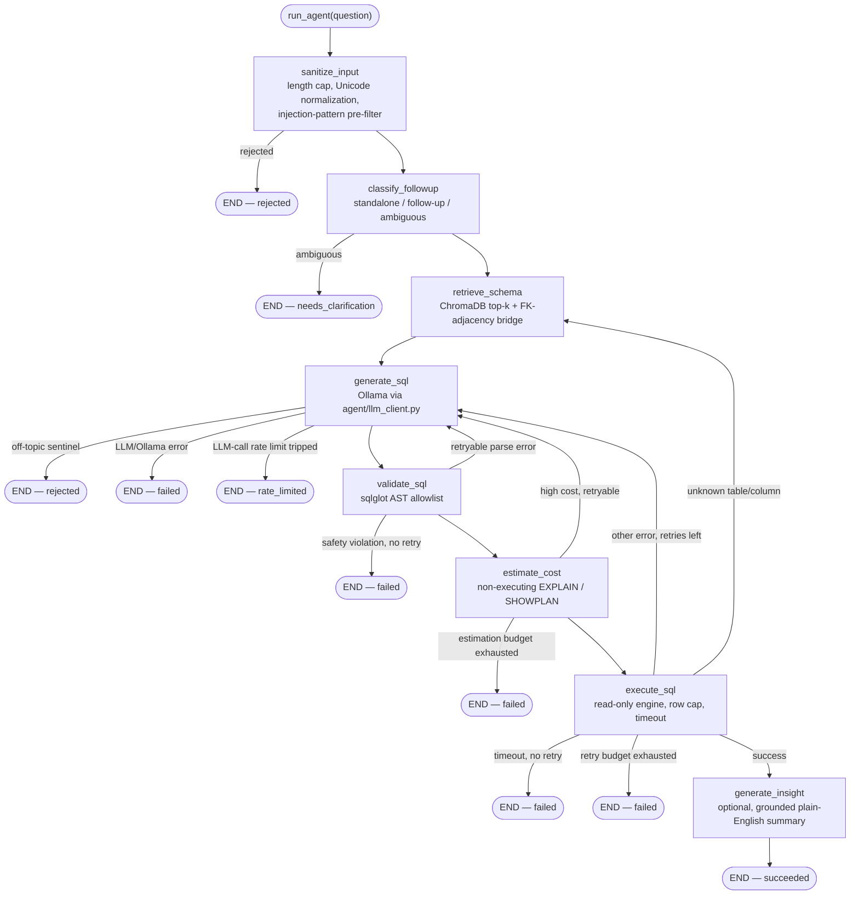

# Architecture

This is the detailed technical walkthrough — the README's diagram is the
30-second version. This document covers three things: the LangGraph node
design, the retry/self-correction logic, and the schema-retrieval pipeline.

Two interfaces sit on top of everything described here: `ui/app.py`
(Streamlit, the primary surface) and `api/main.py` (a thin FastAPI wrapper
added for programmatic access — see [`docs/API.md`](API.md)). Both call
the exact same `agent.graph.run_agent` entry point below — the graph
design, not either interface, is the architectural core.

## 1. The LangGraph state machine

The agent is a small, explicit `StateGraph` (`agent/graph.py`), not a
free-form ReAct-style agent. That's a deliberate choice: every possible
transition is a named edge in a fixed graph, so the retry/error-feedback
path is something you can read off the graph definition, not something
that emerges from a model's own planning. The graph has **eight nodes**,
not just the four covering the "happy path" of retrieval → generation →
validation → execution — the full picture, straight from
`agent/graph.py::build_graph()`:



Three failure shapes go straight to `END (failed)`/`END (rejected)` and
never loop back at all: a validator **safety violation** (non-SELECT,
stacked query, `SELECT ... INTO`, an embedded write inside a CTE, a
dangerous function call), a `generate_sql` **LLM/Ollama error**, and a
query **timeout**. All three are deliberate "don't retry" decisions — see
§2. `needs_clarification` (an ambiguous follow-up) and `rate_limited` (the
process-wide LLM-call limiter tripped) are likewise terminal, but aren't
failures in the same sense — they're clean, expected stops, not errors.

State is threaded through every node as an `AgentState` TypedDict
(`agent/state.py`, `total=False` — each node only sets the fields it owns).
Every node function has the same shape: take the current state, return a
**partial** dict of updates; LangGraph merges those into the running state.
`error_history` and `attempt_history` use an `operator.add` reducer, so
each node's contribution *appends* rather than overwrites — this is what
lets `generate_sql` see the full trail of prior failures on a retry, and
what lets the UI render a complete "Attempt 1: ..., Attempt 2: ..." timeline
instead of just the latest attempt.

### The eight nodes

**`sanitize_input_node`** — the graph's true entry point, before anything
else (including follow-up classification) touches the question. Runs
`agent.input_guard.check_input`: a length cap (`MAX_QUESTION_LENGTH`),
Unicode normalization (NFKC plus an explicit confusables-folding step that
closes a homoglyph-substitution gap plain NFKC alone leaves open — see
`security/sanitization.py`), a regex pre-filter for common prompt-injection
phrasings, and an off-topic/gibberish check. On rejection, `status`
becomes `"rejected"` and the graph ends immediately with a standardized,
non-technical message — never the raw reason or which pattern matched, so
a rejection gives an attacker no signal to iterate against.

**`classify_followup_node`** — a cheap, regex-only heuristic
(`agent.followup.classify_followup`) deciding whether the (already
sanitized) question is standalone, a follow-up to the most recent prior
exchange, or ambiguous — before any schema retrieval or LLM call. On
`"ambiguous"`, the graph ends immediately with `status="needs_clarification"`
rather than guessing.

**`retrieve_schema_node`** — embeds the question, retrieves the top-k most
relevant tables from ChromaDB, expands that set with FK-adjacency bridge
tables (§3), overlays the current `config/table_descriptions.yaml` content
on each table's DDL, and concatenates the result into
`schema_context_text`. This is also the re-entry point on a
`missing_reference` execution failure — see §2.

**`generate_sql_node`** — checks the process-wide LLM-call rate limiter
(`agent.rate_limit.get_llm_call_limiter`) before every attempt, including
retries; a denial ends the run immediately at `status="rate_limited"`,
never retried (see `agent/rate_limit.py`'s docstring for why the retry
loop specifically needs its own, stricter limit, separate from the
question-submission limiter the UI enforces per session). Otherwise calls
Ollama (`agent/llm_client.py`) with the schema context and, on a retry,
the previous SQL plus the specific error that came back (with a
category-specific hint — e.g. "you referenced a column that doesn't
exist, use only what's shown in the schema"). Returns raw SQL text, not
yet validated. The system prompt also instructs the model to refuse (via
a fixed sentinel) if a question isn't answerable as SQL — a second,
independent off-topic backstop for anything `sanitize_input_node`'s
cheaper regex pre-filter missed, which this node turns into the same
`"rejected"` terminal state.

**`validate_sql_node`** — runs the candidate through
`agent/sql_validator.py`'s allowlist (§ below) in the dialect matching
`DB_TYPE`. A safety violation fails closed immediately. An ordinary parse
mistake increments `retry_count` and routes back to `generate_sql` if
budget remains. A pass gets a `LIMIT` clause applied
(`enforce_row_limit`) and moves to `estimate_cost`.

**`estimate_query_cost_node`** — runs a non-executing `EXPLAIN`/`SHOWPLAN`
estimate on the validated SQL (`db/query_cost.py`) — an earlier, additional
layer in front of `execute_sql`'s existing timeout, not a replacement for
it. Always fails open: any estimation problem (unsupported dialect,
timeout, driver error) is logged and treated exactly like "low cost,
proceed." **Low** severity (or estimation unavailable) proceeds silently;
**moderate** proceeds but sets `cost_notice` so the UI can show a
"this may take a moment" caption before execution; **high** does not
execute at all — treated exactly like any other retryable correctness
mistake, sharing the same `max_retries` budget as a parse error, so the
model gets a chance to add a filter on its own before the agent gives up.

**`execute_sql_node`** — runs the validated SQL against a read-only engine
with a row cap and timeout (§ "Execution safety" below), classifies any
failure (`agent/error_classification.py`) into `TIMEOUT` /
`MISSING_REFERENCE` / `SYNTAX` / `UNKNOWN`, and routes accordingly (§2). On
success, results and row count go into state and the graph proceeds to
`generate_insight`.

**`generate_insight_node`** — only reachable from `execute_sql_node`'s
*success* path; a failed, needs-clarification, or rejected run never
generates one. Generates a short, plain-English sentence about the result
(`agent/insight.py::summarize_result`) — skipped entirely (no LLM call)
when the UI's insight toggle is off, or when the result is empty or a
single-cell value that a sentence would just restate. Before it's ever
shown, the generated text is checked by
`agent.insight.is_insight_grounded`: every number in the sentence must be
traceable to the actual result data (a derived stat like a sum/min/max/
top-value share, or a literal value from the question/SQL itself, e.g. a
filter year) within a small rounding tolerance. An insight that fails this
check is **dropped and never shown** — this is a real, tested hallucination
guard (`tests/test_insight.py`), not just a prompt instruction; nothing
here can alter the already-final `sql`/`result_rows`/`row_count`.

## 2. Retry / self-correction semantics

Not every failure is treated the same way — the routing logic
(`route_after_sanitization`, `route_after_classification`,
`route_after_generation`, `route_after_validation`,
`route_after_cost_estimate`, `route_after_execution` in `agent/nodes.py`)
distinguishes failures by *what kind of mistake it was*, because "try
again" isn't equally useful for all of them:

| Failure category | Retries? | Where it routes | Why |
|---|---|---|---|
| Input rejected (`sanitize_input`: too long, empty, injection-pattern match, off-topic) | **Never** | `END (rejected)` | Not a mistake to coach through — the input itself is the problem. |
| Follow-up classification ambiguous | **Never** | `END (needs_clarification)` | Fail-closed on "I don't know what you're asking" rather than guessing and possibly answering the wrong question. |
| Parse error / ordinary validation failure | Yes, up to `MAX_RETRIES` | `generate_sql` | An ordinary correctness mistake — the model has the right context, just wrote bad SQL. |
| Safety violation (non-SELECT, stacked query, `SELECT ... INTO`, embedded write, dangerous function) | **Never** | `END (failed)` | A security-gate failure, not a mistake worth coaching through — the agent fails closed immediately regardless of remaining budget. |
| `generate_sql` off-topic sentinel | **Never** | `END (rejected)` | The model itself judged the question unanswerable as SQL — a defense-in-depth backstop for `sanitize_input`'s pre-filter, not a correctness mistake. |
| `generate_sql` LLM/Ollama error | **Never** | `END (failed)` | The LLM call itself never returned usable text — retrying the same call is unlikely to help within this run. |
| LLM-call rate limit tripped | **Never** | `END (rate_limited)` | A load-shedding stop, not a correctness issue — retrying immediately would just re-trip the same limiter. |
| Query cost estimate: **high** severity | Yes, up to `MAX_RETRIES` | `generate_sql` | Treated exactly like a correctness mistake — the model may be able to add a filter on its own. |
| Execution error, category `SYNTAX`/`UNKNOWN` | Yes, up to `MAX_RETRIES` | `generate_sql` | Schema context was fine; the SQL text wasn't. Same retry shape as a validation failure. |
| Execution error, category `MISSING_REFERENCE` | Yes, up to `MAX_RETRIES` | **`retrieve_schema`**, not `generate_sql` | If the SQL referenced a table/column that doesn't exist, the *wrong tables may have been retrieved* in the first place — re-running generation with the same (possibly wrong) schema context would likely repeat the mistake. This re-entry also folds the DB error text into the retrieval query and widens `top_k` (`settings.schema_top_k + 2`), since the error usually names the missing identifier — a genuinely useful extra signal for similarity search. |
| Execution error, category `TIMEOUT` | **Never** | `END (failed)` | Retrying an expensive query with the same shape wastes the whole retry budget on something a retry can't fix. The failure message suggests narrowing the question instead. |

`retry_count` is incremented in `validate_sql_node`/`estimate_query_cost_node`/
`execute_sql_node` themselves (not in the routing functions), so "retry
vs. give up" is decided from a single, freshly-incremented count rather
than multiple places disagreeing about how many attempts have happened.

Every attempt — successful or not — gets exactly one `AttemptRecord`
appended to `attempt_history`: `{attempt, sql, outcome, error, will_retry}`.
This is what the UI's "Retry timeline" expander renders directly, and
what makes the self-correction loop demoable rather than just something
that happens in a log file.

### Execution safety

`execute_sql_node` calls `db.execution.execute_readonly_sql`, which runs SQL
on a background thread (`_execute_with_timeout`) and force-closes the
connection from the calling thread if it's still running past
`QUERY_TIMEOUT_SECONDS` — SQLAlchemy has
no universal cross-dialect "cancel this query" call, so closing the socket
out from under an in-flight query is the mechanism that works identically
across all four supported engines. A cheap session-level `SET` statement
timeout is also applied first where the dialect supports one
(Postgres/MySQL) as a driver-level belt-and-suspenders layer.

The row cap (`MAX_RESULT_ROWS`) is enforced two independent ways: a
`LIMIT` clause added to the SQL text itself (`enforce_row_limit`, via
`sqlglot`), *and* a `fetchmany(max_result_rows)` at the cursor level — so a
malformed or dialect-mistranslated query that lacks a working `LIMIT`
still can't pull an unbounded result set into memory.

## 3. Schema-retrieval pipeline

The core problem this pipeline solves: a real production schema can have
hundreds of tables, and dumping all of them into the prompt burns context
and increases hallucinated joins against irrelevant tables. So the LLM
only ever sees a small, targeted slice of the schema — but a slice that's
*complete enough* to answer the question, which is the harder half of the
problem.

```
introspect_schema()          -- live SQLAlchemy Inspector, metadata only
        |
value_sampling.attach_sample_values()  -- real DISTINCT values for
        |                                  qualifying low-cardinality
        |                                  string columns (see below)
        v
embeddings.schema_indexer.build_index()  -- one Chroma chunk per table,
        |                                    DDL + sampled values only
        |                                    (NOT table_descriptions --
        |                                    see below)
        v
   [ChromaDB persisted index]
        |
        | (per question, in agent.nodes.retrieve_schema_node)
        v
embeddings.retriever.retrieve_relevant_schema()
   1. top-k similarity search
   2. _expand_with_fk_bridges() -- FK-adjacency bridge expansion
        |
        v
config.table_descriptions.apply_table_description()  -- fresh from disk,
        |                                                every question
        v
   schema_context_text  -->  generate_sql_node's prompt
```

### Live introspection, not a hardcoded schema

`db/schema_introspection.py` is the sole source of truth for schema shape.
`introspect_schema()` uses SQLAlchemy's `Inspector` to pull real
tables/columns/types/FKs and synthesizes a compact `CREATE TABLE`-style DDL
string per table — chosen because that format is what most SQL-generation
models are tuned on. This function is deliberately metadata-only (no data
queries), which matters for both cost (catalog queries are cheap; data
queries on a large fact table are not) and scope (it should be safe to run
against any configured database without needing data-read intent).

### Value sampling: fixing "the column name lied to me"

A column like `DimProduct.ProductLine` looks, from its name and type
alone, like it could hold almost anything. It actually holds short codes
(`M`/`R`/`S`/`T`) — nothing like a business term such as "Bikes". Left
alone, a model will sometimes filter on the column whose *name* sounds
right rather than the one whose *values* actually match.

`db/value_sampling.py` is a separate module from `schema_introspection.py`
on purpose — introspection's docstring promises it never touches table
data, and value sampling is the one place that intentionally does, scoped
tightly:

- Only string-family columns (`VARCHAR`/`CHAR`/`NVARCHAR`/`NCHAR`).
- Never a primary key or a column that's part of a foreign key (those are
  join plumbing, not descriptive values).
- Declared length capped (skip large free-text columns).
- Actual distinct-value count capped at 20 — a column with more distinct
  values than that either isn't a "code" column, or is high-cardinality
  enough to plausibly be PII (names, emails). This cap is what makes the
  mechanism privacy-safe *by construction*: real PII columns are
  high-cardinality by nature and never pass it, without needing a
  column-name denylist.

Qualifying columns get their real values rendered directly into the DDL
comment (`-- e.g. 'M', 'R', 'S', 'T'`), and the generation prompt
(`agent/llm_client.py`) has a standing rule telling the model to only
filter a column on a literal value if it actually appears in that
column's sample list — and if it doesn't, to look for a different column
(often in a related table) instead.

### FK-adjacency bridge expansion: fixing "the connector table didn't score well"

Pure text-similarity retrieval has a systematic blind spot: a fact table
(mostly numeric columns — `SalesAmount`, `OrderQuantity`) embeds weakly
against a question like "which territory had the highest sales," even
though it's the one table that structurally connects "territory" to
"sales" at all. The same blind spot hits intermediate dimensions in a
multi-level hierarchy (e.g. `DimProduct` sitting between a fact table and
`DimProductSubcategory`/`DimProductCategory`).

Left alone, the model doesn't fail loudly here — it invents a plausible-
looking but nonexistent shortcut (a direct column, or a join on two
unrelated surrogate keys that happen to be small integers) to route around
the table it was never shown.

`embeddings/retriever.py::_expand_with_fk_bridges` fixes this generically,
without knowing anything about *which* tables matter for *which*
questions: at index-build time, each table's FK targets are stored in
Chroma's metadata (`schema_indexer.py`). At retrieval time:

1. Treat the retrieved tables as nodes in the full FK graph, and find the
   **connected components** of the subgraph they induce (edges only
   between two retrieved tables). If retrieval came back as one connected
   island, there's nothing to bridge.
2. If there's more than one island, find the **shortest real path** (BFS
   over the *full* schema graph, not just retrieved tables) between the two
   closest islands, and add that path's intermediate tables.
3. Recompute components and repeat until everything is one island, a
   connecting path would need more than `_MAX_BRIDGE_PATH_HOPS`
   intermediate tables (treated as "genuinely unrelated," not force-
   connected), or the total bridge budget (`_MAX_BRIDGE_TABLES`) runs out.

This directly handles **two or more consecutive** missing hops — e.g. both
a fact table and an intermediate dimension missing at once — which an
earlier, simpler version of this function (checking only "is this table
adjacent to 2+ *already-selected* tables") could not bootstrap into: with
two consecutive gaps, neither missing table starts out adjacent to 2
selected tables, so that check alone never triggers. Finding the actual
shortest connecting path, rather than a local degree count, closes gaps of
any length up to the hop cap.

One sharp edge worth knowing: when two candidate bridge paths tie in
length, the tie-break (alphabetical, for determinism) can pick the less
useful one and "spend" a slot from the bridge budget that the truly
necessary table then doesn't get. This showed up in practice — a tie
between two single-hop paths meant a needed table lost out until the
budget was widened slightly (`_MAX_BRIDGE_TABLES = 5`). The eval harness's
`expect_tables_used` check (see `CONTRIBUTING.md`) exists specifically to
catch this class of failure, since the alternative (a skipped hop that
returns a plausible non-empty result by pure key-range coincidence) passes
a row-count-only check silently.

### Table descriptions: applied fresh, not baked into the index

`config/table_descriptions.yaml` is a hand-reviewed, plain-language
description of what each table means and how it relates to others,
including per-column disambiguation notes (e.g. spelling out that
`ProductLine` is an unrelated code, not a category name). It is
deliberately **not** embedded into the Chroma index at build time — baking
it in would freeze it as of the last `build_embeddings.py` run, so editing
the file to fix a wrong note wouldn't take effect until someone remembered
to rebuild. Instead, `retrieve_schema_node` calls
`config.table_descriptions.load_table_descriptions()` — which re-parses
the YAML from disk on every single call, with no caching layer — and
overlays the *current* file content onto whatever DDL came back from
retrieval, on every question. A hand-edit takes effect on the very next
question asked, with zero rebuild step.

### Caching

Re-embedding the schema is skipped whenever
`db.schema_introspection.get_schema_fingerprint()` (a SHA-256 hash of the
introspected — *not* value-sampled — tables) matches the hash from the
last build, stored alongside the Chroma persist directory. The fingerprint
is deliberately computed from the pre-value-sampling tables: if it were
computed from the sample-enriched DDL, incidental data changes (a new
distinct color appearing in a `Color` column, say) would force a full
re-embed on every build even though nothing schema-*shaped* had changed.
