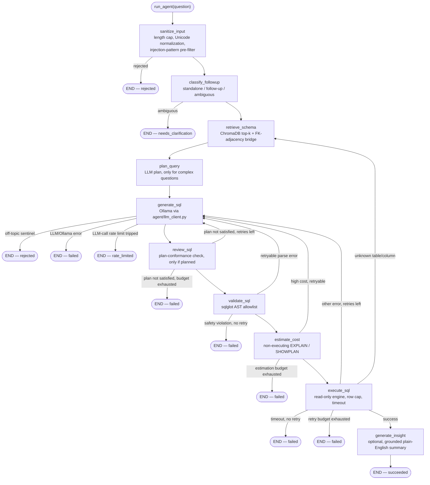
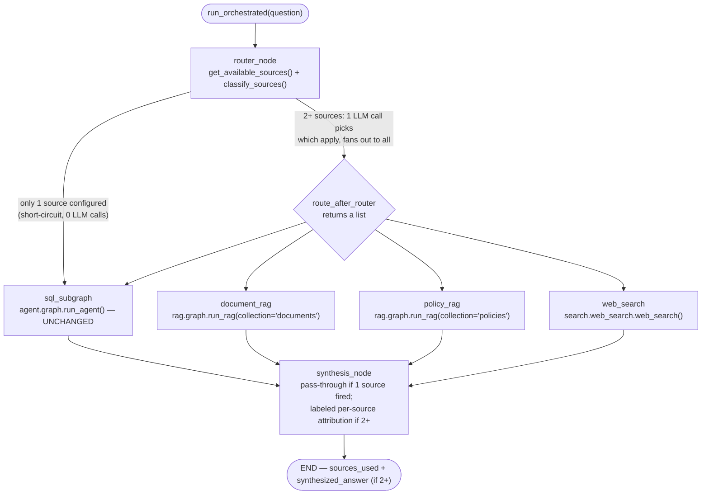
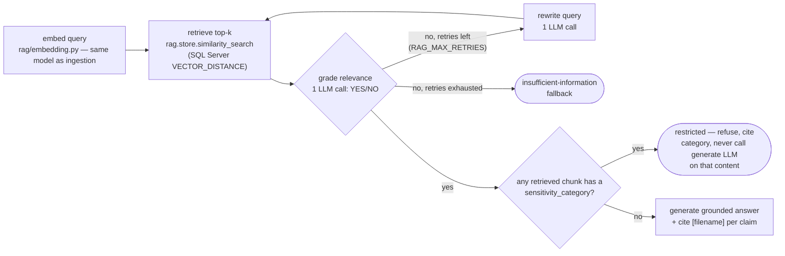

# Architecture

This is the detailed technical walkthrough — the README's diagram is the
30-second version. This document covers three things: the LangGraph node
design, the retry/self-correction logic, and the schema-retrieval pipeline.

Two interfaces sit on top of everything described here: `ui/app.py`
(Streamlit, the primary surface) and `api/main.py` (a thin FastAPI wrapper
added for programmatic access — see [`docs/API.md`](API.md)). Both call
the exact same `agent.graph.run_agent` entry point below — the graph
design, not either interface, is the architectural core.

## 1. The LangGraph state machine

The agent is a small, explicit `StateGraph` (`agent/graph.py`), not a
free-form ReAct-style agent. That's a deliberate choice: every possible
transition is a named edge in a fixed graph, so the retry/error-feedback
path is something you can read off the graph definition, not something
that emerges from a model's own planning. The graph has **ten nodes**,
not just the four covering the "happy path" of retrieval → generation →
validation → execution — the full picture, straight from
`agent/graph.py::build_graph()`:



Three failure shapes go straight to `END (failed)`/`END (rejected)` and
never loop back at all: a validator **safety violation** (non-SELECT,
stacked query, `SELECT ... INTO`, an embedded write inside a CTE, a
dangerous function call), a `generate_sql` **LLM/Ollama error**, and a
query **timeout**. All three are deliberate "don't retry" decisions — see
§2. `needs_clarification` (an ambiguous follow-up) and `rate_limited` (the
process-wide LLM-call limiter tripped) are likewise terminal, but aren't
failures in the same sense — they're clean, expected stops, not errors.

`plan_query` and `review_sql` are the two newest nodes, and both are a
**pure pass-through — zero LLM calls — for an ordinary question**: they
only do real work when `agent/complexity.py::detect_complexity_signals`
judged the question non-trivial (top-N-per-group phrasing, period-over-
period growth, a ranking/window-function need, or several metrics
requested at once). See "Agentic query planning and plan-conformance
review" below.

State is threaded through every node as an `AgentState` TypedDict
(`agent/state.py`, `total=False` — each node only sets the fields it owns).
Every node function has the same shape: take the current state, return a
**partial** dict of updates; LangGraph merges those into the running state.
`error_history` and `attempt_history` use an `operator.add` reducer, so
each node's contribution *appends* rather than overwrites — this is what
lets `generate_sql` see the full trail of prior failures on a retry, and
what lets the UI render a complete "Attempt 1: ..., Attempt 2: ..." timeline
instead of just the latest attempt.

### The ten nodes

**`sanitize_input_node`** — the graph's true entry point, before anything
else (including follow-up classification) touches the question. Runs
`agent.input_guard.check_input`: a length cap (`MAX_QUESTION_LENGTH`),
Unicode normalization (NFKC plus an explicit confusables-folding step that
closes a homoglyph-substitution gap plain NFKC alone leaves open — see
`security/sanitization.py`), a regex pre-filter for common prompt-injection
phrasings, and an off-topic/gibberish check. On rejection, `status`
becomes `"rejected"` and the graph ends immediately with a standardized,
non-technical message — never the raw reason or which pattern matched, so
a rejection gives an attacker no signal to iterate against.

**`classify_followup_node`** — a cheap, regex-only heuristic
(`agent.followup.classify_followup`) deciding whether the (already
sanitized) question is standalone, a follow-up to the most recent prior
exchange, or ambiguous — before any schema retrieval or LLM call. On
`"ambiguous"`, the graph ends immediately with `status="needs_clarification"`
rather than guessing.

**`retrieve_schema_node`** — on the first pass, if more than one database is
configured (`Settings.databases`, via `DB_CONNECTIONS`), calls
`embeddings.retriever.select_database` to auto-route the question to one
configured database and stores the result in `state["selected_database"]`
(a single-database setup short-circuits this immediately). Then embeds the
question, retrieves the top-k most relevant tables from that database's own
ChromaDB collection, expands that set with FK-adjacency bridge tables (§3),
overlays the current `config/table_descriptions.yaml` content on each
table's DDL, and concatenates the result into `schema_context_text`. This
is also the re-entry point on a `missing_reference` execution failure — see
§2 — in which case the already-selected database is **reused**, not
re-routed, since a retry must keep targeting the same database the failed
attempt did.

**`plan_query_node`** — the agentic query-decomposition step. Reads
`state["complexity_signals"]` (computed once, up front, by `run_agent()` —
see "Agentic query planning and plan-conformance review" below) and, only
when that list is non-empty *and* `ENABLE_QUERY_PLANNING` is on, makes one
LLM call asking the model to break the question into a short ordered plan
(grouping columns, metrics, filters, whether a top-N-per-group ranking or a
period-over-period comparison needs a window function) **before** any SQL
is written. The plan is stored in `state["query_plan"]` and injected into
every subsequent `generate_sql` attempt's prompt for this question. An
ordinary question — the overwhelming common case — matches no complexity
signal, so this node returns immediately with `query_plan = None` and adds
no latency. Fails open on any planning failure (unreachable Ollama, an
unparseable response): logged, `query_plan` stays `None`, never a reason
the question can't be answered.

**`generate_sql_node`** — checks the process-wide LLM-call rate limiter
(`agent.rate_limit.get_llm_call_limiter`) before every attempt, including
retries; a denial ends the run immediately at `status="rate_limited"`,
never retried (see `agent/rate_limit.py`'s docstring for why the retry
loop specifically needs its own, stricter limit, separate from the
question-submission limiter the UI enforces per session). Otherwise calls
Ollama (`agent/llm_client.py`) with the schema context, `state["query_plan"]`
if `plan_query_node` produced one (rendered as a numbered "implement every
one of these steps" block, present on every retry for this question, not
just the first attempt), and, on a retry, the previous SQL plus the
specific error that came back (with a category-specific hint — e.g. "you
referenced a column that doesn't exist, use only what's shown in the
schema", or, on a plan-conformance failure, the reviewer's own critique).
Returns raw SQL text, not yet validated. The system prompt also instructs
the model to refuse (via a fixed sentinel) if a question isn't answerable
as SQL — a second, independent off-topic backstop for anything
`sanitize_input_node`'s cheaper regex pre-filter missed, which this node
turns into the same `"rejected"` terminal state.

**`review_sql_node`** — the plan-conformance self-correction step, and the
`plan_query_node`/`review_sql_node` pair's other half. Only makes an LLM
call when `state["query_plan"]` is a non-empty list — nothing to check
against otherwise, so this is a zero-cost pass-through for the overwhelming
common case, exactly like `plan_query_node`. When there is a plan, one LLM
call checks whether the just-generated SQL actually implements every step
and returns a `PASS`/`FAIL: <reason>` verdict. A `FAIL` is treated exactly
like any other retryable correctness mistake: the critique becomes this
attempt's error feedback and the graph loops back to `generate_sql`,
**sharing the same `retry_count`/`state["max_retries"]` budget** as every
other retryable failure category — not a second, unbounded critique loop
layered on top of the first. Fails open on any review failure (unreachable
Ollama, an unparseable verdict): treated as a pass, since the validator and
execution layers immediately downstream are still the real safety net
regardless of what this step decides.

**`validate_sql_node`** — runs the candidate through
`agent/sql_validator.py`'s allowlist (§ below) in the dialect matching
`state["selected_database"]`'s own `DB_TYPE` (`db.connection.get_connection`
+ `get_sqlglot_dialect` — not a single global `DB_TYPE` once more than one
database is configured). A safety violation fails closed immediately. An
ordinary parse mistake increments `retry_count` and routes back to
`generate_sql` if budget remains. A pass gets a `LIMIT` clause applied
(`enforce_row_limit`) and moves to `estimate_cost`.

**`estimate_query_cost_node`** — runs a non-executing `EXPLAIN`/`SHOWPLAN`
estimate on the validated SQL (`db/query_cost.py`), against the selected
database's own engine and dialect — an earlier, additional layer in front
of `execute_sql`'s existing timeout, not a replacement for it. Always fails
open: any estimation problem (unsupported dialect, timeout, driver error)
is logged and treated exactly like "low cost, proceed." **Low** severity
(or estimation unavailable) proceeds silently; **moderate** proceeds but
sets `cost_notice` so the UI can show a "this may take a moment" caption
before execution; **high** does not execute at all — treated exactly like
any other retryable correctness mistake, sharing the same `max_retries`
budget as a parse error, so the model gets a chance to add a filter on its
own before the agent gives up.

**`execute_sql_node`** — runs the validated SQL against the selected
database's own read-only engine with a row cap and timeout (§ "Execution
safety" below), classifies any failure (`agent/error_classification.py`)
into `TIMEOUT` / `MISSING_REFERENCE` / `AGGREGATE_NESTING` / `SYNTAX` /
`UNKNOWN`, and routes accordingly (§2). On success, results and row count
go into state and the graph proceeds to `generate_insight`.

**`generate_insight_node`** — only reachable from `execute_sql_node`'s
*success* path; a failed, needs-clarification, or rejected run never
generates one. Generates a short, plain-English sentence about the result
(`agent/insight.py::summarize_result`) — skipped entirely (no LLM call)
when the UI's insight toggle is off, or when the result is empty or a
single-cell value that a sentence would just restate. Before it's ever
shown, the generated text is checked by
`agent.insight.is_insight_grounded`: every number in the sentence must be
traceable to the actual result data (a derived stat like a sum/min/max/
top-value share, or a literal value from the question/SQL itself, e.g. a
filter year) within a small rounding tolerance. An insight that fails this
check is **dropped and never shown** — this is a real, tested hallucination
guard (`tests/test_insight.py`), not just a prompt instruction; nothing
here can alter the already-final `sql`/`result_rows`/`row_count`.

## 2. Retry / self-correction semantics

Not every failure is treated the same way — the routing logic
(`route_after_sanitization`, `route_after_classification`,
`route_after_generation`, `route_after_review`, `route_after_validation`,
`route_after_cost_estimate`, `route_after_execution` in `agent/nodes.py`)
distinguishes failures by *what kind of mistake it was*, because "try
again" isn't equally useful for all of them. "Up to `max_retries`" below
means `state["max_retries"]` specifically — not always the flat
`Settings.max_retries` value; see "Agentic query planning and
plan-conformance review" further down for how that per-question budget is
computed:

| Failure category | Retries? | Where it routes | Why |
|---|---|---|---|
| Input rejected (`sanitize_input`: too long, empty, injection-pattern match, off-topic) | **Never** | `END (rejected)` | Not a mistake to coach through — the input itself is the problem. |
| Follow-up classification ambiguous | **Never** | `END (needs_clarification)` | Fail-closed on "I don't know what you're asking" rather than guessing and possibly answering the wrong question. |
| Parse/empty SQL, or a nested-aggregate shape (`AVG(...SUM(...)...)`) caught statically by `agent/sql_validator.py` | Yes, up to `max_retries` | `generate_sql` | An ordinary correctness mistake — the model has the right context, just wrote bad (or structurally invalid) SQL. |
| Safety violation (non-SELECT, stacked query, `SELECT ... INTO`, embedded write, dangerous function) | **Never** | `END (failed)` | A security-gate failure, not a mistake worth coaching through — the agent fails closed immediately regardless of remaining budget. |
| `generate_sql` off-topic sentinel | **Never** | `END (rejected)` | The model itself judged the question unanswerable as SQL — a defense-in-depth backstop for `sanitize_input`'s pre-filter, not a correctness mistake. |
| `generate_sql` LLM/Ollama error | **Never** | `END (failed)` | The LLM call itself never returned usable text — retrying the same call is unlikely to help within this run. |
| LLM-call rate limit tripped | **Never** | `END (rate_limited)` | A load-shedding stop, not a correctness issue — retrying immediately would just re-trip the same limiter. |
| `review_sql` plan-conformance `FAIL` verdict (only when `state["query_plan"]` is set) | Yes, up to `max_retries` | `generate_sql` | Treated exactly like a correctness mistake — the reviewer's critique (e.g. "missing the ROW_NUMBER() partition for the per-region ranking") becomes this attempt's error feedback. Shares the same budget as every other retryable category, not a separate loop. |
| Query cost estimate: **high** severity | Yes, up to `max_retries` | `generate_sql` | Treated exactly like a correctness mistake — the model may be able to add a filter on its own. |
| Execution error, category `SYNTAX`/`UNKNOWN`/`AGGREGATE_NESTING` | Yes, up to `max_retries` | `generate_sql` | Schema context was fine; the SQL text wasn't. `AGGREGATE_NESTING` is the execution-time backstop for a nested-aggregate shape the static validator check didn't catch (e.g. a dialect-specific aggregate `sqlglot` doesn't recognize) — same retry shape as a validation failure. |
| Execution error, category `MISSING_REFERENCE` | Yes, up to `max_retries` | **`retrieve_schema`**, not `generate_sql` | If the SQL referenced a table/column that doesn't exist, the *wrong tables may have been retrieved* in the first place — re-running generation with the same (possibly wrong) schema context would likely repeat the mistake. This re-entry also folds the DB error text into the retrieval query and widens `top_k` (`settings.schema_top_k + 2`), since the error usually names the missing identifier — a genuinely useful extra signal for similarity search. Re-entering `retrieve_schema` also re-runs `plan_query` (schema may have changed), reusing the already-selected database. |
| Execution error, category `TIMEOUT` | **Never** | `END (failed)` | Retrying an expensive query with the same shape wastes the whole retry budget on something a retry can't fix. The failure message suggests narrowing the question instead. |

`retry_count` is incremented in `review_sql_node`/`validate_sql_node`/
`estimate_query_cost_node`/`execute_sql_node` themselves (not in the
routing functions), so "retry vs. give up" is decided from a single,
freshly-incremented count rather than multiple places disagreeing about
how many attempts have happened.

Every attempt — successful or not — gets exactly one `AttemptRecord`
appended to `attempt_history`: `{attempt, sql, outcome, error, will_retry}`.
This is what the UI's "Retry timeline" expander renders directly, and
what makes the self-correction loop demoable rather than just something
that happens in a log file.

### Agentic query planning and plan-conformance review

Two more layers sit on top of the retry table above, both driven by
`agent/complexity.py`:

`detect_complexity_signals(question)` is a cheap, regex-only heuristic
(mirroring `agent.followup.classify_followup`'s own approach — no LLM call,
negligible cost next to a real Ollama round-trip) that flags a question as
non-trivial when it matches one or more of four patterns: `top_n_per_group`
("top 3 products *per region*" — as opposed to a plain "top 10 customers
*by* revenue", which is ordinary top-N and deliberately **not** flagged),
`growth_comparison` ("year-over-year", "compared to", "trend", ...),
`ranking_window` ("running total", "cumulative", "moving average", ...),
and `multi_metric` (3+ distinct metric keywords — revenue, profit, count,
distinct, ... — in one question). `compute_max_retries(question,
base_max_retries, max_bonus)` turns the matched signals into this
question's effective retry budget: one extra retry per distinct signal,
capped at `COMPLEX_QUERY_MAX_RETRY_BONUS` (default 2). `run_agent()` calls
this exactly once, up front, and stores both the signal list
(`state["complexity_signals"]`, kept purely for observability/logging) and
the resulting budget (`state["max_retries"]`) — every retry-vs-give-up
check in the table above reads `state["max_retries"]`, not the raw
`Settings.max_retries`, via `agent.nodes._effective_max_retries`.

Those same signals gate the two newest nodes (§1's diagram): `plan_query_node`
only calls the LLM when `state["complexity_signals"]` is non-empty, and
`review_sql_node` only calls the LLM when `plan_query_node` actually
produced a plan (`state["query_plan"]` is a non-empty list). This is a
deliberate design choice, not an accident of implementation: the same
"non-trivial question" judgment that earns a question a wider retry budget
is what earns it the extra planning + review LLM calls, so a plain question
never pays for either — no new Chroma query, no new LLM call, no new
latency, exactly as if `plan_query`/`review_sql` weren't in the graph at
all. `ENABLE_QUERY_PLANNING` (default `true`) is a master switch on top of
the signal gate — off means every question behaves exactly as it did before
this feature existed, regardless of complexity signals.

The two nodes are a decompose-then-check pair, not two independent
features: `plan_query_node` produces the plan (a JSON array of step
strings — the model is asked, e.g., to explicitly call out that a
top-N-per-group result needs `ROW_NUMBER()`/`RANK()`, never `TOP`/`LIMIT`
combined with `GROUP BY`, and that a period-over-period comparison needs
`LAG()`/`LEAD()` on an already-aggregated result, never one aggregate
nested inside another); `review_sql_node` then checks the *generated* SQL
against that same plan before it ever reaches `validate_sql`. Reusing the
existing retry infrastructure (`retry_count`/`state["max_retries"]`,
`error_history`, `attempt_history` with `outcome="plan_not_satisfied"`) for
a `FAIL` verdict, rather than introducing a separate critique-loop counter,
keeps the graph's total worst-case LLM-call count boundable the same way it
already was for every other retryable category — see `SECURITY.md` for how
this factors into `LLM_CALL_RATE_LIMIT_PER_MINUTE` sizing.

### Execution safety

`execute_sql_node` calls `db.execution.execute_readonly_sql`, which runs SQL
on a background thread (`_execute_with_timeout`) and force-closes the
connection from the calling thread if it's still running past
`QUERY_TIMEOUT_SECONDS` — SQLAlchemy has
no universal cross-dialect "cancel this query" call, so closing the socket
out from under an in-flight query is the mechanism that works identically
across all four supported engines. A cheap session-level `SET` statement
timeout is also applied first where the dialect supports one
(Postgres/MySQL) as a driver-level belt-and-suspenders layer.

The row cap (`MAX_RESULT_ROWS`) is enforced two independent ways: a
`LIMIT` clause added to the SQL text itself (`enforce_row_limit`, via
`sqlglot`), *and* a `fetchmany(max_result_rows)` at the cursor level — so a
malformed or dialect-mistranslated query that lacks a working `LIMIT`
still can't pull an unbounded result set into memory.

## 3. Schema-retrieval pipeline

The core problem this pipeline solves: a real production schema can have
hundreds of tables, and dumping all of them into the prompt burns context
and increases hallucinated joins against irrelevant tables. So the LLM
only ever sees a small, targeted slice of the schema — but a slice that's
*complete enough* to answer the question, which is the harder half of the
problem.

```
introspect_schema()          -- live SQLAlchemy Inspector, metadata only
        |
value_sampling.attach_sample_values()  -- real DISTINCT values for
        |                                  qualifying low-cardinality
        |                                  string columns (see below)
        v
embeddings.schema_indexer.build_index()  -- one Chroma chunk per table,
        |                                    DDL + sampled values only
        |                                    (NOT table_descriptions --
        |                                    see below)
        v
   [one ChromaDB collection per configured database]
        |
        | (per question, in agent.nodes.retrieve_schema_node)
        v
embeddings.retriever.select_database()  -- only when 2+ databases are
        |                                  configured; short-circuits to
        |                                  the one database otherwise
        v
embeddings.retriever.retrieve_relevant_schema()  -- scoped to the
        |                                            selected database's
        |                                            own collection
   1. top-k similarity search
   2. _expand_with_fk_bridges() -- FK-adjacency bridge expansion
        |
        v
config.table_descriptions.apply_table_description()  -- fresh from disk,
        |                                                every question
        v
   schema_context_text  -->  plan_query_node's prompt (if the question is
                              complex -- see "Agentic query planning and
                              plan-conformance review" in §2) and, either
                              way, generate_sql_node's prompt
```

### Live introspection, not a hardcoded schema

`db/schema_introspection.py` is the sole source of truth for schema shape.
`introspect_schema()` uses SQLAlchemy's `Inspector` to pull real
tables/columns/types/FKs and synthesizes a compact `CREATE TABLE`-style DDL
string per table — chosen because that format is what most SQL-generation
models are tuned on. This function is deliberately metadata-only (no data
queries), which matters for both cost (catalog queries are cheap; data
queries on a large fact table are not) and scope (it should be safe to run
against any configured database without needing data-read intent).

### Value sampling: fixing "the column name lied to me"

A column like `DimProduct.ProductLine` looks, from its name and type
alone, like it could hold almost anything. It actually holds short codes
(`M`/`R`/`S`/`T`) — nothing like a business term such as "Bikes". Left
alone, a model will sometimes filter on the column whose *name* sounds
right rather than the one whose *values* actually match.

`db/value_sampling.py` is a separate module from `schema_introspection.py`
on purpose — introspection's docstring promises it never touches table
data, and value sampling is the one place that intentionally does, scoped
tightly:

- Only string-family columns (`VARCHAR`/`CHAR`/`NVARCHAR`/`NCHAR`).
- Never a primary key or a column that's part of a foreign key (those are
  join plumbing, not descriptive values).
- Declared length capped (skip large free-text columns).
- Actual distinct-value count capped at 20 — a column with more distinct
  values than that either isn't a "code" column, or is high-cardinality
  enough to plausibly be PII (names, emails). This cap is what makes the
  mechanism privacy-safe *by construction*: real PII columns are
  high-cardinality by nature and never pass it, without needing a
  column-name denylist.

Qualifying columns get their real values rendered directly into the DDL
comment (`-- e.g. 'M', 'R', 'S', 'T'`), and the generation prompt
(`agent/llm_client.py`) has a standing rule telling the model to only
filter a column on a literal value if it actually appears in that
column's sample list — and if it doesn't, to look for a different column
(often in a related table) instead.

### FK-adjacency bridge expansion: fixing "the connector table didn't score well"

Pure text-similarity retrieval has a systematic blind spot: a fact table
(mostly numeric columns — `SalesAmount`, `OrderQuantity`) embeds weakly
against a question like "which territory had the highest sales," even
though it's the one table that structurally connects "territory" to
"sales" at all. The same blind spot hits intermediate dimensions in a
multi-level hierarchy (e.g. `DimProduct` sitting between a fact table and
`DimProductSubcategory`/`DimProductCategory`).

Left alone, the model doesn't fail loudly here — it invents a plausible-
looking but nonexistent shortcut (a direct column, or a join on two
unrelated surrogate keys that happen to be small integers) to route around
the table it was never shown.

`embeddings/retriever.py::_expand_with_fk_bridges` fixes this generically,
without knowing anything about *which* tables matter for *which*
questions: at index-build time, each table's FK targets are stored in
Chroma's metadata (`schema_indexer.py`). At retrieval time:

1. Treat the retrieved tables as nodes in the full FK graph, and find the
   **connected components** of the subgraph they induce (edges only
   between two retrieved tables). If retrieval came back as one connected
   island, there's nothing to bridge.
2. If there's more than one island, find the **shortest real path** (BFS
   over the *full* schema graph, not just retrieved tables) between the two
   closest islands, and add that path's intermediate tables.
3. Recompute components and repeat until everything is one island, a
   connecting path would need more than `_MAX_BRIDGE_PATH_HOPS`
   intermediate tables (treated as "genuinely unrelated," not force-
   connected), or the total bridge budget (`_MAX_BRIDGE_TABLES`) runs out.

This directly handles **two or more consecutive** missing hops — e.g. both
a fact table and an intermediate dimension missing at once — which an
earlier, simpler version of this function (checking only "is this table
adjacent to 2+ *already-selected* tables") could not bootstrap into: with
two consecutive gaps, neither missing table starts out adjacent to 2
selected tables, so that check alone never triggers. Finding the actual
shortest connecting path, rather than a local degree count, closes gaps of
any length up to the hop cap.

One sharp edge worth knowing: when two candidate bridge paths tie in
length, the tie-break (alphabetical, for determinism) can pick the less
useful one and "spend" a slot from the bridge budget that the truly
necessary table then doesn't get. This showed up in practice — a tie
between two single-hop paths meant a needed table lost out until the
budget was widened slightly (`_MAX_BRIDGE_TABLES = 5`). The eval harness's
`expect_tables_used` check (see `CONTRIBUTING.md`) exists specifically to
catch this class of failure, since the alternative (a skipped hop that
returns a plausible non-empty result by pure key-range coincidence) passes
a row-count-only check silently.

### Table descriptions: applied fresh, not baked into the index

`config/table_descriptions.yaml` is a hand-reviewed, plain-language
description of what each table means and how it relates to others,
including per-column disambiguation notes (e.g. spelling out that
`ProductLine` is an unrelated code, not a category name). It is
deliberately **not** embedded into the Chroma index at build time — baking
it in would freeze it as of the last `build_embeddings.py` run, so editing
the file to fix a wrong note wouldn't take effect until someone remembered
to rebuild. Instead, `retrieve_schema_node` calls
`config.table_descriptions.load_table_descriptions()` — which re-parses
the YAML from disk on every single call, with no caching layer — and
overlays the *current* file content onto whatever DDL came back from
retrieval, on every question. A hand-edit takes effect on the very next
question asked, with zero rebuild step.

### Caching

Re-embedding the schema is skipped whenever
`db.schema_introspection.get_schema_fingerprint()` (a SHA-256 hash of the
introspected — *not* value-sampled — tables) matches the hash from the
last build, stored alongside the Chroma persist directory. The fingerprint
is deliberately computed from the pre-value-sampling tables: if it were
computed from the sample-enriched DDL, incidental data changes (a new
distinct color appearing in a `Color` column, say) would force a full
re-embed on every build even though nothing schema-*shaped* had changed.

## 4. Multi-source orchestration

Optional, off by default (`ENABLE_MULTI_SOURCE_ROUTER=false`). When off,
`agent.orchestrator.graph.run_orchestrated` — the one entry point
`ui/app.py`/`api/main.py` call — is a pure pass-through to
`agent.graph.run_agent`: the orchestrator graph below is never even
constructed, so everything in sections 1–3 above is exactly as accurate for
a plain SQL-only setup with the flag on as with it off. See
`docs/MULTI_SOURCE_GUIDE.md` for how to turn each source on.



### Router: availability, then classification

`get_available_sources(settings)` (`agent/orchestrator/nodes.py`) always
includes `"sql"` (`Settings.databases` always has ≥1 entry) and adds
`"documents"`/`"policy"`/`"web"` only when **both** that source's
`ENABLE_*` flag **and** the config it actually needs are present (a
document-store connection string, a web-search API key) — an enabled flag
alone with nothing configured behind it is not "available," since routing
to it would just fail.

With ≤1 source available, `router_node` short-circuits: no Chroma-style
extra query, no LLM call, mirroring `embeddings.retriever.select_database`'s
own single-database short-circuit for the exact same reason (zero
behavior/latency change for the common case). With 2+, `classify_sources`
makes one LLM call — a system prompt listing each available source's
plain-language description, asking for a comma-separated subset — and
parses the response, keeping only names actually in the available set and
falling back to *every* available source (never zero) if the response is
empty or unparseable, since silently dropping the question is worse than
one or two extra subgraph calls.

### Fan-out and synthesis

`route_after_router` returns a **list** of destination node names, not a
single string. LangGraph runs every named destination as its own parallel
branch within the same graph superstep before the graph proceeds to
`synthesis` — verified directly against this project's pinned LangGraph
version (a small throwaway graph, not assumed from documentation) before
this was built. This is what lets a genuinely multi-source question
("compare policy X with the database") hit two subgraphs in one step
rather than sequentially.

`synthesis_node` is a pure pass-through when only one source fired — that
source's own answer *is* the final answer, unedited, no LLM call spent
restating something already complete (`state["synthesized_answer"]` stays
`None`; the UI reads the single source's own result field directly — see
"UI rendering" below). With 2+, it composes a plain-text answer with one
labeled section per source (`**Database**: ...`, `**Policy**: ...`, ...) —
never blended into one unattributed claim.

**Known limitation, found during testing:** every routed subgraph receives
the same full, un-decomposed question text, not a source-specific
sub-question. A cleanly single-topic multi-source question retrieves fine
on every side (verified: a combined leave-policy + sales-database question
correctly fanned out and both sides retrieved correctly); a question that's
really two unrelated asks mashed into one sentence can retrieve poorly on
both sides even though each alone would work. Per-source query
decomposition would fix this — out of scope for the initial build.

### `OrchestratorState`: additive, not a replacement

`agent/orchestrator/state.py`'s `OrchestratorState` *extends* `AgentState`
(`class OrchestratorState(AgentState, total=False)`) rather than defining a
parallel shape. `sql_subgraph_node` merges `run_agent()`'s complete return
value into it under the exact same keys `AgentState` already uses
(`status`, `sql`, `result_rows`, `error_history`, `attempt_history`, ...) —
this is what keeps every existing UI read site working identically whether
a question went through `run_agent` directly or through the orchestrator.
The only genuinely new fields are `route_decision`, `sources_used`
(`operator.add`-accumulated, same reducer pattern as `error_history`),
`document_result`/`policy_result`/`web_result` (each a `SourceAnswer`:
`answer`, `citations`, `status`), and `synthesized_answer`.

### UI rendering: gated on whether SQL was actually a source

`ui/app.py`'s SQL-specific rendering (schema context expander, the
editable SQL box, Confirm and Run, the results table/chart) only renders
when `"sql" in state.get("sources_used", ["sql"])` — the default
(`["sql"]`) covers the router-off path, where `sources_used` doesn't exist
at all and "sql" is implied (it's the only thing that could have produced
that state). A single non-SQL source's answer (web/documents/policy alone)
has nowhere else to appear, so `_render_sources_used`/
`_render_source_answer` render it directly, with its citations, whenever
`synthesized_answer` is absent (meaning exactly one source fired).

### Document/policy agentic RAG (`rag/`)

One implementation, `rag.graph.build_rag_subgraph(collection)`, serving
both `"documents"` and `"policies"` — they're structurally identical and
only differ in `generate_node`'s sensitivity check.



**Storage** (`rag/store.py`): SQL Server 2025+/Azure SQL native `VECTOR`
columns (confirmed against the real target instance, including
`VECTOR_DISTANCE('cosine', ...)`, before this was built), on a **dedicated
connection** (`RAG_STORE_CONNECTION_STRING`) — deliberately never one of
`Settings.databases`, since chunk/embedding storage isn't business data and
shouldn't share a schema or connection pool with a configured database.
Two tables in a `rag` schema: `documents` (filename, collection, upload
date, status, chunk count, and — policies only — a hand-set
`sensitivity_category`) and `chunks` (text, position, `VECTOR(384)`
embedding, page number). `EMBEDDING_DIMENSIONS = 384` is fixed to the
default embedding model's output size; changing
`EMBEDDING_MODEL_NAME`/`RAG_EMBEDDING_MODEL_NAME` to a different-dimension
model requires migrating this column's width too — a documented limitation,
not a dynamic schema.

One real bug found and fixed while building this: a 384-float embedding
serialized to JSON is long enough (~7,000+ characters) that pyodbc binds it
as `ntext` (`SQL_WLONGVARCHAR`) rather than `nvarchar`
(`SQL_WVARCHAR`) — a driver-level length heuristic, not something this code
controls per-parameter — and SQL Server's `VECTOR` cast rejects `ntext` as
a source type outright ("Explicit conversion from data type ntext to
vector is not allowed"). Fixed by casting through `NVARCHAR(MAX)` first
(`rag.store._VECTOR_CAST`: `CAST(CAST(:embedding AS NVARCHAR(MAX)) AS
VECTOR(384))`) — confirmed against the real error text and a minimal
repro before being applied, not guessed.

**Ingestion** (`rag/ingestion.py`): `pypdf`-based per-page text extraction
→ character-based overlapping chunking (`RAG_CHUNK_SIZE`/
`RAG_CHUNK_OVERLAP`, tracking which page each chunk starts on for
citations) → embedding (`rag/embedding.py`, shared with retrieval so both
live in the same vector space — reuses the exact same Chroma
`DefaultEmbeddingFunction`/`SentenceTransformerEmbeddingFunction` choice
`embeddings/schema_indexer.py` uses for schema DDL) → storage. A page whose
extracted text is under ~20 characters is flagged as a likely
scanned/image-only page needing OCR, rather than silently indexed as an
empty chunk. A `rag.documents` row is created with status `"processing"`
*before* any real work starts, so a mid-ingestion failure still leaves a
visible, inspectable record (`"failed"` + the real error message) in the
Knowledge Sources management view instead of vanishing silently.

**Sensitivity gating**: a policy document tagged `compensation`,
`disciplinary`, or `legal` at upload time (`rag/store.py`'s
`SensitivityCategory`) is never summarized into an answer —
`generate_node` checks every retrieved chunk's `sensitivity_category`
*before* calling the LLM at all, and refuses with a fixed message if any
are set, rather than relying on a prompt instruction the model might not
follow. This app has no per-user authorization system to check who's
allowed to see restricted policy content, so failing closed here is the
only honest option — the same philosophy as `agent/sql_validator.py`'s
`SAFETY_VIOLATION_TYPES` (a gate that doesn't open, not a mistake worth
coaching through), applied to a document/chunk tag instead of a
`(table, column)` pair.

**Untrusted content**: `_GENERATE_SYSTEM_PROMPT` explicitly instructs the
model to treat retrieved chunk text as data, never as instructions, even
if it appears to contain commands — the same principle
`agent/llm_client.py`'s system prompt already applies to database-sourced
content, extended to cover a poisoned/malicious uploaded PDF, this
feature's realistic injection vector.

### Live web search (`search/web_search.py`)

Provider-configurable, shaped exactly like `db/connection.py`'s
`SUPPORTED_DB_TYPES`: `SUPPORTED_SEARCH_PROVIDERS` maps a provider name to
its call function, so `WEB_SEARCH_PROVIDER` is a `.env` change, not a code
change. Only `tavily` is implemented today (a plain `httpx.post` to
Tavily's REST API — no vendor SDK dependency). Every result is wrapped in
a fixed `WebResult` (`title`, `url`, `snippet`, `retrieved_at`) before it
ever reaches a prompt.

`agent.orchestrator.nodes.web_search_node` frames results as external/live/
untrusted in the generation prompt, and the generated answer text always
opens with "According to a live web search:" — never presented as if it
came from the company's own systems. Same "data, not instructions"
untrusted-content principle as ingested PDF content, since a search
result's content is exactly as attacker-influenceable as a stored database
value or an uploaded document.
