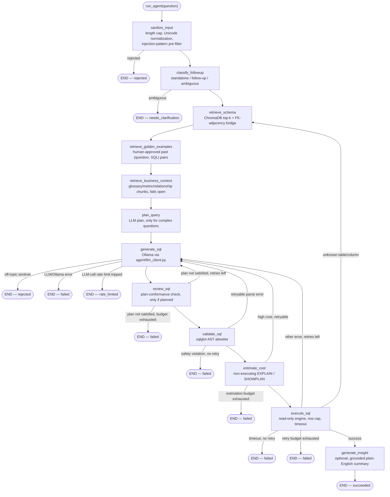
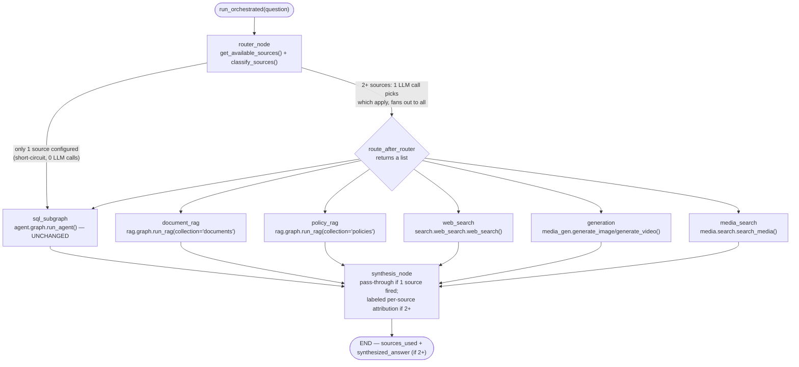
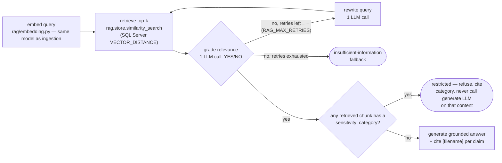

# Architecture

This is the detailed technical walkthrough — the README's diagram is the
30-second version. This document covers three things: the LangGraph node
design, the retry/self-correction logic, and the schema-retrieval pipeline.

One interface sits on top of everything described here: `api/main.py`
(FastAPI), which serves both the REST API and the React dashboard
(`frontend/`, the primary human-facing surface — see
[`docs/API.md`](API.md)). It calls the exact same `agent.graph.run_agent`
entry point below — the graph design, not the interface, is the
architectural core.

## 1. The LangGraph state machine

The agent is a small, explicit `StateGraph` (`agent/graph.py`), not a
free-form ReAct-style agent. That's a deliberate choice: every possible
transition is a named edge in a fixed graph, so the retry/error-feedback
path is something you can read off the graph definition, not something
that emerges from a model's own planning. The graph has **twelve nodes**,
not just the four covering the "happy path" of retrieval → generation →
validation → execution — the full picture, straight from
`agent/graph.py::build_graph()`:


```mermaid
flowchart TD
    START(["run_agent(question)"]) --> SI["sanitize_input<br/>length cap, Unicode normalization,<br/>injection-pattern pre-filter"]
    SI -->|rejected| ENDREJ1(["END — rejected"])
    SI --> CF["classify_followup<br/>standalone / follow-up / ambiguous"]
    CF -->|ambiguous| ENDCLAR(["END — needs_clarification"])
    CF --> RS["retrieve_schema<br/>ChromaDB top-k + FK-adjacency bridge"]
    RS --> RGE["retrieve_golden_examples<br/>human-approved past (question, SQL) pairs"]
    RGE --> RBC["retrieve_business_context<br/>glossary/metric/relationship chunks, fails open"]
    RBC --> PQ["plan_query<br/>LLM plan, only for complex questions"]
    PQ --> GS["generate_sql<br/>Ollama via agent/llm_client.py"]
    GS -->|off-topic sentinel| ENDREJ2(["END — rejected"])
    GS -->|LLM/Ollama error| ENDFAIL1(["END — failed"])
    GS -->|LLM-call rate limit tripped| ENDRATE(["END — rate_limited"])
    GS --> RV["review_sql<br/>plan-conformance check, only if planned"]
    RV -->|plan not satisfied, retries left| GS
    RV -->|plan not satisfied, budget exhausted| ENDFAIL6(["END — failed"])
    RV --> VS["validate_sql<br/>sqlglot AST allowlist"]
    VS -->|safety violation, no retry| ENDFAIL2(["END — failed"])
    VS -->|retryable parse error| GS
    VS --> CE["estimate_cost<br/>non-executing EXPLAIN / SHOWPLAN"]
    CE -->|high cost, retryable| GS
    CE -->|estimation budget exhausted| ENDFAIL3(["END — failed"])
    CE --> ES["execute_sql<br/>read-only engine, row cap, timeout"]
    ES -->|unknown table/column| RS
    ES -->|other error, retries left| GS
    ES -->|timeout, no retry| ENDFAIL4(["END — failed"])
    ES -->|retry budget exhausted| ENDFAIL5(["END — failed"])
    ES -->|success| GI["generate_insight<br/>optional, grounded plain-English summary"]
    GI --> ENDOK(["END — succeeded"])
```

Three failure shapes go straight to `END (failed)`/`END (rejected)` and
never loop back at all: a validator **safety violation** (non-SELECT,
stacked query, `SELECT ... INTO`, an embedded write inside a CTE, a
dangerous function call), a `generate_sql` **LLM/Ollama error**, and a
query **timeout**. All three are deliberate "don't retry" decisions — see
§2. `needs_clarification` (an ambiguous follow-up) and `rate_limited` (the
process-wide LLM-call limiter tripped) are likewise terminal, but aren't
failures in the same sense — they're clean, expected stops, not errors.

`plan_query` and `review_sql` are the two newest nodes, and both are a
**pure pass-through — zero LLM calls — for an ordinary question**: they
only do real work when `agent/complexity.py::detect_complexity_signals`
judged the question non-trivial (top-N-per-group phrasing, period-over-
period growth, a ranking/window-function need, or several metrics
requested at once). See "Agentic query planning and plan-conformance
review" below.

State is threaded through every node as an `AgentState` TypedDict
(`agent/state.py`, `total=False` — each node only sets the fields it owns).
Every node function has the same shape: take the current state, return a
**partial** dict of updates; LangGraph merges those into the running state.
`error_history` and `attempt_history` use an `operator.add` reducer, so
each node's contribution *appends* rather than overwrites — this is what
lets `generate_sql` see the full trail of prior failures on a retry, and
what lets the UI render a complete "Attempt 1: ..., Attempt 2: ..." timeline
instead of just the latest attempt.

### The twelve nodes

**`sanitize_input_node`** — the graph's true entry point, before anything
else (including follow-up classification) touches the question. Runs
`agent.input_guard.check_input`: a length cap (`MAX_QUESTION_LENGTH`),
Unicode normalization (NFKC plus an explicit confusables-folding step that
closes a homoglyph-substitution gap plain NFKC alone leaves open — see
`security/sanitization.py`), a regex pre-filter for common prompt-injection
phrasings, and an off-topic/gibberish check. On rejection, `status`
becomes `"rejected"` and the graph ends immediately with a standardized,
non-technical message — never the raw reason or which pattern matched, so
a rejection gives an attacker no signal to iterate against.

**`classify_followup_node`** — a cheap, regex-only heuristic
(`agent.followup.classify_followup`) deciding whether the (already
sanitized) question is standalone, a follow-up to the most recent prior
exchange, or ambiguous — before any schema retrieval or LLM call. On
`"ambiguous"`, the graph ends immediately with `status="needs_clarification"`
rather than guessing.

**`retrieve_schema_node`** — on the first pass, if more than one database is
configured (`Settings.databases`, via `DB_CONNECTIONS`), calls
`embeddings.retriever.select_database` to auto-route the question to one
configured database and stores the result in `state["selected_database"]`
(a single-database setup short-circuits this immediately). Then embeds the
question, retrieves the top-k most relevant tables from that database's own
ChromaDB collection, expands that set with FK-adjacency bridge tables (§3),
overlays the current `config/table_descriptions.yaml` content on each
table's DDL, and concatenates the result into `schema_context_text`. This
is also the re-entry point on a `missing_reference` execution failure — see
§2 — in which case the already-selected database is **reused**, not
re-routed, since a retry must keep targeting the same database the failed
attempt did.

**`retrieve_golden_examples_node`** — looks up human-approved (question,
SQL) pairs a user previously saved via the UI's thumbs-up feedback (see
"Golden-dataset feedback loop" below), from that database's own per-database
ChromaDB collection (`embeddings/golden_examples.py`, mirroring
`retrieve_schema_node`'s own per-database collection pattern). Only queries
the store when `ENABLE_GOLDEN_EXAMPLES` is on (default `true`), and only
examples clearing `GOLDEN_EXAMPLES_MIN_SIMILARITY` (default 0.75) are kept.
Matches are stored in `state["golden_examples"]` and injected into every
subsequent `generate_sql` attempt's prompt as reference-only few-shot
material. Fails open exactly like `plan_query_node` right below: a disabled
flag, an empty/unreachable store, or a lookup error all resolve to "no
examples," never a reason a question can't be answered.

**`retrieve_business_context_node`** — semantic retrieval over a second,
business-context ChromaDB collection (`retrieval/`, see
[`docs/vector-retrieval-design.md`](vector-retrieval-design.md)): table/
column/relationship descriptions, glossary terms, metric definitions,
curated SQL examples, and documentation chunks — additive to (never a
replacement for) the live schema-DDL retrieval `retrieve_schema_node`
already did. Results are stored in `state["retrieved_context"]` and
injected into every `generate_sql` attempt's prompt as a clearly labeled
"verify against the live schema, treat retrieved SQL as a pattern only"
section. Fails open on any vector-store/embedding failure or a disabled
`ENABLE_BUSINESS_CONTEXT_RETRIEVAL` flag — an empty collection, a lookup
error, and the feature being off all resolve to "no extra context" plus a
logged, state-visible warning (`state["retrieval_warnings"]`), never a
reason a question can't be answered.

**`plan_query_node`** — the agentic query-decomposition step. Reads
`state["complexity_signals"]` (computed once, up front, by `run_agent()` —
see "Agentic query planning and plan-conformance review" below) and, only
when that list is non-empty *and* `ENABLE_QUERY_PLANNING` is on, makes one
LLM call asking the model to break the question into a short ordered plan
(grouping columns, metrics, filters, whether a top-N-per-group ranking or a
period-over-period comparison needs a window function) **before** any SQL
is written. The plan is stored in `state["query_plan"]` and injected into
every subsequent `generate_sql` attempt's prompt for this question. An
ordinary question — the overwhelming common case — matches no complexity
signal, so this node returns immediately with `query_plan = None` and adds
no latency. Fails open on any planning failure (unreachable Ollama, an
unparseable response): logged, `query_plan` stays `None`, never a reason
the question can't be answered.

**`generate_sql_node`** — checks the process-wide LLM-call rate limiter
(`agent.rate_limit.get_llm_call_limiter`) before every attempt, including
retries; a denial ends the run immediately at `status="rate_limited"`,
never retried (see `agent/rate_limit.py`'s docstring for why the retry
loop specifically needs its own, stricter limit, separate from the
question-submission limiter the UI enforces per session). Otherwise calls
Ollama (`agent/llm_client.py`) with the schema context, `state["query_plan"]`
if `plan_query_node` produced one (rendered as a numbered "implement every
one of these steps" block, present on every retry for this question, not
just the first attempt), and, on a retry, the previous SQL plus the
specific error that came back (with a category-specific hint — e.g. "you
referenced a column that doesn't exist, use only what's shown in the
schema", or, on a plan-conformance failure, the reviewer's own critique).
Returns raw SQL text, not yet validated. The system prompt also instructs
the model to refuse (via a fixed sentinel) if a question isn't answerable
as SQL — a second, independent off-topic backstop for anything
`sanitize_input_node`'s cheaper regex pre-filter missed, which this node
turns into the same `"rejected"` terminal state.

**`review_sql_node`** — the plan-conformance self-correction step, and the
`plan_query_node`/`review_sql_node` pair's other half. Only makes an LLM
call when `state["query_plan"]` is a non-empty list — nothing to check
against otherwise, so this is a zero-cost pass-through for the overwhelming
common case, exactly like `plan_query_node`. When there is a plan, one LLM
call checks whether the just-generated SQL actually implements every step
and returns a `PASS`/`FAIL: <reason>` verdict. A `FAIL` is treated exactly
like any other retryable correctness mistake: the critique becomes this
attempt's error feedback and the graph loops back to `generate_sql`,
**sharing the same `retry_count`/`state["max_retries"]` budget** as every
other retryable failure category — not a second, unbounded critique loop
layered on top of the first. Fails open on any review failure (unreachable
Ollama, an unparseable verdict): treated as a pass, since the validator and
execution layers immediately downstream are still the real safety net
regardless of what this step decides.

**`validate_sql_node`** — runs the candidate through
`agent/sql_validator.py`'s allowlist (§ below) in the dialect matching
`state["selected_database"]`'s own `DB_TYPE` (`db.connection.get_connection`
+ `get_sqlglot_dialect` — not a single global `DB_TYPE` once more than one
database is configured). A safety violation fails closed immediately. An
ordinary parse mistake increments `retry_count` and routes back to
`generate_sql` if budget remains. A pass gets a `LIMIT` clause applied
(`enforce_row_limit`) and moves to `estimate_cost`.

**`estimate_query_cost_node`** — runs a non-executing `EXPLAIN`/`SHOWPLAN`
estimate on the validated SQL (`db/query_cost.py`), against the selected
database's own engine and dialect — an earlier, additional layer in front
of `execute_sql`'s existing timeout, not a replacement for it. Always fails
open: any estimation problem (unsupported dialect, timeout, driver error)
is logged and treated exactly like "low cost, proceed." **Low** severity
(or estimation unavailable) proceeds silently; **moderate** proceeds but
sets `cost_notice` so the UI can show a "this may take a moment" caption
before execution; **high** does not execute at all — treated exactly like
any other retryable correctness mistake, sharing the same `max_retries`
budget as a parse error, so the model gets a chance to add a filter on its
own before the agent gives up.

**`execute_sql_node`** — runs the validated SQL against the selected
database's own read-only engine with a row cap and timeout (§ "Execution
safety" below), classifies any failure (`agent/error_classification.py`)
into `TIMEOUT` / `MISSING_REFERENCE` / `AGGREGATE_NESTING` / `SYNTAX` /
`UNKNOWN`, and routes accordingly (§2). On success, results and row count
go into state and the graph proceeds to `generate_insight`.

**`generate_insight_node`** — only reachable from `execute_sql_node`'s
*success* path; a failed, needs-clarification, or rejected run never
generates one. Generates a short, plain-English sentence about the result
(`agent/insight.py::summarize_result`) — skipped entirely (no LLM call)
when the UI's insight toggle is off, or when the result is empty or a
single-cell value that a sentence would just restate. Before it's ever
shown, the generated text is checked by
`agent.insight.is_insight_grounded`: every number in the sentence must be
traceable to the actual result data (a derived stat like a sum/min/max/
top-value share, or a literal value from the question/SQL itself, e.g. a
filter year) within a small rounding tolerance. An insight that fails this
check is **dropped and never shown** — this is a real, tested hallucination
guard (`tests/test_insight.py`), not just a prompt instruction; nothing
here can alter the already-final `sql`/`result_rows`/`row_count`.

## 2. Retry / self-correction semantics

Not every failure is treated the same way — the routing logic
(`route_after_sanitization`, `route_after_classification`,
`route_after_generation`, `route_after_review`, `route_after_validation`,
`route_after_cost_estimate`, `route_after_execution` in `agent/nodes.py`)
distinguishes failures by *what kind of mistake it was*, because "try
again" isn't equally useful for all of them. "Up to `max_retries`" below
means `state["max_retries"]` specifically — not always the flat
`Settings.max_retries` value; see "Agentic query planning and
plan-conformance review" further down for how that per-question budget is
computed:

| Failure category | Retries? | Where it routes | Why |
|---|---|---|---|
| Input rejected (`sanitize_input`: too long, empty, injection-pattern match, off-topic) | **Never** | `END (rejected)` | Not a mistake to coach through — the input itself is the problem. |
| Follow-up classification ambiguous | **Never** | `END (needs_clarification)` | Fail-closed on "I don't know what you're asking" rather than guessing and possibly answering the wrong question. |
| Parse/empty SQL, or a nested-aggregate shape (`AVG(...SUM(...)...)`) caught statically by `agent/sql_validator.py` | Yes, up to `max_retries` | `generate_sql` | An ordinary correctness mistake — the model has the right context, just wrote bad (or structurally invalid) SQL. |
| Safety violation (non-SELECT, stacked query, `SELECT ... INTO`, embedded write, dangerous function) | **Never** | `END (failed)` | A security-gate failure, not a mistake worth coaching through — the agent fails closed immediately regardless of remaining budget. |
| `generate_sql` off-topic sentinel | **Never** | `END (rejected)` | The model itself judged the question unanswerable as SQL — a defense-in-depth backstop for `sanitize_input`'s pre-filter, not a correctness mistake. |
| `generate_sql` LLM/Ollama error | **Never** | `END (failed)` | The LLM call itself never returned usable text — retrying the same call is unlikely to help within this run. |
| LLM-call rate limit tripped | **Never** | `END (rate_limited)` | A load-shedding stop, not a correctness issue — retrying immediately would just re-trip the same limiter. |
| `review_sql` plan-conformance `FAIL` verdict (only when `state["query_plan"]` is set) | Yes, up to `max_retries` | `generate_sql` | Treated exactly like a correctness mistake — the reviewer's critique (e.g. "missing the ROW_NUMBER() partition for the per-region ranking") becomes this attempt's error feedback. Shares the same budget as every other retryable category, not a separate loop. |
| Query cost estimate: **high** severity | Yes, up to `max_retries` | `generate_sql` | Treated exactly like a correctness mistake — the model may be able to add a filter on its own. |
| Execution error, category `SYNTAX`/`UNKNOWN`/`AGGREGATE_NESTING` | Yes, up to `max_retries` | `generate_sql` | Schema context was fine; the SQL text wasn't. `AGGREGATE_NESTING` is the execution-time backstop for a nested-aggregate shape the static validator check didn't catch (e.g. a dialect-specific aggregate `sqlglot` doesn't recognize) — same retry shape as a validation failure. |
| Execution error, category `MISSING_REFERENCE` | Yes, up to `max_retries` | **`retrieve_schema`**, not `generate_sql` | If the SQL referenced a table/column that doesn't exist, the *wrong tables may have been retrieved* in the first place — re-running generation with the same (possibly wrong) schema context would likely repeat the mistake. This re-entry also folds the DB error text into the retrieval query and widens `top_k` (`settings.schema_top_k + 2`), since the error usually names the missing identifier — a genuinely useful extra signal for similarity search. Re-entering `retrieve_schema` also re-runs `plan_query` (schema may have changed), reusing the already-selected database. |
| Execution error, category `TIMEOUT` | **Never** | `END (failed)` | Retrying an expensive query with the same shape wastes the whole retry budget on something a retry can't fix. The failure message suggests narrowing the question instead. |

`retry_count` is incremented in `review_sql_node`/`validate_sql_node`/
`estimate_query_cost_node`/`execute_sql_node` themselves (not in the
routing functions), so "retry vs. give up" is decided from a single,
freshly-incremented count rather than multiple places disagreeing about
how many attempts have happened.

Every attempt — successful or not — gets exactly one `AttemptRecord`
appended to `attempt_history`: `{attempt, sql, outcome, error, will_retry}`.
This is what the UI's "Retry timeline" expander renders directly, and
what makes the self-correction loop demoable rather than just something
that happens in a log file.

### Agentic query planning and plan-conformance review

Two more layers sit on top of the retry table above, both driven by
`agent/complexity.py`:

`detect_complexity_signals(question)` is a cheap, regex-only heuristic
(mirroring `agent.followup.classify_followup`'s own approach — no LLM call,
negligible cost next to a real Ollama round-trip) that flags a question as
non-trivial when it matches one or more of four patterns: `top_n_per_group`
("top 3 products *per region*" — as opposed to a plain "top 10 customers
*by* revenue", which is ordinary top-N and deliberately **not** flagged),
`growth_comparison` ("year-over-year", "compared to", "trend", ...),
`ranking_window` ("running total", "cumulative", "moving average", ...),
and `multi_metric` (3+ distinct metric keywords — revenue, profit, count,
distinct, ... — in one question). `compute_max_retries(question,
base_max_retries, max_bonus)` turns the matched signals into this
question's effective retry budget: one extra retry per distinct signal,
capped at `COMPLEX_QUERY_MAX_RETRY_BONUS` (default 2). `run_agent()` calls
this exactly once, up front, and stores both the signal list
(`state["complexity_signals"]`, kept purely for observability/logging) and
the resulting budget (`state["max_retries"]`) — every retry-vs-give-up
check in the table above reads `state["max_retries"]`, not the raw
`Settings.max_retries`, via `agent.nodes._effective_max_retries`.

Those same signals gate the two newest nodes (§1's diagram): `plan_query_node`
only calls the LLM when `state["complexity_signals"]` is non-empty, and
`review_sql_node` only calls the LLM when `plan_query_node` actually
produced a plan (`state["query_plan"]` is a non-empty list). This is a
deliberate design choice, not an accident of implementation: the same
"non-trivial question" judgment that earns a question a wider retry budget
is what earns it the extra planning + review LLM calls, so a plain question
never pays for either — no new Chroma query, no new LLM call, no new
latency, exactly as if `plan_query`/`review_sql` weren't in the graph at
all. `ENABLE_QUERY_PLANNING` (default `true`) is a master switch on top of
the signal gate — off means every question behaves exactly as it did before
this feature existed, regardless of complexity signals.

The two nodes are a decompose-then-check pair, not two independent
features: `plan_query_node` produces the plan (a JSON array of step
strings — the model is asked, e.g., to explicitly call out that a
top-N-per-group result needs `ROW_NUMBER()`/`RANK()`, never `TOP`/`LIMIT`
combined with `GROUP BY`, and that a period-over-period comparison needs
`LAG()`/`LEAD()` on an already-aggregated result, never one aggregate
nested inside another); `review_sql_node` then checks the *generated* SQL
against that same plan before it ever reaches `validate_sql`. Reusing the
existing retry infrastructure (`retry_count`/`state["max_retries"]`,
`error_history`, `attempt_history` with `outcome="plan_not_satisfied"`) for
a `FAIL` verdict, rather than introducing a separate critique-loop counter,
keeps the graph's total worst-case LLM-call count boundable the same way it
already was for every other retryable category — see `SECURITY.md` for how
this factors into `LLM_CALL_RATE_LIMIT_PER_MINUTE` sizing.

### Execution safety

`execute_sql_node` calls `db.execution.execute_readonly_sql`, which runs SQL
on a background thread (`_execute_with_timeout`) and force-closes the
connection from the calling thread if it's still running past
`QUERY_TIMEOUT_SECONDS` — SQLAlchemy has
no universal cross-dialect "cancel this query" call, so closing the socket
out from under an in-flight query is the mechanism that works identically
across all four supported engines. A cheap session-level `SET` statement
timeout is also applied first where the dialect supports one
(Postgres/MySQL) as a driver-level belt-and-suspenders layer.

The row cap (`MAX_RESULT_ROWS`) is enforced two independent ways: a
`LIMIT` clause added to the SQL text itself (`enforce_row_limit`, via
`sqlglot`), *and* a `fetchmany(max_result_rows)` at the cursor level — so a
malformed or dialect-mistranslated query that lacks a working `LIMIT`
still can't pull an unbounded result set into memory.

## 3. Schema-retrieval pipeline

The core problem this pipeline solves: a real production schema can have
hundreds of tables, and dumping all of them into the prompt burns context
and increases hallucinated joins against irrelevant tables. So the LLM
only ever sees a small, targeted slice of the schema — but a slice that's
*complete enough* to answer the question, which is the harder half of the
problem.

```
introspect_schema()          -- live SQLAlchemy Inspector, metadata only
        |
value_sampling.attach_sample_values()  -- real DISTINCT values for
        |                                  qualifying low-cardinality
        |                                  string columns (see below)
        v
embeddings.schema_indexer.build_index()  -- one Chroma chunk per table,
        |                                    DDL + sampled values only
        |                                    (NOT table_descriptions --
        |                                    see below)
        v
   [one ChromaDB collection per configured database]
        |
        | (per question, in agent.nodes.retrieve_schema_node)
        v
embeddings.retriever.select_database()  -- only when 2+ databases are
        |                                  configured; short-circuits to
        |                                  the one database otherwise
        v
embeddings.retriever.retrieve_relevant_schema()  -- scoped to the
        |                                            selected database's
        |                                            own collection
   1. top-k similarity search
   2. _expand_with_fk_bridges() -- FK-adjacency bridge expansion
        |
        v
config.table_descriptions.apply_table_description()  -- fresh from disk,
        |                                                every question
        v
   schema_context_text  -->  plan_query_node's prompt (if the question is
                              complex -- see "Agentic query planning and
                              plan-conformance review" in §2) and, either
                              way, generate_sql_node's prompt
```

### Live introspection, not a hardcoded schema

`db/schema_introspection.py` is the sole source of truth for schema shape.
`introspect_schema()` uses SQLAlchemy's `Inspector` to pull real
tables/columns/types/FKs and synthesizes a compact `CREATE TABLE`-style DDL
string per table — chosen because that format is what most SQL-generation
models are tuned on. This function is deliberately metadata-only (no data
queries), which matters for both cost (catalog queries are cheap; data
queries on a large fact table are not) and scope (it should be safe to run
against any configured database without needing data-read intent).

### Value sampling: fixing "the column name lied to me"

A column like `DimProduct.ProductLine` looks, from its name and type
alone, like it could hold almost anything. It actually holds short codes
(`M`/`R`/`S`/`T`) — nothing like a business term such as "Bikes". Left
alone, a model will sometimes filter on the column whose *name* sounds
right rather than the one whose *values* actually match.

`db/value_sampling.py` is a separate module from `schema_introspection.py`
on purpose — introspection's docstring promises it never touches table
data, and value sampling is the one place that intentionally does, scoped
tightly:

- Only string-family columns (`VARCHAR`/`CHAR`/`NVARCHAR`/`NCHAR`).
- Never a primary key or a column that's part of a foreign key (those are
  join plumbing, not descriptive values).
- Declared length capped (skip large free-text columns).
- Actual distinct-value count capped at 20 — a column with more distinct
  values than that either isn't a "code" column, or is high-cardinality
  enough to plausibly be PII (names, emails). This cap is what makes the
  mechanism privacy-safe *by construction*: real PII columns are
  high-cardinality by nature and never pass it, without needing a
  column-name denylist.

Qualifying columns get their real values rendered directly into the DDL
comment (`-- e.g. 'M', 'R', 'S', 'T'`), and the generation prompt
(`agent/llm_client.py`) has a standing rule telling the model to only
filter a column on a literal value if it actually appears in that
column's sample list — and if it doesn't, to look for a different column
(often in a related table) instead.

### FK-adjacency bridge expansion: fixing "the connector table didn't score well"

Pure text-similarity retrieval has a systematic blind spot: a fact table
(mostly numeric columns — `SalesAmount`, `OrderQuantity`) embeds weakly
against a question like "which territory had the highest sales," even
though it's the one table that structurally connects "territory" to
"sales" at all. The same blind spot hits intermediate dimensions in a
multi-level hierarchy (e.g. `DimProduct` sitting between a fact table and
`DimProductSubcategory`/`DimProductCategory`).

Left alone, the model doesn't fail loudly here — it invents a plausible-
looking but nonexistent shortcut (a direct column, or a join on two
unrelated surrogate keys that happen to be small integers) to route around
the table it was never shown.

`embeddings/retriever.py::_expand_with_fk_bridges` fixes this generically,
without knowing anything about *which* tables matter for *which*
questions: at index-build time, each table's FK targets are stored in
Chroma's metadata (`schema_indexer.py`). At retrieval time:

1. Treat the retrieved tables as nodes in the full FK graph, and find the
   **connected components** of the subgraph they induce (edges only
   between two retrieved tables). If retrieval came back as one connected
   island, there's nothing to bridge.
2. If there's more than one island, find the **shortest real path** (BFS
   over the *full* schema graph, not just retrieved tables) between the two
   closest islands, and add that path's intermediate tables.
3. Recompute components and repeat until everything is one island, a
   connecting path would need more than `_MAX_BRIDGE_PATH_HOPS`
   intermediate tables (treated as "genuinely unrelated," not force-
   connected), or the total bridge budget (`_MAX_BRIDGE_TABLES`) runs out.

This directly handles **two or more consecutive** missing hops — e.g. both
a fact table and an intermediate dimension missing at once — which an
earlier, simpler version of this function (checking only "is this table
adjacent to 2+ *already-selected* tables") could not bootstrap into: with
two consecutive gaps, neither missing table starts out adjacent to 2
selected tables, so that check alone never triggers. Finding the actual
shortest connecting path, rather than a local degree count, closes gaps of
any length up to the hop cap.

One sharp edge worth knowing: when two candidate bridge paths tie in
length, the tie-break (alphabetical, for determinism) can pick the less
useful one and "spend" a slot from the bridge budget that the truly
necessary table then doesn't get. This showed up in practice — a tie
between two single-hop paths meant a needed table lost out until the
budget was widened slightly (`_MAX_BRIDGE_TABLES = 5`). The eval harness's
`expect_tables_used` check (see `CONTRIBUTING.md`) exists specifically to
catch this class of failure, since the alternative (a skipped hop that
returns a plausible non-empty result by pure key-range coincidence) passes
a row-count-only check silently.

### Table descriptions: applied fresh, not baked into the index

`config/table_descriptions.yaml` is a hand-reviewed, plain-language
description of what each table means and how it relates to others,
including per-column disambiguation notes (e.g. spelling out that
`ProductLine` is an unrelated code, not a category name). It is
deliberately **not** embedded into the Chroma index at build time — baking
it in would freeze it as of the last `build_embeddings.py` run, so editing
the file to fix a wrong note wouldn't take effect until someone remembered
to rebuild. Instead, `retrieve_schema_node` calls
`config.table_descriptions.load_table_descriptions()` — which re-parses
the YAML from disk on every single call, with no caching layer — and
overlays the *current* file content onto whatever DDL came back from
retrieval, on every question. A hand-edit takes effect on the very next
question asked, with zero rebuild step.

### Caching

Re-embedding the schema is skipped whenever
`db.schema_introspection.get_schema_fingerprint()` (a SHA-256 hash of the
introspected — *not* value-sampled — tables) matches the hash from the
last build, stored alongside the Chroma persist directory. The fingerprint
is deliberately computed from the pre-value-sampling tables: if it were
computed from the sample-enriched DDL, incidental data changes (a new
distinct color appearing in a `Color` column, say) would force a full
re-embed on every build even though nothing schema-*shaped* had changed.

## 4. Multi-source orchestration

Optional, off by default (`ENABLE_MULTI_SOURCE_ROUTER=false`). When off,
`agent.orchestrator.graph.run_orchestrated` — the one entry point
`api/main.py` calls — is a pure pass-through to
`agent.graph.run_agent`: the orchestrator graph below is never even
constructed, so everything in sections 1–3 above is exactly as accurate for
a plain SQL-only setup with the flag on as with it off. See
`docs/MULTI_SOURCE_GUIDE.md` for how to turn each source on.


```mermaid
flowchart TD
    START(["run_orchestrated(question)"]) --> ROUTER["router_node<br/>get_available_sources() + classify_sources()"]
    ROUTER -->|"only 1 source configured<br/>(short-circuit, 0 LLM calls)"| SQLSUB
    ROUTER -->|"2+ sources: 1 LLM call picks<br/>which apply, fans out to all"| FANOUT{route_after_router<br/>returns a list}
    FANOUT --> SQLSUB["sql_subgraph<br/>agent.graph.run_agent() — UNCHANGED"]
    FANOUT --> DOCSUB["document_rag<br/>rag.graph.run_rag(collection='documents')"]
    FANOUT --> POLSUB["policy_rag<br/>rag.graph.run_rag(collection='policies')"]
    FANOUT --> WEBSUB["web_search<br/>search.web_search.web_search()"]
    FANOUT --> GENSUB["generation<br/>media_gen.generate_image/generate_video()"]
    FANOUT --> MEDSUB["media_search<br/>media.search.search_media()"]
    SQLSUB --> SYN
    DOCSUB --> SYN
    POLSUB --> SYN
    WEBSUB --> SYN
    GENSUB --> SYN
    MEDSUB --> SYN
    SYN["synthesis_node<br/>pass-through if 1 source fired;<br/>labeled per-source attribution if 2+"]
    SYN --> ENDOK(["END — sources_used + synthesized_answer (if 2+)"])
```

### Router: availability, then classification

`get_available_sources(settings)` (`agent/orchestrator/nodes.py`) always
includes `"sql"` (`Settings.databases` always has ≥1 entry) and adds
`"documents"`/`"policy"`/`"web"`/`"generation"`/`"media_search"` only when
**both** that source's `ENABLE_*` flag **and** the config it actually needs
are present (a document-store connection string, a web-search API key, an
IMA API key, a real `MEDIA_LIBRARY_PATH`) — an enabled flag alone with
nothing configured behind it is not "available," since routing to it would
just fail.

With ≤1 source available, `router_node` short-circuits: no Chroma-style
extra query, no LLM call, mirroring `embeddings.retriever.select_database`'s
own single-database short-circuit for the exact same reason (zero
behavior/latency change for the common case). With 2+, `classify_sources`
makes one LLM call — a system prompt listing each available source's
plain-language description, asking for a comma-separated subset — and
parses the response, keeping only names actually in the available set and
falling back to *every* available source (never zero) if the response is
empty or unparseable, since silently dropping the question is worse than
one or two extra subgraph calls.

### Fan-out and synthesis

`route_after_router` returns a **list** of destination node names, not a
single string. LangGraph runs every named destination as its own parallel
branch within the same graph superstep before the graph proceeds to
`synthesis` — verified directly against this project's pinned LangGraph
version (a small throwaway graph, not assumed from documentation) before
this was built. This is what lets a genuinely multi-source question
("compare policy X with the database") hit two subgraphs in one step
rather than sequentially.

`synthesis_node` is a pure pass-through when only one source fired — that
source's own answer *is* the final answer, unedited, no LLM call spent
restating something already complete (`state["synthesized_answer"]` stays
`None`; the UI reads the single source's own result field directly — see
"UI rendering" below). With 2+, it composes a plain-text answer with one
labeled section per source (`**Database**: ...`, `**Policy**: ...`, ...) —
never blended into one unattributed claim.

**Known limitation, found during testing:** every routed subgraph receives
the same full, un-decomposed question text, not a source-specific
sub-question. A cleanly single-topic multi-source question retrieves fine
on every side (verified: a combined leave-policy + sales-database question
correctly fanned out and both sides retrieved correctly); a question that's
really two unrelated asks mashed into one sentence can retrieve poorly on
both sides even though each alone would work. Per-source query
decomposition would fix this — out of scope for the initial build.

### `OrchestratorState`: additive, not a replacement

`agent/orchestrator/state.py`'s `OrchestratorState` *extends* `AgentState`
(`class OrchestratorState(AgentState, total=False)`) rather than defining a
parallel shape. `sql_subgraph_node` merges `run_agent()`'s complete return
value into it under the exact same keys `AgentState` already uses
(`status`, `sql`, `result_rows`, `error_history`, `attempt_history`, ...) —
this is what keeps every existing UI read site working identically whether
a question went through `run_agent` directly or through the orchestrator.
The only genuinely new fields are `route_decision`, `sources_used`
(`operator.add`-accumulated, same reducer pattern as `error_history`),
`document_result`/`policy_result`/`web_result` (each a `SourceAnswer`:
`answer`, `citations`, `status`), and `synthesized_answer`.

### UI rendering: gated on whether SQL was actually a source

The React dashboard's SQL-specific rendering (schema context expander, the
editable SQL box, Confirm and Run, the results table/chart) only renders
when `"sql" in state.get("sources_used", ["sql"])` — the default
(`["sql"]`) covers the router-off path, where `sources_used` doesn't exist
at all and "sql" is implied (it's the only thing that could have produced
that state). A single non-SQL source's answer (web/documents/policy alone)
has nowhere else to appear, so `_render_sources_used`/
`_render_source_answer` render it directly, with its citations, whenever
`synthesized_answer` is absent (meaning exactly one source fired).

### Document/policy agentic RAG (`rag/`)

One implementation, `rag.graph.build_rag_subgraph(collection)`, serving
both `"documents"` and `"policies"` — they're structurally identical and
only differ in `generate_node`'s sensitivity check.


```mermaid
flowchart LR
    A["embed query<br/>rag/embedding.py — same model as ingestion"] --> B["retrieve top-k<br/>rag.store.similarity_search<br/>(SQL Server VECTOR_DISTANCE)"]
    B --> C{"grade relevance<br/>1 LLM call: YES/NO"}
    C -->|"no, retries left<br/>(RAG_MAX_RETRIES)"| D["rewrite query<br/>1 LLM call"] --> B
    C -->|"no, retries exhausted"| E(["insufficient-information<br/>fallback"])
    C -->|yes| F{"any retrieved chunk has a<br/>sensitivity_category?"}
    F -->|yes| G(["restricted — refuse, cite<br/>category, never call generate LLM<br/>on that content"])
    F -->|no| H["generate grounded answer<br/>+ cite [filename] per claim"]
```

**Storage** (`rag/store.py`): SQL Server 2025+/Azure SQL native `VECTOR`
columns (confirmed against the real target instance, including
`VECTOR_DISTANCE('cosine', ...)`, before this was built), on a **dedicated
connection** (`RAG_STORE_CONNECTION_STRING`) — deliberately never one of
`Settings.databases`, since chunk/embedding storage isn't business data and
shouldn't share a schema or connection pool with a configured database.
Two tables in a `rag` schema: `documents` (filename, collection, upload
date, status, chunk count, and — policies only — a hand-set
`sensitivity_category`) and `chunks` (text, position, `VECTOR(384)`
embedding, page number). `EMBEDDING_DIMENSIONS = 384` is fixed to the
default embedding model's output size; changing
`EMBEDDING_MODEL_NAME`/`RAG_EMBEDDING_MODEL_NAME` to a different-dimension
model requires migrating this column's width too — a documented limitation,
not a dynamic schema.

One real bug found and fixed while building this: a 384-float embedding
serialized to JSON is long enough (~7,000+ characters) that pyodbc binds it
as `ntext` (`SQL_WLONGVARCHAR`) rather than `nvarchar`
(`SQL_WVARCHAR`) — a driver-level length heuristic, not something this code
controls per-parameter — and SQL Server's `VECTOR` cast rejects `ntext` as
a source type outright ("Explicit conversion from data type ntext to
vector is not allowed"). Fixed by casting through `NVARCHAR(MAX)` first
(`rag.store._VECTOR_CAST`: `CAST(CAST(:embedding AS NVARCHAR(MAX)) AS
VECTOR(384))`) — confirmed against the real error text and a minimal
repro before being applied, not guessed.

**Ingestion** (`rag/ingestion.py`): `pypdf`-based per-page text extraction
→ character-based overlapping chunking (`RAG_CHUNK_SIZE`/
`RAG_CHUNK_OVERLAP`, tracking which page each chunk starts on for
citations) → embedding (`rag/embedding.py`, shared with retrieval so both
live in the same vector space — reuses the exact same Chroma
`DefaultEmbeddingFunction`/`SentenceTransformerEmbeddingFunction` choice
`embeddings/schema_indexer.py` uses for schema DDL) → storage. A page whose
extracted text is under ~20 characters is flagged as a likely
scanned/image-only page needing OCR, rather than silently indexed as an
empty chunk. A `rag.documents` row is created with status `"processing"`
*before* any real work starts, so a mid-ingestion failure still leaves a
visible, inspectable record (`"failed"` + the real error message) in the
Knowledge Sources management view instead of vanishing silently.

**Sensitivity gating**: a policy document tagged `compensation`,
`disciplinary`, or `legal` at upload time (`rag/store.py`'s
`SensitivityCategory`) is never summarized into an answer —
`generate_node` checks every retrieved chunk's `sensitivity_category`
*before* calling the LLM at all, and refuses with a fixed message if any
are set, rather than relying on a prompt instruction the model might not
follow. This app has no per-user authorization system to check who's
allowed to see restricted policy content, so failing closed here is the
only honest option — the same philosophy as `agent/sql_validator.py`'s
`SAFETY_VIOLATION_TYPES` (a gate that doesn't open, not a mistake worth
coaching through), applied to a document/chunk tag instead of a
`(table, column)` pair.

**Untrusted content**: `_GENERATE_SYSTEM_PROMPT` explicitly instructs the
model to treat retrieved chunk text as data, never as instructions, even
if it appears to contain commands — the same principle
`agent/llm_client.py`'s system prompt already applies to database-sourced
content, extended to cover a poisoned/malicious uploaded PDF, this
feature's realistic injection vector.

### Live web search (`search/web_search.py`)

Provider-configurable, shaped exactly like `db/connection.py`'s
`SUPPORTED_DB_TYPES`: `SUPPORTED_SEARCH_PROVIDERS` maps a provider name to
its call function, so `WEB_SEARCH_PROVIDER` is a `.env` change, not a code
change. Only `tavily` is implemented today (a plain `httpx.post` to
Tavily's REST API — no vendor SDK dependency). Every result is wrapped in
a fixed `WebResult` (`title`, `url`, `snippet`, `retrieved_at`) before it
ever reaches a prompt.

`agent.orchestrator.nodes.web_search_node` frames results as external/live/
untrusted in the generation prompt, and the generated answer text always
opens with "According to a live web search:" — never presented as if it
came from the company's own systems. Same "data, not instructions"
untrusted-content principle as ingested PDF content, since a search
result's content is exactly as attacker-influenceable as a stored database
value or an uploaded document.

## 5. Scale-out program

Everything described in sections 1-4 above is the enduring architecture;
this section covers the ongoing effort to take it from single-instance to
horizontally scalable. [`docs/SCALE_OUT_PROMPT.md`](SCALE_OUT_PROMPT.md) is
the 11-phase program (Phase 0-10) driving it — stateless API tier,
streamed responses, distributed rate limiting, a real inference gateway, a
shared data tier, multi-tenancy, and production observability/deployment.

**Phase 0** (done): a load-test harness (`eval/load/` — a mock-Ollama
server, a throwaway Postgres + seeded schema/local-auth users, k6
scenarios) and a measured baseline
([`docs/SCALE_BASELINE.md`](SCALE_BASELINE.md)). Zero application code
changed for Phase 0 itself — but actually *running* the harness surfaced
one real, previously-invisible application bug (`db/connection.py::get_engine`
was passing a *password-masked* connection string to `create_engine`,
silently breaking every discrete-field database connection with a real
password — fixed, with a regression test) and several load-test-infrastructure-only
bugs (missing shared volumes, a `Content-Length` bug in the mock server) —
see `SCALE_BASELINE.md`'s own "What this harness found and fixed" section.

**A same-session hardening pass** (ahead of Phase 1's full async rewrite,
which needs its own dedicated plan) added the highest-impact, lowest-risk
concurrency and isolation fixes bottleneck #1 and #3 called for, without
new infrastructure:

- **Bounded `/ask` concurrency, real admission control**
  (`api/main.py`, `agent/rate_limit.py`'s new `ConcurrencyLimiter`/
  `BoundedConcurrencyLimiterCache`). The unbounded `threading.Thread`-per-request
  pattern is now a `ThreadPoolExecutor` sized to
  `Settings.max_concurrent_ask_requests` (default 50) — a caller past
  that global cap, or past their own `max_concurrent_ask_requests_per_caller`
  cap (default 2), gets an immediate 429 with `Retry-After`, *before* any
  LLM/DB work starts. Concurrency slots are released only when the
  underlying graph execution actually finishes — not when the outer
  request-timeout gives up waiting on it — so an abandoned-but-still-running
  call still correctly occupies its slot (real backpressure under
  sustained overload, not an invisible thread leak). Still not true
  cancellation (Phase 1's job); what this buys is described in
  `api/main.py::_get_ask_executor`'s own docstring.
- **Rate/concurrency limits keyed by real identity, not raw IP**
  (`security.oidc.real_caller_subject`, used by `api/main.py`'s
  `_rate_limit_key` and `api/attachments.py`'s `_owner_subject`). Closes
  two related gaps at once: IP-keying is meaningless behind a load
  balancer or carrier NAT, *and* — a genuine cross-user data-isolation bug,
  found while fixing this — both call sites used to treat `mode="local"`
  (this app's own real per-user JWT accounts) exactly like the two modes
  with no real per-caller identity at all, silently pooling every distinct
  local-auth user's attachments and rate/concurrency budget into one
  shared "no owner" bucket.

See `docs/SCALE_OUT_PROMPT.md`'s own working rules for the cadence going
forward: one phase per session/PR, plan-mode-first for anything that
qualifies as a large refactor, every phase re-runs `SCALE_BASELINE.md`'s
harness and appends its numbers.

## 6. Configurable Ollama model selection

Before this, `Settings.ollama_model` was the *only* model any of
`agent/llm_client.py`'s four Ollama call sites (generation, planning,
review, insight) could ever use — set once per process, with no
per-request concept at all. A caller may now pick which locally-installed
Ollama model answers a given question (`POST /ask`'s optional `model`
field) without replacing any of that architecture: the same four call
sites, the same cached `ollama.Client`, the same LangGraph graph shape.

### Three deliberately separate concepts

`agent/model_registry.py` is the one place these meet:

1. **Configured/allowed** — `Settings.ollama_allowed_models`
   (`OLLAMA_ALLOWED_MODELS`, comma-separated, mirroring `DB_CONNECTIONS`'/
   `CORS_ALLOWED_ORIGINS`' own convention) — the only thing that actually
   gates what `AskRequest.model` may request. `Settings.ollama_model` is
   always unioned in even if an operator's own list omits it. Left unset,
   it falls back to a small starter set evaluated against the live Ollama
   Library once, during development, for local Text-to-SQL suitability —
   **not a claim that this is every good model, or the full online
   catalog**; an operator may list any model name regardless of whether
   this starter set has ever heard of it. `Settings
   .ollama_model_selection_enabled` (default `true`) is the kill switch —
   `false` collapses the allowed set to exactly `(ollama_model,)`.
2. **This application's own curated display metadata** —
   `config/ollama_models.yaml` + `config/ollama_models.py` (display name,
   parameter size, context length, resource level, capabilities,
   description, `recommended`) — purely cosmetic, never a gate. A model
   with no catalog entry gets a generic fallback, never dropped.
3. **Installed locally** — a live `ollama.Client().list()` lookup against
   the *connected* Ollama instance, queried only by `GET /models` and,
   independently, by `GET /health`'s own vision-model-availability check
   — **never called from `/ask` itself**, so selecting a model never adds
   a second Ollama round trip per question.

### Validation, request-scoping, and the concurrency guarantee

**`GET /models`** (`Permission.ASK`) returns every configured model
enriched with live installed status — never hides an
allowed-but-uninstalled model, only flags it (`installed: false`).

**`POST /ask`'s `model` field is validated *before* any admission-control
slot is acquired or LLM/DB work starts** (`agent.model_registry
.validate_model_selection`) — an unrecognized/disallowed value raises
`InvalidModelSelectionError` (a plain `ValueError`, deliberately *not* an
`agent.exceptions.AgentError`, since this is a malformed-request
condition meant to become `HTTP 400`, not a graceful `AgentState`
"failed" run) and is audit-logged. Deliberately does **not** also verify
live installed status on every `/ask` — a configured-but-never-pulled
model surfaces naturally through the existing `OllamaUnavailableError`
handling instead.

**Request-scoped, never global** (`AgentState["selected_model"]`,
mirroring `selected_database`'s exact "resolved once by the caller,
read-never-re-selected by every node" shape): `agent.graph.run_agent`
gained a `model: str | None = None` parameter, resolves it to `model or
settings.ollama_model` once up front, and stores it in `initial_state`.
**No process-global mutable model variable was introduced anywhere** —
verified with a real-`threading.Thread` regression test
(`tests/test_model_selection_concurrency.py`) that forces a race window
open and confirms two concurrent calls with different models never
cross-contaminate.

**Model boundaries preserved, per this feature's own explicit scope**:
the embedding model, the vision model, voice transcription/synthesis,
document/policy RAG's own LLM calls, and web-search answer synthesis are
all completely untouched.

### A real, previously-latent bug found and fixed while building this

`Settings.ollama_allowed_models`/`cors_allowed_origins` both raised
`pydantic_settings.exceptions.SettingsError` when set via a genuine
`.env`/environment-variable value — pydantic-settings attempts its own
JSON-array decoding of a compound-typed (`tuple[str, ...]`) field
*before* any field validator runs, a distinct, earlier layer than
Pydantic's own validation pipeline. Every existing CORS test had only
ever exercised direct `Settings(cors_allowed_origins=(...))` construction
(bypassing env-source decoding entirely), so this was never caught. Fixed
on both fields via `Annotated[tuple[str, ...], NoDecode]`
(`pydantic_settings.NoDecode`).

### React UI

`components/settings/ModelSelector.tsx` — a plain native `<select>`,
backed by `useAvailableModels()` (`staleTime: 30_000`, so `GET /models`
is never called on every keystroke). An uninstalled model's `<option>`
is rendered `disabled`, but server-side validation still re-checks
independently regardless, since a frontend restriction is never treated
as a security boundary anywhere in this codebase. A reconciliation
effect resets a persisted selection back to "use the default" if a later
`GET /models` response no longer includes it.

### Remaining limitations, disclosed rather than silently left

Model availability is not live-reloaded mid-process — an
`OLLAMA_ALLOWED_MODELS`/`OLLAMA_MODEL` change needs a process restart.
Per-model role-based restriction (e.g. reserving a larger model for
`analyst`+) was not requested and was not built — every role that can
reach `/ask` at all can select any configured/installed model.
Insight/planning/review always use the exact same model chosen for
generation — there is no way to pick a different model for the
narrative insight step alone.

Configuration reference: `docs/CONFIGURATION.md`'s "Model selection"
section.

## 7. Enterprise scalability/security assessment

A follow-up assessment pass (synthesizing, not re-deriving, the Scale-out
program above plus `docs/THREAT_MODEL.md`) found and fixed six further,
in-place gaps without introducing any new infrastructure: identity-aware
rate limiting extended to every remaining rate-limited route (not just
`/ask`), opt-in trusted-proxy IP resolution (`security/client_ip.py`,
`Settings.trusted_proxy_count` — off by default, byte-for-byte unchanged
behavior until an operator explicitly sets it), structured JSON logging
(`Settings.log_format="json"`, opt-in), a liveness/readiness split
(`GET /live` alongside the existing `GET /health`), graceful shutdown of
the bounded `/ask` thread pool on process exit, and a startup warning when
`MAX_CONCURRENT_ASK_REQUESTS` exceeds a replica's own DB-pool capacity.

Full report, current-state/target-state diagrams, and the honest capacity
statement (no million-user or specific-concurrent-user claim is made
anywhere): [`docs/ENTERPRISE_SCALABILITY_SECURITY_ASSESSMENT.md`](ENTERPRISE_SCALABILITY_SECURITY_ASSESSMENT.md).
Deployment-facing configuration: `docs/DEPLOYMENT.md`'s "Reverse proxy and
auth" and related sections; `docs/CONFIGURATION.md`'s `TRUSTED_PROXY_COUNT`/
`LOG_FORMAT` entries.

## 8. AI-guided (generative) image editing

A real, provider-backed generative image edit (`POST
/attachments/{id}/ai-edit`, IMA Studio's `image_to_image` task category)
sits alongside the deterministic local image actions described under
"Chat attachments, image actions, and their security hardening" in
`CLAUDE.md` (and §15 above) — the two are
deliberately kept on separate code paths (`attachments/ai_edit.py` vs.
`attachments/blur.py`/`image_ops.py`/`inpaint.py`), never a shared
"call the model for everything" handler, so a deterministic action (blur,
resize, OCR) keeps working even when the paid AI-edit provider isn't
configured. The editor's own quick-action buttons are routed accordingly
— only the genuinely generative presets (remove object, replace
background/sky, enhance) reach the paid endpoint.

Full design (provider verification, the canonical-mask-to-provider-overlay
conversion, pixel-alignment fix, backend contract, and disclosed
limitations): [`docs/image-editing-architecture.md`](image-editing-architecture.md).
Configuration reference: `docs/CONFIGURATION.md`'s "AI-guided (generative)
image editing" section.

## 9. Google sign-in

A second way to reach this app's own self-hosted accounts (`identity/`),
layered entirely on top of the pre-existing local-account system — it
never touches OIDC mode, the static-token mode, or `agent/authz.py`'s
RBAC, and a successful Google sign-in produces the exact same session a
password login does (`api/identity_auth.py`'s existing `_issue_tokens`
helper). The flow is Google Identity Services' ID-token flow, not the
OAuth authorization-code flow — chosen specifically because Google
sign-in here is authentication only, never authorization to any Google
API, so no `client_secret` is ever needed at all.

`security/google_oidc.py::verify_google_id_token` does the real work via
Google's own `google-auth` library (signature against Google's live,
rotating keys; issuer/audience/`azp` checks; a server-issued single-use
nonce; `sub` as the only durable identity key). `identity/repositories
/external_identities.py::find_or_create_user_for_google_identity` owns
identity linking — the same `(provider, provider_subject)` always resolves
to the same local user, and a new sign-in is never silently merged into an
existing local account by email alone.

Full design, every server-side check, and the honest "what's live-verified
vs. not" breakdown: [`docs/AUTHENTICATION.md`](AUTHENTICATION.md#google-sign-in-2026-09-28).
Configuration reference: `docs/CONFIGURATION.md`'s "Local self-hosted
accounts, Google sign-in & conversation sharing" section.

## 10. Secure conversation sharing

Turns a conversation into a controlled, read-only snapshot other people
may view — never a live query channel, an authentication session, or a way
to reach this app's SQL/RAG/web/model/image pipelines from a shared view.
`identity/share_policy.py::authorize_share_action` is the single RBAC/ABAC
decision point every route and resolver calls before acting (mirroring
`agent/authz.py`'s own "pure policy, no web-framework import" split) —
three roles (owner / invited viewer / anonymous link viewer, no "Editor"),
deny-by-default on anything unrecognized. `identity/repositories/shares.py`
owns the snapshot boundary (a message sent after sharing is invisible
until the owner explicitly refreshes it) and `build_share_projection`, a
hard **allowlist** (not a blocklist) of which persisted-turn metadata
fields a viewer may ever see.

This app has no real multi-tenant model (single-tenant by design, see
`agent/rate_limit.py`'s own existing disclosure) — only the new sharing
tables carry a scoped `tenant_id` (`security/tenancy.py`), a deliberate,
narrower decision than a full multi-tenant retrofit. Share-link and
invitation tokens reuse `identity/security.py`'s existing CSPRNG-token/
SHA-256-hash primitive directly rather than reinventing one.

Full design (data model, token lifecycle, cache/referrer protections, the
API surface, and two real bugs found and fixed by live-testing the running
app rather than unit tests alone): [`docs/SHARING_SECURITY.md`](SHARING_SECURITY.md).
Configuration reference: `docs/CONFIGURATION.md`'s "Local self-hosted
accounts, Google sign-in & conversation sharing" section.

## 11. Media search

Content-based search over an **untagged** local image/video library — no
filenames, no manual tags. Routed as the `"media_search"` orchestrator
source (`agent.orchestrator.nodes.media_search_node`), gated by
`ENABLE_MEDIA_SEARCH` + a real `MEDIA_LIBRARY_PATH` (both required — same
flag-plus-config pattern as media generation's `enable_media_generation`/
`ima_api_key`). Off by default, unlike voice mode: it needs a configured
library path and pulls in a real, meaningfully larger dependency footprint
(`torch`, `opencv-python`) that shouldn't land on every fresh clone
uninvited.

**Local CLIP embeddings by default, not a hosted API.** A deliberate
deviation from a common assumption for this kind of feature (the original
implementation prompt for this asked for "a hosted multimodal embedding
API," listing Voyage/Vertex/OpenAI as candidates). Given this project's
consistent "local-first, cloud only as a disclosed opt-in exception"
identity (Ollama for the LLM, faster-whisper+Piper for voice mode both
chosen explicitly over cloud alternatives), the default path instead uses
`sentence-transformers`' `clip-ViT-B-32` running fully on-device
(`media/embedding.py`) — no API key, no per-image cost, no media content
ever leaving the machine. The **same** model embeds both images and query
text, which is what guarantees they land in one comparable vector space;
this is why `media/embedding.py` computes embeddings directly rather than
through Chroma's own text-only `EmbeddingFunction` callback interface the
way `embeddings/schema_indexer.py`/`rag/embedding.py` do. Built behind a
small provider map (`Settings.media_embedding_provider`, shaped like
`search/web_search.py`'s `SUPPORTED_SEARCH_PROVIDERS`) so a hosted
provider could be added later as a second dict entry, without touching
any call site — nothing exercises that path today. This is the one real
exception to this project's otherwise-consistent "no torch" dependency
posture (`faster-whisper`/`piper-tts`'s own requirements.txt comments both
explicitly celebrate avoiding it) — a real, consequential tradeoff, not an
oversight.

**Vector store: the same ChromaDB this project already depends on**, not
a new vendor (Pinecone/Qdrant/pgvector) — this app is explicitly
"single-user, local-dev oriented" per `README.md`'s own Limitations
section, so new vector-DB infrastructure would add real operational
weight for no benefit at this scale. Two collections (`media/store.py`'s
`media_images`/`media_video_segments`), mirroring
`embeddings/golden_examples.py`'s "one collection per distinct purpose"
convention — reusing the same process-lifetime-cached `PersistentClient`
(`embeddings.schema_indexer.get_chroma_client`) every other Chroma-backed
module here already shares.

**Video pipeline**, per file ingested by `scripts/build_media_index.py`:

1. **Scene-change keyframing** (`media/keyframes.py`, via `PySceneDetect`)
   — segments a video at real scene boundaries, not fixed intervals, so a
   long continuous shot isn't indexed as many near-identical frames.
   `PySceneDetect` requires `opencv-python` unconditionally at its current
   pinned version (confirmed against its own PyPI `requires_dist`
   metadata before pinning — `av`/PyAV is only an optional extra for its
   separate clip-export feature, not a way to avoid OpenCV here).
2. **ASR** (`media/transcription.py`) — reuses `voice/stt.py`'s
   faster-whisper model loader directly (`voice.stt.get_whisper_model`, a
   small refactor extracted specifically for this reuse) rather than
   loading a second Whisper model instance; per-Whisper-segment
   timestamps are bucketed against each detected scene's own time range
   (`transcript_for_range`), not just flattened into one string.
3. **OCR** (`media/ocr.py`, via `pytesseract`/Tesseract) — on-screen text
   in the representative keyframe. Needs the system Tesseract binary
   installed separately (see `CLAUDE.md`'s "Windows / Visual
   Studio-specific notes").
4. **Captioning** (`media/captioning.py`) — reuses **Ollama**, this
   project's existing local LLM runtime, with a vision-capable model
   (`Settings.media_vision_model`, e.g. `llava`) rather than a separate
   hosted vision-language model API. The only new setup step is `ollama
   pull <model>`, mirroring the Piper voice-model download precedent
   (`scripts/download_voice_model.py`). **Fails open**: a blank
   `media_vision_model` (the default) or any call failure returns `None`,
   not an error — the segment is still indexed and searchable via its ASR
   transcript + OCR text alone.
5. Each segment gets **up to two embeddings, sharing a `segment_id`**: one
   from its combined caption/transcript/OCR text (via CLIP's own text
   encoder), one from its keyframe image (via CLIP's image encoder) —
   `media/search.py` queries both and merges/de-dupes hits that share a
   `segment_id`, keeping the better-scoring modality.

**Serving is a separate, persistent path from generated-media serving.**
`api/media_library.py`'s `GET /media/library/{media_id}` is deliberately
**not** built on `media_gen.cache.MediaCache` — that cache is in-memory,
process-lifetime, and bounded to 100 entries with FIFO eviction, built for
short-lived *generated* media, the wrong fit for a persistent library
meant to stay searchable indefinitely. Instead it looks up `media_id`
directly in the Chroma collections' own stored metadata to resolve either
the original file (an image hit) or the representative keyframe thumbnail
(a video-segment hit — a full clip is never streamed; the UI shows frame +
timestamp instead), then re-validates the resolved path is still inside
the expected root directory before ever opening it — a local-path-
traversal defense in the same spirit as `media_gen/download.py`'s SSRF
hardening, applied to disk paths instead of URLs.

**Untrusted content is framed as data, not sanitized/quoted.** OCR text,
ASR transcripts, and generated captions are all attacker-influenceable (a
sign in a photo, or spoken audio, could contain an instruction-like
string) once they reach `media_search_node`'s answer-composition prompt.
Rather than introducing a new sanitize/escape step, this follows the
exact convention `rag/graph.py` and `web_search_node` already established
for the same class of risk: the system prompt explicitly frames hit
captions/OCR/ASR text as **untrusted data, never instructions** — see
`SECURITY.md`'s "Media search" section.

**Router disambiguation from "generation."** `media_search` and
`generation` are the two media-adjacent sources, and the one real
ambiguity between them ("make a picture of X" vs. "find a picture of X")
is handled by `agent.orchestrator.nodes._MEDIA_SEARCH_VS_GENERATION_GUIDANCE`,
appended to the classifier prompt only when *both* sources are available.
Unlike `generation_result`, `media_search_result` **does** contribute a
text bullet to `synthesis_node`'s combined answer (it has a natural
citable answer — what was found, and roughly when for a video — unlike a
freshly-created asset); its hits still separately drive
`MediaSearchResultCard.tsx`'s own thumbnail rendering.

**API + standalone page.** `POST /search/media` (`api/media_search.py`)
searches directly, independent of the conversational `/ask` flow, reusing
the existing shared `api_action_rate_limit_per_minute` rather than a
dedicated limiter. `frontend/src/pages/MediaSearch.tsx` is a standalone
page (mirrors `KnowledgeSources.tsx`'s shape) with its own nav entry, for
direct use outside chat.

**Known gaps, named rather than silently left:**
- **No dense-video-captioning quality tuning has been done.** Whichever
  small Ollama vision model is pulled works as-is; no evaluation of
  caption quality across different models/prompts was performed as part
  of building this.
- **The eval harness extension (`eval/media_benchmark/`) ships as an
  empty template**, not a populated dataset — this repo has no checked-in
  media library to grade against.
- **A full video clip is never streamed** — only a representative frame +
  timestamp range. Real HTTP range-request video streaming is a
  deliberately out-of-scope follow-up.

## 12. Content moderation gate

Both content-ingestion pipelines — media search's images/video
(`media/ingest.py`) and document/policy RAG's PDFs (`rag/ingestion.py`) —
run every chunk of every file through `moderation/gate.py::moderate_chunks`
before either one ever calls its own store's upsert/insert functions.
**Mandatory whenever `ENABLE_MEDIA_SEARCH` or `ENABLE_DOCUMENT_RAG`/
`ENABLE_POLICY_RAG` is on** — deliberately no `ENABLE_CONTENT_MODERATION`
toggle exists that could silently disable it while leaving either pipeline
on; missing provider/store config fails ingestion closed
(`moderation.exceptions.ModerationNotConfiguredError`), mirroring
`rag.store.RagStoreNotConfiguredError`'s existing pattern.

**Chunking, per type, before moderation ever runs** (a classifier has
input limits, and checking only a whole asset can miss a problem buried in
one part of it):
- **Image**: one chunk, unless it exceeds `MEDIA_IMAGE_TILE_THRESHOLD_PX`
  in either dimension (default 2048px), in which case it's split into an
  NxN grid of temp-file tiles first (`media/ingest.py::_tile_image_for_moderation`)
  — a classifier's own internal downsampling could otherwise shrink away a
  small region of concern in a very large image.
- **Video**: one chunk per already-detected scene segment (reusing
  `media/keyframes.py`'s existing segmentation, no second pass) — both the
  keyframe image and its combined caption/transcript/OCR text are checked.
  `media/ingest.py::_ingest_video` is restructured into two phases:
  extract-and-moderate-every-segment-first, then only if *all* of them
  pass does the existing embed+store loop run — one rejected segment
  blocks the whole video, so nothing may be stored until every segment has
  been checked.
- **PDF**: one chunk per page's text, plus one per embedded image
  (`pypdf`'s `page.images`). A page flagged likely-scanned (the existing
  `_OCR_SUSPECT_CHAR_THRESHOLD` heuristic, previously just a warning shown
  to the uploader) is now actually rasterized (`pymupdf`, chosen over
  `pdf2image` specifically because it needs no system Poppler binary) and
  OCR'd via the **existing** `media.ocr.extract_text` — the OCR'd text is
  used both for moderation and for the real retrieval chunk that page
  contributes, so a scanned page that passes moderation is also now
  actually searchable (previously it indexed as an empty, unsearchable
  chunk).

**Decision rule: a hard-reject on any chunk rejects the entire asset —
never a partial ingestion.** Every chunk is still checked (not
short-circuited on the first hit, so the audit trail is complete via
`security.audit_log.log_security_event`), but nothing from a rejected file
is ever embedded or stored anywhere. This required reordering
`rag/ingestion.py::ingest_pdf` specifically: the pre-moderation flow called
`rag/store.py::insert_document` (which can itself persist the file's raw
bytes, if `ENABLE_PDF_DOWNLOAD` is on) *before* any content check ran — a
real gap where a rejected file's bytes could already be sitting in the
store ahead of the rejection being known. Now nothing touches
`rag/store.py` until moderation has passed; a rejected PDF never gets a
`rag.documents` row at all.

**Taxonomy and its honest limits** (`moderation/taxonomy.py`). Azure AI
Content Safety (the only provider implemented, `moderation/provider.py`,
called via its REST API with `httpx` — no vendor SDK) checks four real
harm categories — Hate, SelfHarm, Sexual, Violence, each scored 0/2/4/6,
hard-rejecting at or above `MODERATION_SEVERITY_THRESHOLD` (default 4).
Azure has **no dedicated "weapons," "drugs," or "synthetic/AI-generated
media" category** — stated honestly rather than glossed over:
- **Weapons**: a coarse Violence-category proxy for imagery (Azure can't
  distinguish "weapon" from "violence" generally) plus a custom text
  blocklist (`config/moderation_blocklist.yaml`) against OCR/caption/
  transcript/extracted text.
- **Drugs**: the same text blocklist only — no visual signal at all.
- **Synthetic/manipulated ("hallucinated"/deepfake) media**: a
  **disclosed placeholder**, not a real detector. Every image/video chunk
  is recorded as `"not_checked"` for this category rather than silently
  omitted or falsely presented as covered — no mainstream moderation API
  reliably classifies this today. Deliberately a soft-flag, never a
  hard-reject, even once a real detector is eventually plugged in
  (deepfake classifiers have real, well-documented accuracy limits; an
  auto-rejected false positive on real user content was judged worse than
  under-flagging). See `docs/RISK_REGISTER.md`'s R-014.

**A disclosed exception to "fully local."** Unlike every other model in
this stack (Ollama, local CLIP, `faster-whisper`/Piper), accurate content
moderation has no comparable on-device option today — this gate calls a
third-party cloud API for every chunk of every ingested file. The
provider is pluggable (`moderation.provider.SUPPORTED_MODERATION_PROVIDERS`),
so this is a deliberate, named tradeoff (see `docs/RISK_REGISTER.md`'s
R-013), not an unexamined one.

**Metadata store (`moderation/store.py`), dedupe, and pooling.** A
dedicated SQL Server connection (`MODERATION_STORE_CONNECTION_STRING`) —
deliberately separate from both `DB_CONNECTIONS` and
`RAG_STORE_CONNECTION_STRING`, since media search is independently
toggleable from document/policy RAG. One table,
`moderation.media_assets`, keyed by content hash (`file_hash`, a unique
index) — a previously-seen hash (whether it passed or was rejected)
short-circuits before any extraction/moderation/embedding work, the
feature's main performance win. `record_asset` is delete-then-insert
(upsert-by-hash), so a `force=True` re-run replaces the same content's
old record rather than failing on the unique-index collision. Unlike
`db/connection.py`/`rag/store.py` (both left on SQLAlchemy's `QueuePool`
defaults of 5/10), this engine sets `pool_size`/`max_overflow` explicitly
(`MODERATION_STORE_POOL_SIZE`/`_MAX_OVERFLOW`, default 10/20) since
ingestion can run many concurrent DB writes.

**Concurrency: this project's first bounded thread pool.** Before this,
`scripts/build_media_index.py` was a plain sequential `for` loop — no
background-job/task-queue/worker-pool infrastructure existed anywhere in
this codebase. A real async job queue (Celery/RQ) was judged heavier
infrastructure than this project's stated scale justifies, so
`scripts/build_media_index.py` instead gained a bounded
`concurrent.futures.ThreadPoolExecutor` (`MEDIA_INGEST_WORKERS`, default
4) — I/O-bound work (the moderation API call, DB writes) benefits from
threads despite the GIL. The PDF upload path (`api/documents.py`) needed
no equivalent change: FastAPI already dispatches each sync request handler
to its own worker thread.

**Known, narrow limitation:** the PDF dedupe short-circuit is keyed purely
on content hash, not `(hash, collection, sensitivity_category)`.
Re-uploading byte-identical PDF content to a *different* collection or
with a different sensitivity tag than its first upload reuses the first
upload's existing `rag.documents` row rather than creating a second one
for the new intent — a deliberately accepted tradeoff for the common case
(skip redundant moderation/embedding for a true duplicate).

## 13. Voice mode

Optional, **on by default** (`ENABLE_VOICE_MODE=true`) — unlike media
generation, this feature spends no money and makes no external network
call once its one-time local model downloads are done, so there's no
cost-control reason to make it opt-in. Spoken questions are transcribed
via `faster-whisper` (CTranslate2-based Whisper), spoken answers
synthesized via Piper. Both run fully local inference (no `torch` pulled
in by either — `faster-whisper` uses `ctranslate2`, Piper uses
`onnxruntime`, already a transitive dep via chromadb). `voice/stt.py`/
`voice/tts.py` each wrap their backend behind a single
`transcribe()`/`synthesize()` call so either could be swapped later
without touching `api/voice.py`.

**A transcribed question is never treated specially.** `POST
/voice/transcribe`'s result is submitted through the exact same `POST
/ask` path a typed question uses — `agent.input_guard.check_input`
therefore applies unconditionally, with no separate code path for voice
input to bypass.

**One voice turn, inline in the composer — record once, review, then the
user presses Send.** `frontend/src/hooks/useVoiceConversation.ts` drives
listen → transcribe (`idle` → `listening` → `transcribing` → back to
`idle`, plus a `speaking` phase while a spoken answer plays back) per
mic-button click. There is **no separate takeover card** —
`ChatInput.tsx` keeps its normal textarea/mic/send layout the whole time;
the mic button itself toggles in place to a stop button while
`phase === 'listening'`, and while `isTranscribing`/`isSpeaking` it shows
a small spinner/volume icon instead. While listening, the textarea is
read-only and shows the live interim caption (see "Live captions" below)
in place of its real value; once the local `POST /voice/transcribe`
result comes back, `useVoiceConversation` hands its **raw `text` only**
(never `corrected_text`, the optional AI-cleaned rewrite — see
`voice/correction.py`) to `ChatInput` via an `onTranscribed` callback,
which drops it straight into the textarea, exactly as if it had been
typed. Nothing is auto-submitted, and the existing Send button (or Enter)
is the only confirmation step. `ChatInput` tags the question as
voice-originated (`QueryHistoryEntry.originatedFromVoice`) as long as the
box still holds that transcript, including through manual edits — only
clearing the box and typing fresh from empty drops the tag.

**Autoplay warm-up for the very first spoken answer.** The gap between
the mic-button click and the actual `<audio>.play()` call in
`playAnswer` can be several seconds (recording + local transcription +
the agent's own LLM round trip), long enough that some browsers no longer
treat that later, code-triggered play as tied to the original click and
silently block it. `start()` works around this by calling `.play()`
synchronously inside the click handler itself, on a ~0-byte silent WAV
(`SILENT_AUDIO_SRC`), on the same `<audio>` element `playAnswer` reuses.

**Live captions are a disclosed, deliberate exception to "fully local."**
While listening, `frontend/src/hooks/useSpeechRecognition.ts` wraps the
browser's built-in `SpeechRecognition`/`webkitSpeechRecognition` Web
Speech API purely to show word-by-word interim captions as the user
talks. In Chromium-based browsers this API sends microphone audio to the
browser vendor's own cloud speech service — a real, narrow exception to
this feature's otherwise-local STT/TTS design, chosen deliberately
(offered to and picked by the user over a laggier fully-local
chunked-transcription alternative) because no local model can produce
true instant word-by-word captions from a streaming batch architecture
like `faster-whisper`'s. The caption is **never** what gets submitted —
the local Whisper result from `POST /voice/transcribe`, run once the
browser detects end-of-utterance, remains the sole authoritative
transcript; the live caption is discarded the moment it comes back.
Browsers without this API get no live caption and no auto-stop signal —
the textarea shows a static "recording" placeholder instead, and the
mic-turned-stop button is the only way to end listening; local
transcription and TTS playback are unaffected either way.

**Schema-aware transcription accuracy.** `voice.stt._build_vocabulary_hint`
introspects every configured database's table/column names and feeds a
short, deduped, length-capped (`Settings.stt_vocabulary_max_chars`)
comma-joined string to Whisper's `initial_prompt` — biases recognition
toward real schema terms instead of similar-sounding common words.
Computed fresh per call rather than cached; fails open (returns `""`,
logs a warning) on any introspection error.

**Security.** A recorded upload is capped by both size
(`Settings.voice_max_upload_mb`) and duration
(`Settings.voice_max_duration_seconds`, checked by cheaply probing the
decoded audio's length via PyAV *before* running the comparatively
expensive Whisper model). `POST /voice/synthesize`'s input text is capped
by the existing `Settings.max_question_length`.

**What gets spoken back.** A voice-originated turn that succeeds gets a
spoken answer, in priority order: `state.insight` → `state
.synthesized_answer`/the relevant per-source answer → a row-count
fallback ("Found N rows.") — never silent on success. Origin tracking is
a plain boolean (`QueryHistoryEntry.originatedFromVoice`, set by
`ChatInput.submit()` whenever the textarea still holds a voice transcript
at send time, never by typing) so a typed question can never trigger
`POST /voice/synthesize` at all — a structural guarantee, not a runtime
check. `TurnCard.tsx` renders the spoken audio afterward with `controls`
only (no `autoPlay`) so the user can manually replay it.

**Piper voice models are a separate one-time download**, same shape as
`ollama pull` — `scripts/download_voice_model.py` fetches
`<voice>.onnx`/`<voice>.onnx.json` from the public `rhasspy/piper-voices`
repo into `voice/models/` (gitignored). Faster-whisper's own model needs
no such step — it auto-downloads from Hugging Face Hub on first use.

**Capability discovery.** `GET /health` carries a `voice_enabled` field;
the React dashboard only shows the mic button and its own settings toggle
when the server says the feature is actually available — the
"all-or-nothing infra flag, plus a per-session UI switch" shape.

## 14. SQL result charting

A confirmed SQL result never auto-renders a chart — an unobtrusive
"Visualize" button (disabled, with a reason, when nothing in the result is
chartable) is the only way one appears, and removing it drops back to
just the answer + table, never the other way around. This replaced an
earlier, always-on Plotly-figure-from-the-backend design entirely
(`plotly` is no longer a dependency) in favor of a fully client-side
engine: **the backend's own `chart_recommendation`
(`agent/result_charting.py`'s `classify_columns`/`recommend_chart`, still
computed and returned on every `/execute` call as
`column_types`/`chart_recommendation`/`truncated`) is only ever a seed
for the *initial* axis/type choice — every chart type's actual
enabled/disabled state is recomputed from the real returned columns/rows
on the frontend, every time** — which is also what lets the user switch
chart types (or send a follow-up like "show this as a pie chart") without
a server round trip or re-running SQL at all.

`frontend/src/lib/chartEngine.ts` is the one place chart logic lives:
`inferColumnRoles` (numeric/date/text, preferring the backend's
`column_types` hint but falling back to client-side inference so a result
reloaded from chat history still works), `getChartTypeOptions` (every one
of 11 types — kpi/bar/bar-horizontal/bar-stacked/line/area/pie/doughnut/
scatter/mixed/table — with a real validity rule and an always-populated
reason), `recommendChart`, `prepareChart` (sort/top-N/date-grouping
transforms, all disclosed via `notices`), and the Chart.js
dataset/options builders. **"mixed" (bar+line) never adds a second
y-axis** — per the loaded data-viz skill's own non-negotiable ("two
measures of different scale → two charts, never a dual axis"), it's only
offered when the two measures are within a 10x magnitude ratio of each
other (`MIXED_SCALE_RATIO_LIMIT`), sharing one axis.

`ChartSection.tsx` (`frontend/src/components/sql/`) owns the whole flow:
closed (Visualize button) → editing (`ChartPicker` + `ChartCustomizePanel`
+ a live preview, "Generate chart"/"Reset to recommended"/"Cancel") →
generated (`ResultChart.tsx`'s Chart.js render + "Customize"/"Remove
chart"). `TurnCard.tsx` lazy-loads this whole subtree (`React.lazy`) so
Chart.js — the largest single remaining dependency chunk — is never
downloaded for a turn nobody visualizes. State
(`QueryHistoryEntry.chartOptions`, plus `confirmedColumnTypes`/
`confirmedChartRecommendation`/`confirmedTruncated`) is session-only, the
same lifetime as `confirmedColumns`/`confirmedRows` themselves; reset to
`null` on every fresh "Confirm and Run."

The categorical palette (`--chart-cat-1..6` in `index.css`, light and
dark) was generated and validated against this app's own real light/dark
card surfaces via the data-viz skill's `validate_palette.js` (lightness
band, chroma floor, CVD/normal-vision separation, contrast) — used in the
fixed order the skill mandates, never cycled/regenerated per chart.

**Lightweight NL follow-up chart-type switching**
(`frontend/src/lib/chartFollowup.ts`, `chatStore.tryApplyChartTypeFollowup`):
a message like "show this as a pie chart", "switch to line", or "bar
chart instead" is detected by a small, deliberately non-LLM set of
regexes (a switch-shaped phrase combined with a recognized chart-type
keyword; either signal alone is not enough, which is what keeps an
ordinary question like "show sales as a percentage of total" from
misfiring). If detected, `ChatInput.tsx`'s `submit()` never calls `/ask`
at all — it re-validates the requested type against the most recent
chartable turn's *actual* result and either applies it directly or shows
why it can't, rather than sending nonsense to the SQL agent as if it were
a real question. Deliberately scoped as "lightweight, not full NLU" — a
phrasing outside this pattern set simply falls through to a normal
question, the safe, disclosed failure mode.

**A genuine jsdom/Chart.js incompatibility, found and fixed as
infrastructure, not app-code**: jsdom's `HTMLCanvasElement.getContext('2d')`
is unimplemented (returns `undefined`), which Chart.js treats not as
"no-op the draw calls" but as a fully-failed construction — the resulting
half-built chart instance then crashes deep in its own internal
attach/detach resize-bind logic the moment anything calls `.update()` on
it (e.g. a chart-type switch in a test). Fixed with two additive stubs in
`frontend/src/test/setup.ts` (a `ResizeObserver` stub, and a minimal fake
2D context via `Proxy` so every canvas method no-ops instead of the real
context acquisition failing) — the same category as that file's
pre-existing `Blob.prototype.arrayBuffer`/`matchMedia` polyfills for
missing jsdom capabilities, deliberately still short of pulling in the
full `canvas` npm package (no pixel output is asserted on in any test
here).

**Current test coverage** (verify against the live suite rather than
trusting a fixed count — see "How to run tests / lint" in `CLAUDE.md`):
`frontend/src/lib/chartEngine.test.ts`, `chartFollowup.test.ts`,
`frontend/src/store/chatStore.chartFollowup.test.ts`,
`frontend/src/components/sql/ChartSection.test.tsx`/`ResultChart.test.tsx`,
and `tests/test_result_charting.py`/`tests/test_api_execute.py` on the
backend side.

**Known limitations, named rather than silently left**: (1) the NL
follow-up detector is intentionally a small pattern set, not full
intent/slot NLU; (2) a chart's `title`/axis labels are user-entered free
text rendered by Chart.js's own canvas text renderer (not `innerHTML`,
so no injection surface), but no explicit sanitization/length cap exists
beyond `Settings.max_question_length` not applying here at all (chart
titles are local UI state, never sent to the backend); (3) a chart
config doesn't survive a page reload or a reloaded-from-server past
conversation turn, by the same disclosed design as the rest of this
app's session-only confirmed-result state.

## 15. Chat attachments, image actions, and security hardening

Closes a real, previously-disclosed gap (see "Frontend UI redesign"
above): attaching a file to a chat question used to only ever hold it in
the browser tab's memory for local preview/editing, with no backend
endpoint that accepted it at all and no way for the model to see its
content. `attachments/` is a top-level package implementing the full
validate → store → process → answer pipeline, wired in as a new
`"attachments"` orchestrator source alongside `sql`/`documents`/`policy`/
`web`/`generation`/`media_search`.

### Storage model, and why it's deliberately NOT `rag/ingestion.py`'s pipeline

A chat attachment is ephemeral, per-conversation, per-caller content
given directly to the model as context for the question that attached
it — not a permanent, shared knowledge base entry retrieved many times
later the way an uploaded Knowledge Sources PDF is. So this reuses
`rag.ingestion.extract_pdf_pages` for the one genuinely shared piece (PDF
text extraction) but does **not** run attachments through
`rag/ingestion.py::ingest_pdf`'s moderation gate, vector embedding, or SQL
Server `VECTOR` storage — `attachments/store.py`'s `AttachmentStore` is a
bounded, in-memory, process-lifetime registry (FIFO eviction past 200
entries, same accepted tradeoff as `media_gen.cache.MediaCache`), keyed by
a server-generated `attachment_id`, never persisted to a database. Bytes
live under `Settings.attachment_storage_dir` (default `./data/attachments`,
gitignored), one file per `attachment_id` — the actual on-disk path is
built entirely from that id plus the validated extension, never from the
caller's filename at all, a stronger path-traversal defense than
sanitizing the filename would be (there's nothing to escape with `../`
if the filename never touches the path in the first place).

Processing happens once, eagerly, at upload time (`POST
/attachments/upload` → `attachments.pipeline.validate_and_store_upload`),
not lazily when a question later references the attachment — this is what
makes a follow-up question ("what's the total in that spreadsheet I
uploaded earlier?") free. Re-uploading byte-identical content (by
SHA-256, scoped per caller) reuses the existing record outright rather
than reprocessing it, including a previously-*failed* outcome.

Every `Attachment` carries an `owner_subject` (the authenticated caller's
`security.oidc.AuthIdentity.subject`, OIDC mode only). `AttachmentStore
.get`/`resolve_many`/`delete` all silently treat a wrong-owner id exactly
like a never-existed one — never confirming another caller's attachment
even exists, the same account-enumeration-avoidance shape
`identity.exceptions.InvalidCredentialsError` already uses for login.

### Per-file-kind processors and the attachment-QA subgraph

One processor class per file kind (`attachments/processors/`:
`image_processor.py`, `pdf_processor.py`, `docx_processor.py`,
`xlsx_processor.py`, `pptx_processor.py`, `json_processor.py`,
`csv_processor.py`, `text_processor.py`), a `FileProcessor` Protocol +
`registry.get_processor_for` picking the right one by `media_type`. A
scanned PDF page falls back to OCR via `media.ocr.extract_text`
(Tesseract), the same rasterize-via-`pymupdf` pattern
`rag/ingestion.py::_ocr_suspect_pages` already established for the
Knowledge Sources pipeline (a small, deliberate duplication rather than
sharing that module's private helper — see `pdf_processor.py`'s own
docstring for why these stay two separate pipelines). CSV/XLSX
processors use the standard library `csv` module / `openpyxl` directly,
never pandas — this codebase has a documented pandas/Python-3.14
datetime segfault footgun (see `CLAUDE.md`'s "Python 3.14 gotchas"), and
a chat attachment's spreadsheet is exactly the kind of arbitrary,
unvalidated schema where a stray date-looking column could trigger it.

Images are decoded/verified/resized/re-encoded by `attachments
/image_processing.py` (Pillow) — downscaled to
`Settings.max_attachment_image_dimension_px` and re-encoded through a
fresh buffer, which strips EXIF/ICC/XMP metadata, before being base64
data-URL-encoded. Describing *what's in* an image reuses this project's
existing local Ollama vision-model call
(`attachments/vision.py::describe_images`, the exact same
`client.chat(..., images=[...])` shape `media/captioning.py` already
uses) — fully local, no API key, no outbound network call.

The attachment-QA LangGraph subgraph (`attachments/graph.py`,
`run_attachment_qa`) is a 7-node flow: `validate_attachments` (resolves
ids → owned, stored attachments; a missing/inaccessible id becomes a
structured `AttachmentError`, never a crash) → `process_attachments` →
`build_attachment_context` (`attachments/context_builder.py` —
delimited, per-attachment-budget-capped, de-duplicated by content hash,
never claims an attachment contains information if it failed to process)
→ `build_multimodal_message` (collects image data URLs, or the OCR
fallback) → `call_model` (the vision call if images are present, else a
plain Ollama text call grounded strictly in the attachment context —
framed as untrusted data, never instructions, the same posture
`rag/graph.py`'s own `generate_node` already has) → `validate_response`
(records `used_attachment_ids`, fails closed if nothing usable came
back). Compiled once per process (`functools.lru_cache`).

### Orchestrator wiring: the one genuinely new architectural wrinkle

`"attachments"` is added to `agent/orchestrator/nodes.py`'s source list,
but unlike every other source there, its *availability* depends on the
current request (did the caller attach anything?), not standing config —
`get_available_sources` takes a new `has_attachments` parameter.
`router_node` **forces** `"attachments"` into the final route whenever
available, regardless of what the LLM classifier picks — the classifier's
only real job when attachments are present is deciding whether some
*other* source is *also* needed. `agent.orchestrator.graph.run_orchestrated`
gained a new parameter, `attachment_ids`, that **breaks its own
pre-existing "flag off → call `run_agent` directly" short-circuit**:
attaching a file must work regardless of `Settings.enable_multi_source_router`
— the short-circuit condition is now `not enable_multi_source_router and
not has_attachments`, preserving the byte-for-byte-unchanged guarantee
for every caller that never attaches anything.

### API surface and frontend

`POST /attachments/upload` (multipart, one or more files — each
validated/processed independently) and `DELETE /attachments/{id}`
(`api/attachments.py`, gated by `Permission.ASK`). `AskRequest` gained
`attachment_ids: list[str]`; `AskResponse` gained `attachment_result`
(`answer`, `status`, `used_attachment_ids`, `vision_unavailable`).
`Settings.enable_chat_attachments` (default `true`) is the flag; a
`max_attachment_*` family of settings bounds image/document size, total
per-message size, attachment count, extracted-text length, PDF page
count, and spreadsheet row count.

`useChatAttachments.ts` (frontend) uploads each file to `POST
/attachments/upload` immediately on selection (one request per file) and
tracks per-chip `uploading`/`ready`/`error` status. Editing an
already-uploaded image re-uploads the edited bytes as a fresh attachment
and deletes the stale one server-side. Attachments are deliberately
**not** cleared from the composer after sending — a second question
about the same file needs no re-upload.

### Explicit image actions: extract text, resize, remove text (2026-09-26)

Before this, an attached image could only ever be described by the
vision model (or OCR'd only as an internal fallback) — there was no way
to ask for exactly one of four distinct capabilities on purpose:

- **(A) Image understanding** — unchanged, `attachments/vision.py` via `POST /ask` with `attachment_ids`.
- **(B) OCR / text extraction** (`attachments/ocr_extract.py`, `POST /attachments/{id}/extract-text`) — a real Tesseract pass (`pytesseract.image_to_data`), returning `raw_text`/`cleaned_text` (exact recognized text, never an LLM paraphrase) plus per-word bounding boxes/confidence. Non-empty `raw_text` is persisted onto the attachment's own `extracted_text` so a follow-up question can see it via the normal attachment-context path.
- **(C) Deterministic manipulation — resize** (`attachments/image_ops.py`, `POST /attachments/{id}/resize`) — pure Pillow work, no model call: width/height with `contain`/`cover`/`stretch` fit modes, EXIF-orientation correction, output-format conversion, a small named-preset list.
- **(D) Image editing — remove text** (`attachments/inpaint.py`, `GET /attachments/{id}/detect-text-regions` + `POST /attachments/{id}/remove-text`) — real pixel editing via OpenCV's classical `cv2.inpaint` (Telea's fast-marching algorithm), explicitly **not** a generative AI model and **not** a solid-color rectangle; every response carries an honest limitation warning saying so. Region selection is either OCR-proposed (merged per-line, capped, largest-area-first) and caller-confirmed, or manually drawn. If OCR is unavailable or finds nothing, `detect-text-regions` returns an empty list rather than an error — the frontend falls open to manual click-and-drag selection.

Both (C) and (D) always produce a **brand-new** attachment
(`attachments.pipeline.register_derived_image`), never mutate the source
in place. A capability registry (`attachments/capabilities.py`, `GET
/attachments/capabilities`) reports live `vision_input`/`ocr`/
`image_resize`/`image_text_removal` flags computed from current
`Settings`, never hardcoded — one honest nuance: `ocr`/`image_text_removal`
report whether the `pytesseract` Python package is importable, not
whether the Tesseract system binary is installed; a missing binary
degrades one request to an empty result with a warning rather than
flipping the capability flag. Resize and text removal's actual pixel
editing need no external binary and are fully, genuinely verified,
including an explicit test asserting the edited region's pixels are
*not* a flat, uniform fill — the concrete way this codebase distinguishes
real inpainting from a rectangle pasted over the text.

### Attachment security hardening: routing fix, zip/PDF safety, injection detection (2026-09-27)

Two independent pieces of follow-up work, both closing gaps found by
directly inspecting the attachment pipeline against a real security-review
brief rather than assuming prior coverage was complete.

**Routing bug: "extract image text" (and other real-world phrasing) could
still reach SQL generation.** `agent/orchestrator/nodes.py::get_available_sources`
always includes `"sql"` (a database is always configured), so attaching
any file made 2+ sources available, which unconditionally triggered the
LLM classifier — with no built-in reason not to also pick `"sql"` just
because a database happens to be configured. Fixed with
`_looks_like_attachment_only_question`, a deterministic, zero-LLM-call
pre-check: when attachments are present and the question matches an
unambiguous OCR/image-understanding/resize/text-removal/document phrasing
**and** contains no database keyword (database, sql, table, records, rows,
columns, query, report, revenue, count, filter), `router_node` skips
`classify_sources` entirely and routes to `["attachments"]` alone. A
single database keyword anywhere in the question defers to the classifier
instead. Defense-in-depth: `classify_sources`'s prompt also gained
`_ATTACHMENT_VS_SQL_GUIDANCE`, explicit few-shot examples of what NOT to
also pick, for phrasings the deterministic check doesn't confidently
catch.

**Also root-caused, same session: "no vision model configured" for a
genuinely attached image.** `MEDIA_VISION_MODEL` was simply unset, and
Tesseract wasn't installed on the reference dev machine either, so both
paths failed with one generic message. Fixed by (1) actually configuring
a real, already-pulled vision-capable Ollama model (verified live) and
(2) replacing the single generic failure message with
`attachments.state.ModelCallOutcome` (`no_content`/`vision_ok`/
`vision_empty`/`text_llm_ok`/`text_llm_empty`/`text_llm_unavailable`), so
"vision was never configured," "a configured vision model answered
empty," and "the text-only model was unreachable" each produce a
genuinely different, actionable message. `GET /health` gained live vision
diagnostics (`vision_enabled`/`vision_model`/`vision_model_available`/
`ocr_enabled`).

**A structured security-brief audit found five further, concrete gaps**
(verified by reading the actual code, not assumed):

1. **No decompression-bomb guard for DOCX/XLSX/PPTX.** All three are plain ZIP archives; none of `python-docx`/`openpyxl`/`python-pptx` bound total decompressed size or entry count before parsing. Closed by `attachments/zip_safety.py::check_zip_safety` — reads only the archive's own central-directory metadata (no actual decompression) and rejects before the real parser ever touches an entry. Also rejects an absolute or `..`-traversal-shaped internal path as a defense-in-depth signal (this app never extracts an entry to disk, so there's no real zip-slip write target today).
2. **No PDF dangerous-content preflight.** `attachments/pdf_safety.py::check_pdf_safety` adds a **catalog-level** check (the document's root `/Root` dict plus its `/Names` name tree) for embedded JavaScript, an embedded-files name tree, an automatic open action, or document-level additional actions — deliberately not a full page/annotation walk (a disclosed scope boundary, not a silent gap). Test fixtures are real PDFs built with `pypdf`'s own `add_js`/`add_attachment` writer helpers, never a checked-in malware sample.
3. **No parser timeout.** `attachments/pipeline.py::process_attachment` now runs every processor call on a small (`max_workers=4`), process-wide bounded thread pool with a hard timeout (`Settings.attachment_processing_timeout_seconds`) — the same "the calling thread stops waiting; Python can't force-kill another thread" caveat `api/main.py::_run_orchestrated_with_timeout` already discloses for `/ask`.
4. **No prompt-injection detection on attachment text.** `security/injection_patterns.py::INJECTION_PATTERNS` was wired into the typed question, the retrieved-schema RAG-poisoning scan, and the persistent Knowledge Sources PDF pipeline — but never into chat attachments. Closed by `attachments/pipeline.py::_scan_for_injection_patterns`, mirroring `rag/ingestion.py`'s own "detection-only, log a security event, never block" policy exactly.
5. **Malware scanning could be off in production with no warning.** `MALWARE_SCAN_PROVIDER` defaults to `"disabled"`, but nothing previously stopped `ENVIRONMENT=production` from starting that way. Closed by a new `Settings` `model_validator`, `_require_malware_scanning_in_production` — production with chat attachments, document RAG, policy RAG, or media search enabled and scanning off refuses to start.

Also found and fixed as a side effect of this audit: `data/attachments/`
was never gitignored, unlike every other runtime-data directory this
project has — closed alongside this pass. Several attachment-related
settings were also missing from `.env.example` — backfilled.

**Verification snapshot at the time this hardening pass was built** (a
historical record, not a standing guarantee — re-run the suite for
current numbers): 1926 backend tests (58 new) and 208 frontend tests (10
new) passed; `tsc --noEmit` clean; `oxlint` clean. Every new
attachment-hardening test fixture is synthetic/programmatically generated
(real `pypdf`/`zipfile` writer output) — no malicious samples committed.

**Not independently verified in this pass:** no live ClamAV daemon was
available, so the "scanner unreachable"/"scanner error" fail-closed path
is unit-tested against a mocked socket only. The PDF preflight's
page/annotation-level action detection remains unimplemented
(catalog-level only, as designed and disclosed above).
